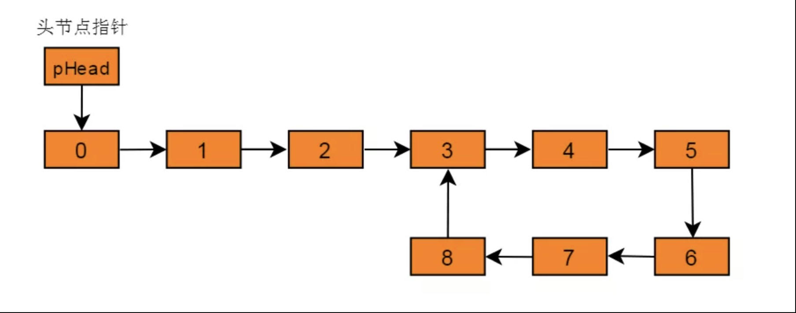
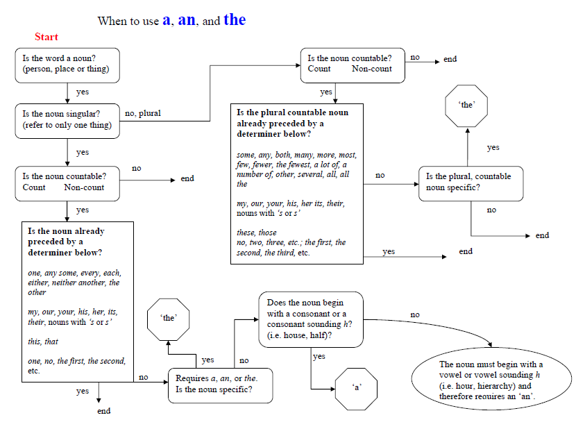
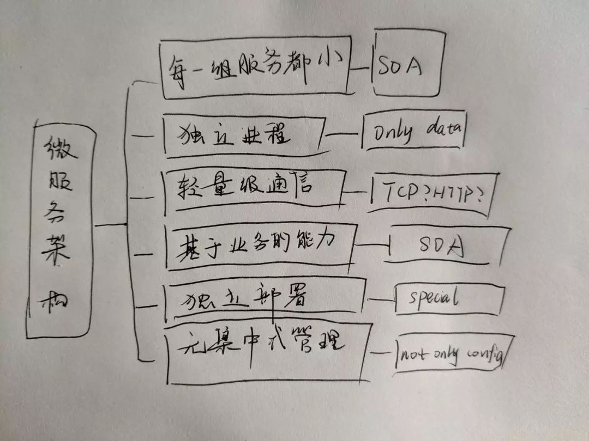
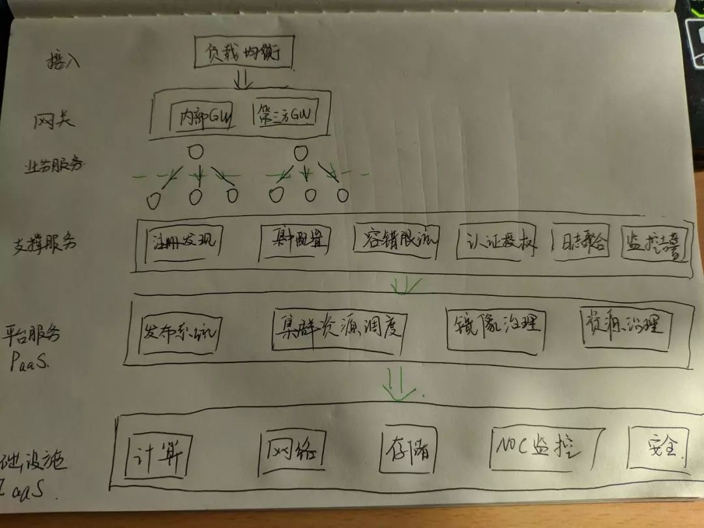
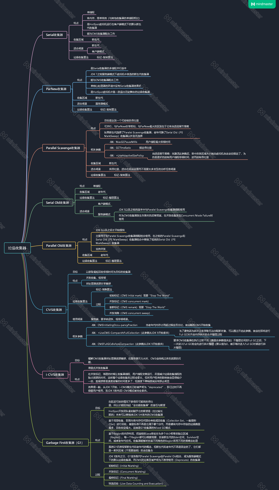

工作学习记录


### 2019.7.25

#### java

  使用了一种特殊的单例模式  -----使用静态内部类实现

***这种方式能达到双检锁方式一样的功效，但实现更简单。对静态域使用延迟初始化，应使用这种方式而不是双检锁方式。这种方式只适用于静态域的情况，双检锁方式可在实例域需要延迟初始化时使用。***

~~~java
public class Singleton {  
    private static class SingletonHolder {  
    private static final Singleton INSTANCE = new Singleton();  
    }  
    private Singleton (){
        //do somthing
    }  
    public static final Singleton getInstance() {  
    return SingletonHolder.INSTANCE;  
    }  
}
~~~

#### juniperSSG 防火墙概览

juniperSSG 只能通过获取所有配置进行解析,不像fortinet可以拆分命令进行解析

​	通过get xxx 来获取配置信lo息  但这些信息不能解析

##### 获取所有配置

```shell
ssg245-> get config all   //解析这个

```

##### save命令进行持久化

```
ssg245->save
```

##### hostname

```shell
ssg245-> set hostname xxx
```

##### zone

创建一个zone,若是Layer2Zone 则需要L2-开头

```shell
ssg245-> set zone name L2-abc L2   
```

若是tunnel类型 需要指定 tunnel out zone's name

```
ssg245-> set zone name ggg tunnel Trust
```

修改zone

```shell
ssg245->set zone zonename
```


##### interface

​	interface 在配置ip前必须先配置zone

```shell
ssg245-> set interface ethernet0/2 zone Trust //设置zone 不设置的话没有设置ip的选项
ssg245-> set interface ethernet0/1 ip 1.1.1.1/24
```

##### address

在指定的zone创建一个address   名字唯一 

```shell
ssg245-> set address Trust addressName 1.2.3.4/24 desc  //ipv4
```

```
ssg245-> set address Trust addressName domainName desc  //domain 使用 get domian 获得
```

##### address group

 指定zone 创建一个address group    名字唯一  

```
ssg245->set group address Trust addrgr1
```

修改

```
ssg245->set group address Trust addrgr1 add aa comment desc //增加member 必须是此zone内的地址
ssg245-> set group address Trust addrgr1 comment desc  //只comment
ssg245-> set group address Trust addrgr1 hidden //hidden group
```

##### service 

名字唯一  插入一个service

```
ssg245->set service serv1 protocal <num> src-port 11-22 dst-port 33-44 timeout60/never
ssg245->set service serv2 protocal tcp src-port 11-22 dst-port 33-44 timeout60/never
ssg245->set service serv3 protocal udp src-port 11-22 dst-port 33-44 timeout60/never
ssg245-> set service ab protocol sun-rpc program 1-3 timeout60/never
ssg245-> set service ab2 protocol ms-rpc uuid xxx-xxx-xxx-xxxx //uuid
```

修改 将protocal改成+   icmp/tcp/udp/udp可看做同一类型 sun-rpc, ms-rpc 不同类型不能尾加

```
ssg245->set service serv1 + <num> src-port 11-22 dst-port 33-44 timeout60/never
```

##### service group 

  创建一个service group    名字唯一  

```
ssg245-> set group service g1 
```

修改 与address group 雷同  使用add

```
ssg245->set group service g1 add aa comment desc //增加member 
ssg245-> set group service g1 comment desc  //只comment
ssg245-> set group service g1 hidden //hidden group
```

##### scheduler

有once 和 Recurrent 两种类型

```
ssg245-> set scheduler b once start mm/dd/yyyy hh:mm stop mm/dd/yyyy hh:mm comment desc
```

Recurrent 可设置两个时间

```
ssg245-> set scheduler abc recurrent monday start 11:22 stop 22:21 start 22:11 stop 11:23
```

##### syslog

```
ssg245-> set syslog config 1.2.3.4/24 //ip
ssg245-> set syslog config ssg245  //hostname
```

##### policy

可以直接设置   指定zone到zone   id唯一

```
ssg245-> set policy from ZoneName to ZoneName Any Any ANY dney
ssg245-> set policy global Any Any ANY dney    //golbal policy
```

先根据id进入指定的policy进行设置

```
ssg245-> set policy id 125 
ssg245(policy:125)-> 
---------------------
ssg245(policy:125)-> set src-address abb  //源地址    可以多个
ssg245(policy:125)-> set dst-address abb2 //目的地址  可以多个
ssg245(policy:125)-> set service ser //服务   可以多个
```

---

### 2019.7.26

今天主要进行了JuniperSSG策略开通的工作

+ 分析scheduler
+ 分析地址服务对象
+ 分析 Policy 的 Relation
+ 根据Policy 的 Relation 确定 新策略是新增还是冲突等关系

---

### 2019.7.27

周末学习计划

#### 阿里云k8s公开课学习

##### k8s基本概念

kubenetes主要有以下几个核心组件组成：

- etcd保存了整个集群的状态
- kube-apiserver提供了资源操作的唯一入口，并提供认证、授权、访问控制、api注册和发现等机制
- kube-controller-manager负责维护集群的状态，比如故障检测、自动扩展、滚动更新等
- kube-scheduler负责资源的调度，按照预定的调度策略将pod调度到响应的机器上；
- kubelet负责维持容器的生命周期，同时也负责volume（CVI）和网络（CNI）的管理
- Container runtime负责镜像管理以及pod和容器的真正运行（CRI），默认的容器运行时为docker
- kube-proxy负责为service提供cluster内部的服务发现和负载均衡(代理节点)

##### pod

1. 运行一个pod

```
kubectl run db --image mongo

```

2. 查看信息

```
kubectl get pods
```

3. 删除pod

```
kubectl delete development db
```

4. 通过声明语法创建

```
kubectl create -f pod/db.yml

kubectl get pods -o json # 以json格式显示(或wide)

kubectl describe pod db
```

5. 流程

```
kubectl发布请求创建pod - apiserver发出请求 - scheduler调取信息 - 在指定node节点运行pod - 返回到apiserver节点 - apiserver发布信息到kubelet - kubelet向docker请求创建容器 - kubelet更新状态 
```

6. 在一个pod里运行多个容器

```
在声明文件中写入两个容器

kubectl exec -it -c api go-demo-2 ps aux # 现在pod里有两个容器，需要指定容器去查看

```

##### ReplicaSets 控制器

> 大多数应用程序都应该是可伸缩的，所有的应用程序都必须具有容错能力。Pods不提供这些特性，ReplicaSets就可以做到

Replication Controller的主要功能只是确保一个特定数量的pod副本与实际状态一致

声明：

```
replicas 运行复制的个数
```

1. 创建一个复制器

```
kubectl create -f rs/go-demo-2.yml
kubectl get rs
kubectl get pods --show-labels
```

2. 流程

```
kubectl发布请求 - apiserver 发布请求 - rs controller 收到请求- 通过apiserver去发布 - Scheduler 调度一个节点去发布pod - kubelet通过apiserver收到请求 - 请求docker去创建容器 - kubelet通过apiserver更新状态
```

3. 操作

```
# 只删除复制控制器
kubectl delete -f rs/go-demo-2.yml --cascade=false

# 扩展新副本，旧副本保持不变
kubectl apply -f rs/go-demo-2-scaled.yml

# 删除一个pod，新创建一个
POD_NAME=$(kubectl get pods -o name |tail -1)
kubectl delete $POD_NAME
```

复制控制器是通过选择器里的label标签去管理pod

##### Service

只有在建立了通信路径之后，应用程序才能完成它们的角色。

k8s的服务提供了可以访问关联pod的地址

1. 通过公共端口创建服务

```
kubectl create -f svc/go-demo-2-rs.yml
kubectl get -f svc/go-demo-2-rs.yml
kubectl expose rs go-demo-2 --name=go-demo-2-svc --target-port=28017 --type=NodePort
```

2. 流程

```
kubectl发送请求 - apiserver收到 - apiserver发送请求到Endpoint Controller - E C创建一个端点对象 - apiserver通知kube proxy更新iptables - apiserver通知kube DNS增加解析
```

3. 声明式语法

```
type:NodePort
nodePort # node节点上的端口
protocol # 协议
selector # 选择器
```

4. 服务发现

```
主要通过两种主要模式来发现:环境变量和DNS
每一个pod都为每一个活跃的服务来获取环境变量

kubectl exec $POD_NAME env

首先检查本地dns解析地址 - 如果没有就使用kube-dns - 如果没有就通过iptables规则 - 最后找到
```

5. selector

```
selector会为Service指派以一个Endpoint对象
如果不指定selector，就不会创建相关的Endpoints对象。可以手动将Service映射到指定的Endpoints。
如果后续决定要将数据库迁移到Kubetnetes中，可以启动对应的Pod，增加合适的Selector或Endpoint，修改service的type。
```

##### Development

我们必须在开发和测试的时候将特性发布到生产环境中，频繁发布的需求增强了对零停机部署的需求。Kubenetes提供Development在没有停机的情况下部署。

**管理模式**


**发布**


**回滚**


1. 部署一个新版本

声明文件

```
Kind： Development
```

和replica差不多

```
kubectl create -f deploy/go-demo-2.yml
```

执行之后development使用replicaSets去创建容器

流程:

```
kubectl发布事件到api，development收到对象事件后创建一个replicaSets对象，将事件发送到api，replicaSets接受到事件后，创建并继续创建pod对象，然后调度器对指定pod到指定节点上，kubelet监听到需要创建pod，这时候就会向docker去请求创建容器，并且更新pod的状态
```

2. 更新部署

```
kubectl set image -f deploy/go-demo-2-db.yml db=mongo:3.4 --record
```

使用set image来更新，保持旧的控制器不变，创建一个新的控制器。

```
kubectl edit -f deploy/go-demo-2-db.yml
```

这时候就可以更改配置文件中的内容，更新部署的内容

```
--save-config 保存配置

--record 保存记录
```

3. 零宕机部署

实际应用中对于当一副本无法进行高可用

```
minReadySeconds 默认值为0，这意味着一旦准备就绪，Pods就认为是可用的

progressDeadlineSeconds 部署等待时间（超过等待时间则部署失败）

revisionHistoryLimit 可以回滚的旧复制的数量，默认为10

Recreate 在更新之前，杀死所有现在的pod，比较适合单副本数据库

RollingUpdate 默认策略，允许我们没有停机时间的情况下部署新版本(maxSurge 定义超出需要本批次更新运行的数量，数字或百分比  maxUnavailable 定义了不能使用的最大数量，也就是更新时，要停掉多少正在允许的pod，默认是25%)
使用这个策略的pod是一个一个增加，旧pod一个一个减少，当增加的pod超过限定值，就使用新的pod
```

```
kubectl create -f deploy/go-demo-2-api.yml --record
```

```
kubectl set image -f deploy/go-demo-2-api.yml api=vfarcic/go-demo-2:2.0 --record
```

```
kubectl rollout status -w -f deploy/go-demo-2-api.yml

kubectl rollout history -w -f deploy/go-demo-2-api.yml 
```

4. 滚动更新

```
kubectl rollout undo -f deploy/go-demo-2-api.yml 回滚，撤销，恢复到上一个版本

kubectl rollout history -f deploy/go-demo-2-api.yml

kubectl rollout undo -f deploy/go-demo-2-api.yml --to-revision=2 回滚到2版本
```

##### Ingress

ingress对象管理对运行在k8s集群内的应用程序的外部访问，提供了一个api允许每个程序通过一个不同的端口到达。类似于nginx

每次去访问docker应用，都要去查询端口，十分麻烦，使用ingress，使用一个端口来代理端口。

请求

```
ingress-nginx(service request) ->  ingress controller -> ingress -> service -> pod
```

ingress定义：

1. 在同一namespace下
2. 创建控制器
3. 创建ingress资源

- 基于路径：- path:/demo 
- 基于域名：- host: nginx 

> 都使用http:path -backend来定义

```
backend: serviceName: demo servicePort:80
```

4. Service指定结点

> namespace的查看 -n

流程：

```
apiserver ->create ingress -> ingress Controller 查找ingress资源 ->配置ingress资源规则(路径/域名)
```

> ingress controller会将一个ingress对象加载生成一段nginx配置，然后将配置通过kubenetes api写到nginx的pod中，然后reload

##### 卷

卷：一个pod容器所访问的文件和目录的引用

可以处理有状态应用

比如运行一个docker容器，可以挂载本地的docker socket，这样在容器中运行的docker命令就是操作本机的docker了

```
    volumeMounts:
    - mountPath: /var/run/docker.sock
      name: docker-socker
  volumes:
  - name: docker-socket
    hostpath:
      path: /var/run/docker.sock
      type: Socket
```

当我们有一个配置文件，也可以将配置文件的路径对应到pod中，这样容器就会直接执行配置文件的配置。

> /etc/redis,则会将redis文件夹放入，/etc/redis/，则会将redis文件夹中所有文件放入

通过空白卷来保持持久状态,创建空白卷之后会创建一个空白卷来保持状态(伴随pod)

```
    volumeMounts:
    - mountPath: /var/jenkins-home
      name: jenkins-home
  volumes:
  - emptyDir: {}
    name: jenkins-home
```

##### Configmaps

configmaps允许将配置和应用程序映像分开，配置文件的来源可以是文件，目录或文字值，目标可以是文件或者环境变量

configmap从一个源获得一个配置，并将其安装到运行容器中作为一个卷

创建方式：

1. 通过yaml文件

- 参数采用k/v
- 文件采用file: |[file]

2. 通过kubectl直接在命令行下创建，直接将一个配置文件创建为一个configMap，通过在命令行直接传递键值对创建：

- kubectl create configmap test-config3 --from-file=./configs/db.conf --from-literal=db.host=10.5.10.116 --from-listeral=db.port='3306'

使用方法：

1. 直接传递pod

```
env:
    - name: SPECIAL_LEVEL_KEY
      valueFrom:
        configMapKeyRef:
          name: special-config
          key: special.how
    - name: SPECIAL_TYPE_KEY
      valueFrom:
        configMapKeyRef:
          name: special-config
          key: special.type
```

2. 在命令行下引用

```
  command: [ "/bin/sh", "-c", "echo $(SPECIAL_LEVEL_KEY) $(SPECIAL_TYPE_KEY)" ]
  env:
    - name: SPECIAL_LEVEL_KEY
      valueFrom:
        configMapKeyRef:
          name: special-config
          key: special.how
    - name: SPECIAL_TYPE_KEY
      valueFrom:
        configMapKeyRef:
          name: special-config
          key: special.type
```

3. 使用volume将ConfigMap作为文件或目录直接挂载，其中每一个key-value键值对都会生成一个文件，key为文件名，value为内容

```
    volumeMounts:
      - name: config-volume
        mountPath: /etc/config
  volumes:
    - name: config-volume
      configMap:
        name: special-config
```

##### Secret

敏感数据需要额外处理，K8S通过secret提供额外保护等级。

pod有两种方式来使用secret：

- 作为volume的一个域被一个或多个容器挂载
- 在拉取镜像的时候被kubelet引用。

1. 內建的Secrets：

由ServiceAccount创建的API证书附加的秘钥

k8s自动生成的用来访问apiserver的Secret，所有Pod会默认使用这个Secret与apiserver通信

2. 自己的Secret

```
kubectl create secret generic db-user-pass --from-file=./username.txt --from-file=./password.txt
```

或者用yaml文件

```
$ echo -n 'admin' | base64
YWRtaW4=
$ echo -n '1f2d1e2e67df' | base64
MWYyZDFlMmU2N2Rm

apiVersion: v1
kind: Secret
metadata:
  name: mysecret
type: Opaque
data:
  username: YWRtaW4=
  password: MWYyZDFlMmU2N2Rm
```

使用

     volumeMounts:
        - name: foo
          mountPath: "/etc/foo"
          readOnly: true
      volumes:
      - name: foo
        secret:
          secretName: mysecret
---

#### java 

  回顾设计模式

##### 工厂模式

> 这种类型的设计模式属于创建型模式，它提供了一种创建对象的最佳方式。在工厂模式中，我们在创建对象时不会对客户端暴露创建逻辑，并且是通过使用一个共同的接口来指向新创建的对象。

**意图：**定义一个创建对象的接口，让其子类自己决定实例化哪一个工厂类，工厂模式使其创建过程延迟到子类进行。

**代码：**

~~~java
public interface Shape {   //创建一个接口并定义抽象方法
   void draw();
}

public class Rectangle implements Shape {  //实现类
 
   @Override
   public void draw() {
      System.out.println("Inside Rectangle::draw() method.");
   }
}

public class Square implements Shape {    //实现类
 
   @Override
   public void draw() {
      System.out.println("Inside Square::draw() method.");
   }
}

public class ShapeFactory {   //定义一个工厂类  根据输入的类型来生成特定的对象
    
   //使用 getShape 方法获取形状类型的对象
   public Shape getShape(String shapeType){
      if(shapeType == null){
         return null;
      }        
      if(shapeType.equalsIgnoreCase("CIRCLE")){
         return new Circle();
      } else if(shapeType.equalsIgnoreCase("RECTANGLE")){
         return new Rectangle();
      } else if(shapeType.equalsIgnoreCase("SQUARE")){
         return new Square();
      }
      return null;
   }
}
~~~

**缺点：**每次增加一个产品时，都需要增加一个具体类和对象实现工厂，使得系统中类的个数成倍增加，在一定程度上增加了系统的复杂度，同时也增加了系统具体类的依赖。这并不是什么好事。

##### 抽象工厂模式

>抽象工厂模式（Abstract Factory Pattern）是围绕一个超级工厂创建**其他工厂**。该超级工厂又称为其他工厂的工厂。这种类型的设计模式属于创建型模式，它提供了一种创建对象的最佳方式。
>
>在抽象工厂模式中，接口是负责创建一个相关对象的工厂，不需要显式指定它们的类。每个生成的工厂都能按照工厂模式提供对象。

**意图：**提供一个创建一系列相关或相互依赖对象的接口，而无需指定它们具体的类。

**代码：**

~~~java
public interface Shape {  //形状接口
   void draw();
}

public class Rectangle implements Shape {  //具体实现类
 
   @Override
   public void draw() {
      System.out.println("Inside Rectangle::draw() method.");
   }
}

public class Square implements Shape {  //具体实现类
 
   @Override
   public void draw() {
      System.out.println("Inside Square::draw() method.");
   }
}

public interface Color {  //颜色接口
   void fill();
}

public class Red implements Color {   //具体实现类
 
   @Override
   public void fill() {
      System.out.println("Inside Red::fill() method.");
   }
}

public class Green implements Color {    //具体实现类
 
   @Override
   public void fill() {
      System.out.println("Inside Green::fill() method.");
   }
}

public abstract class AbstractFactory {  //创建抽象工厂里面包含其他的工厂
   public abstract Color getColor(String color);
   public abstract Shape getShape(String shape) ;
}

public class ShapeFactory extends AbstractFactory {  //创建扩展了 AbstractFactory 的工厂类，基于给定的信息生成实体类的对象。
    
   @Override
   public Shape getShape(String shapeType){
      if(shapeType == null){
         return null;
      }        
      if(shapeType.equalsIgnoreCase("CIRCLE")){
         return new Circle();
      } else if(shapeType.equalsIgnoreCase("RECTANGLE")){
         return new Rectangle();
      } else if(shapeType.equalsIgnoreCase("SQUARE")){
         return new Square();
      }
      return null;
   }
   
   @Override
   public Color getColor(String color) {
      return null;
   }
}

public class FactoryProducer {  //创建一个工厂创造器/生成器类，通过传递形状或颜色信息来获取工厂。
   public static AbstractFactory getFactory(String choice){
      if(choice.equalsIgnoreCase("SHAPE")){
         return new ShapeFactory();
      } else if(choice.equalsIgnoreCase("COLOR")){
         return new ColorFactory();
      }
      return null;
   }
}


public class AbstractFactoryPatternDemo {
   public static void main(String[] args) {
 
      //获取形状工厂
      AbstractFactory shapeFactory = FactoryProducer.getFactory("SHAPE");
 
      //获取形状为 Circle 的对象
      Shape shape1 = shapeFactory.getShape("CIRCLE");
 
      //调用 Circle 的 draw 方法
      shape1.draw();
 
      //获取形状为 Rectangle 的对象
      Shape shape2 = shapeFactory.getShape("RECTANGLE");
 
      //调用 Rectangle 的 draw 方法
      shape2.draw();
      
      //获取形状为 Square 的对象
      Shape shape3 = shapeFactory.getShape("SQUARE");
 
      //调用 Square 的 draw 方法
      shape3.draw();
 
      //获取颜色工厂
      AbstractFactory colorFactory = FactoryProducer.getFactory("COLOR");
 
      //获取颜色为 Red 的对象
      Color color1 = colorFactory.getColor("RED");
 
      //调用 Red 的 fill 方法
      color1.fill();
 
      //获取颜色为 Green 的对象
      Color color2 = colorFactory.getColor("Green");
 
      //调用 Green 的 fill 方法
      color2.fill();
 
      //获取颜色为 Blue 的对象
      Color color3 = colorFactory.getColor("BLUE");
 
      //调用 Blue 的 fill 方法
      color3.fill();
   }
}
~~~

##### 策略模式

>在策略模式（Strategy Pattern）中，一个类的行为或其算法可以在运行时更改。这种类型的设计模式属于行为型模式。
>
>在策略模式中，我们创建表示各种策略的对象和一个行为随着策略对象改变而改变的 context 对象。策略对象改变 context 对象的执行算法。

**意图: **  定义一系列的算法,把它们一个个封装起来, 并且使它们可相互替换。

**代码：**

~~~java
public interface Strategy {  //一个算法的抽象
   public int doOperation(int num1, int num2);
}

public class OperationAdd implements Strategy{ //算法的具体实现
   @Override
   public int doOperation(int num1, int num2) {
      return num1 + num2;
   }
}

public class OperationSubstract implements Strategy{ //算法的具体实现
   @Override
   public int doOperation(int num1, int num2) {
      return num1 - num2;
   }
}

public class Context {   
   private Strategy strategy; //在实用类中封装一个算法抽象
   
   public Context(){
       
   } 
   public Context(Builder builder){  //传进来的具体算法对象
      this.strategy = builder.strategy;
   }
   
   public void setStrategy(Strategy strategy){
       this.strategy = strategy;
   }
 
   public int executeStrategy(int num1, int num2){ //根据具体的算法对象，调用他们的算法实现
      return strategy.doOperation(num1, num2);
   }
    
   public static final class Builder{  //结合builder模式进行构建
       private Strategy strategy;
       
       public Builder(){
           
       }
       
       public Builder setStrategy(Strategy val){
           this.strategy = val;
           return this;
       }
       
       public Context build(){
           return new Context(this);
       }
   } 
}

public class StrategyPatternDemo { //测试
   public static void main(String[] args) {
      Context context = new Context.Builder()
          .setStrategy(new OperationAdd())
          .builder();
       System.out.println("10 + 5 = " + context.executeStrategy(10, 5));
       
       context.setStrategy(new OperationSubstract())
       System.out.println("10 - 5 = " + context.executeStrategy(10, 5));

   }
}
~~~

##### 代理模式

>在代理模式（Proxy Pattern）中，一个类代表另一个类的功能。这种类型的设计模式属于结构型模式。
>
>在代理模式中，我们创建具有现有对象的对象，以便向外界提供功能接口。

**意图：**为其他对象提供一种代理以控制对这个对象的访问。

~~~java
public interface Image {
   void display();
}

public class RealImage implements Image {
 
   private String fileName;
 
   public RealImage(String fileName){
      this.fileName = fileName;
      loadFromDisk(fileName);
   }
 
   @Override
   public void display() {
      System.out.println("Displaying " + fileName);
   }
 
   private void loadFromDisk(String fileName){
      System.out.println("Loading " + fileName);
   }
}

public class ProxyImage implements Image{
 
   private RealImage realImage;  //在代理对象中封装一个真实对象  实例化真实对象前后可进行操作
   private String fileName;
 
   public ProxyImage(String fileName){
      this.fileName = fileName;
   }
 
   @Override
   public void display() {
      if(realImage == null){
         realImage = new RealImage(fileName);
      }
      realImage.display();
   }
}
~~~

---

### 2019.7.28

周末学习计划

#### java

##### springboot 整合 rabbitmq

+ 先在yml文件中配置

~~~yaml
spring:
  rabbitmq:
    host: nap-rabbitmq-host
    port: 5672
    listener:
      concurrency: 2
~~~

+ 编写配置类

~~~java
@Configuration
public class AmqpConfig {
    @Value("${spring.rabbitmq.host}")
    private String host;

    @Value("${spring.rabbitmq.port}")
    private Integer port;

    public ConnectionFactory connectionFactory() {
        return new CachingConnectionFactory(host, port);
    }

    @Bean(value = "rabbitTemplateRpc")
    public RabbitTemplate rabbitTemplateRpc() {
        final RabbitTemplate rabbitTemplate = new RabbitTemplate(connectionFactory());
        rabbitTemplate.setMessageConverter(jackson2MessageConverter());
        rabbitTemplate.setExchange("rpc");
        rabbitTemplate.setReplyAddress("rpc/ssh-response");
        rabbitTemplate.setReplyTimeout(20000);
        rabbitTemplate.setReceiveTimeout(20000);
        return rabbitTemplate;
    }

    @Bean(value = "rabbitTemplateMessaging")
    public RabbitTemplate rabbitTemplateMessaging() {
        final RabbitTemplate rabbitTemplate = new RabbitTemplate(connectionFactory());
        rabbitTemplate.setMessageConverter(jackson2MessageConverter());
        rabbitTemplate.setExchange("messaging");
        rabbitTemplate.setReplyAddress("messaging/messaging-response");
        rabbitTemplate.setReplyTimeout(20000);
        rabbitTemplate.setReceiveTimeout(20000);
        return rabbitTemplate;
    }


    @Bean
    public Jackson2JsonMessageConverter jackson2MessageConverter() {
        Jackson2JsonMessageConverter converter = new Jackson2JsonMessageConverter();
        return converter;
    }

    @Bean
    public SimpleMessageListenerContainer rpcReplyListenerContainer() {
        SimpleMessageListenerContainer container = new SimpleMessageListenerContainer();
        container.setConnectionFactory(connectionFactory());
        container.setQueues(rpcReplyQueue());
        container.setMessageListener(rabbitTemplateRpc());
        return container;
    }

    @Bean
    public SimpleMessageListenerContainer messagingGeneralListenerContainer() {
        SimpleMessageListenerContainer container = new SimpleMessageListenerContainer();
        container.setConnectionFactory(connectionFactory());
        container.setQueues(messagingReplyQueue());
        container.setMessageListener(rabbitTemplateMessaging());
        return container;
    }

    // bindings
    @Bean
    public TopicExchange messagingExchange() {
        return new TopicExchange("messaging");
    }

    @Bean
    public Queue ciscoRawRunningConfig() {
        return new Queue("cisco-raw-running-config");
    }

    @Bean
    public Binding bindCiscoRawRunningConfigToMessaging() {
        return BindingBuilder.bind(ciscoRawRunningConfig()).to(messagingExchange()).with("cisco.raw.running.config");
    }

    
}
~~~

+ 编写service 提供方法调用

~~~java
@Service
public class AmqpService {
    private static final Logger logger = LoggerFactory.getLogger(AmqpService.class);
    @Autowired
    @Qualifier(value = "rabbitTemplateRpc")
    private RabbitTemplate rabbitTemplate;
    @Autowired
    @Qualifier(value = "rabbitTemplateMessaging")
    private RabbitTemplate rabbitTemplateMessaging;

    public void messageDeliver(String routineKey, Object o) throws Exception {
        rabbitTemplateMessaging.convertAndSend("messaging", routineKey, o, message -> {
            message.getMessageProperties().setMessageId(NoReply.class.getName());
                                                  message.getMessageProperties().setCorrelationId(UUID.randomUUID().toString().getBytes());
            return message;
        });
    }
}
~~~

+ 编写Listener监听消息队列

~~~java
@Component
@RabbitListener(queues = "cisco-raw-running-config")
public class CiscoRawRunningConfigListener {
    private static final Logger logger = LoggerFactory.getLogger(CiscoRawRunningConfigListener.class);

    @RabbitHandler
    public synchronized void receive(@Payload RunCommandResponse runCommandResponse) {
        //do somthing
    }
        
}
~~~

##### 二分查找

>二分查找必须是有序情况下才能使用

~~~java
/**
 * Created by work on 2019
 *
 * @author fangcong
 * @description 二分查找
 */
public class Test3 {

    public static void main(String[] args) {
        int arr[] = {1, 2, 3, 4,6,8,19,67,77,88};
        int index = binarySearch(arr, 88);
        int index2 = binarySearch2(arr, 88);
        System.out.println(index);
        System.out.println(index2);
    }

    public static int binarySearch(int [] arr , int key) { //循环实现

        int low = 0;
        int high = arr.length - 1;
        int min = 0;
        if (key < arr[low] || key > arr[high] || low > high) {
            return -1;
        }
        while (low <= high) {
            min = (low + high) / 2;
            if (arr[min] == key) {
                return min;
            } else if (arr[min] < key) {
                low = min + 1;
            } else if (arr[min] > key) {
                high = min - 1;
            }

        }
        return -1;
    }

    public static int binarySearch2(int [] arr , int key) { //递归实现
        int low = 0;
        int high = arr.length - 1;

        if (key < arr[low] || key > arr[high] || low > high) {
            return -1;
        }
        return binarySearch2(arr, key, low, high);
    }

    private static int binarySearch2(int[] arr,int key ,int low, int high) {
        if (low <= high) {
            int min = (low + high) / 2;
            if (arr[min] == key) {
                return min;
            } else if (arr[min] > key) {
                return binarySearch2(arr, key, low, min - 1);
            } else {
                return binarySearch2(arr, key, min+1, high);
            }
        } else {
            return -1;
        }

    }

}
~~~


##### 快速排序

>思想：分治和递归
>
>时间复杂度最好是O(nlogn) 平均也是O(nlogn),最坏情况是序列本来就是有序的，此时时间复杂度为O(n²)
>
> 快速排序的空间复杂度可以理解为递归的深度，而递归的实现依靠栈，平均需要递归logn次，所以平均空间复杂度为O(logn)
>
>是不稳定排序 最好的内排序

~~~java
@Test
public void quickSortTest() {
    //给出无序数组
    int arr[] = {72, 6, 58, 4396, 45, 84, 99, 155, 20, 1, 0, 77};
    //输出无需数组
    System.out.println(Arrays.toString(arr));
    //快速排序
    quickSort(arr);
    //输出有序数组
    System.out.println(Arrays.toString(arr));
}

void quickSort(int[] arr) {
    int low = 0;
    int high = arr.length - 1;
    quickSort(arr, low, high);
}

private void quickSort(int[] arr, int low, int high) {
    if (low < high) {
        //进行分区
        int index = partition(arr, low, high);
        //对左边进行排序
        quickSort(arr, low, index - 1);
        //对右边进行排序
        quickSort(arr, index + 1, high);
    }

}

private int partition(int[] arr, int low, int high) {
    //指定左指针i和右指针j
    int i = low;
    int j = high;
    //将第一个数指定基准值,填坑
    int x = arr[low];
    //使用循环实现分区操作
    while (i < j) {
        //1.从右往左移动j,找到第一个小于基准值的值arr[j]
        while (arr[j] >= x && i < j) {
            j--;
        }
        //2.将右侧找到的小于基准值的值加入到左边的坑中,左指针向右移动一位i++
        if (i < j) {
            arr[i] = arr[j];
            i++;
        }
        //3.从左向右移动i,找到第一个大于等于基准值的值arr[i]
        while (arr[i] < x && i < j) {
            i++;
        }
        //4.将左侧找到的大于等于基准值的值假如到右边的坑正,右指针向左边移动一位j--
        if (i < j) {
            arr[j] = arr[i];
            j--;
        }

    }
    //使用基准值填坑,这就是基准值的最终位置
    arr[i] = x;//arr[j]=x;
    //返回基准值的位置索引
    return i;//return j;

}
~~~


### 2019.7.31

#### postgres 数据库更新字段

1. 进入docker容器    docker exec -it nap-postgres /bin/sh 

2. 切换用户  su postgres

3. 进入nap数据库 psql -d nap

4. 执行更新sql   

   ```sql
   ALTER TABLE "public"."nap_encrypted_license" ALTER COLUMN "license" TYPE text COLLATE "pg_catalog"."default" USING "license"::text;
   ```


#### k8s常用命令

>查看pod

~~~shell
kubectl get all -n nap
~~~

>查看日志

~~~shell
kubectl logs -f nap-api-0 -n nap
~~~

>进入容器    pod  nap-api-0 , 域nap

~~~shell
kubectl exec -it nap-api-0 -n nap -- sh
~~~

### 2019.8.1

#### windows 添加路由命令

~~~
route add -p 192.168.100.0 mask 255.255.255.0 192.168.1.52
~~~


#### postgresql  远程用户开启访问权限

将以下添加到pg_hba.conf第一行：

```
Host all all 0.0.0.0/0 md5
```

---

### 2019.8.5

#### CheckPoint Session管理

使用CheckPoint API时进行登录获取返回的SessionId,在后续的API请求中携带SessionId进行请求

在使用session进行增删改操作时必须调用pulish来持久化或者discard进行取消操作，否则会将操作的对象lock住导致其他session不能操作此对象，同时active的session数量有限，若超过上限则会将整个API进行lock，所以我们集成时将维护一个sessionId 并持久化到数据库 通过检测其过期时间进行维护 若未过期则调用keepalive进行延时，过期时才会重新login获取新的session

#### CheckPoint Policy Create

>工单输入

~~~json
{
  "applicant": "fc",
  "dispatchAt": "string",
  "dispatchAtJson": {
    "description": "string",
    "helpers": {},
    "id": "string",
    "name": "string",
    "values": [
      {
        "type": "DAILY",
        "value": {"start":"10:00","stop":"22:00"}
      }
    ]
  },
  "owner": "admin",
  "policyTicketItemsJson": [
    {
      "deviceId": "f714d6dd-006d-4cb2-a42e-50492a8efbd4",
      "input": {
        "action": "ACCEPT",
        "comments": "agagag",
        "destination": [
          "CP_default_Office_Mode_addresses_pool"
        ],
        "enabled": true,
        "layer": "Network",
        "name": "abb",
        "new-name": "string",
        "new-position": "TOP",
        "position": "TOP",
        "service": [
          "AOL"
        ],
        "source": [
          "any"
        ],
        "time": [
          "Every_Day"
        ]
      }
    }
  ],
  "remark": "test",
  "reviewer": "fangcong"
}
~~~

> 回滚输入

~~~json
{
  "description": "rollback",
  "helpers": {},
  "id": "string",
  "name": "string",
  "values": [
    {
      "type": "DAILY",
      "value": {"start":"10:00","stop":"22:00"}
    }
  ]
}
~~~

#### springboot 整合rabbitmq的自动注入原理

> 1. RabbitmqAutoconfiguration
> 2. 有自动配置了连接工厂ConnectionFactory
> 3. RabbitProperties 封装了Rabbitmq的配置
> 4. RabbitTemplate 给rabbitmq发送和接收消息
> 5. AmqpAdmin  rabbitmq系统管理组件

#### ElasticSearch 快速入门

使用docker安装   略....

使用es restful API

```
PUT localhost:9200/索引/类型/id     //索引一条数据
GET localhost:9200/索引/类型/id     //检索一条数据
DELETE  localhost:9200/索引/类型/id     //删除一条数据

GET localhost:9200/索引/类型/_search     //检索所有的数据
GET localhost:9200/索引/类型/_search?q=lastname:fang //根据条件查询

也可根据查询表达式DSL 在请求体中加json数据进行查询   (重点)
```

#### springboot 整合es

springboot 支持两种技术整合es

1. Jest (默认不生效) 需要导入jest工具包   io.searchbox.client.JestClient
2. springboot-data-elasticsearch
   - client --->封装了节点信息 clusterNodes,clusterName
   - ElasticsearchTemplate   操作es
   - 编写 repository操作es

### 2019.8.7

#### jackson 反序列化枚举类型

>需要在枚举类型上添加jsonProperty注解

~~~java
public enum NatMethod {
    @JsonProperty("hide")
    HIDE("hide"),
    @JsonProperty("static")
    STATIC("static");
    private String value;

    NatMethod(String value) {
        this.value = value;
    }

    public String getValue() {
        return this.value;
    }
}

~~~

#### ForkJon框架

>思想：分治
>
>结合parallelStream使用

~~~java
 ForkJoinPool forkJoinPool = new ForkJoinPool(16);
        forkJoinPool.submit(() -> {
            List<Host> hosts = host.getObjects().parallelStream().map(x -> {
                Host host1 = null;
                try {
                    host1 = checkPointService.getHost(deviceId, x.getName());

                } catch (CheckPointOperationException e) {
                    logger.error(e.toString());
                    e.printStackTrace();
                }
                config.getAddresses().add(host1);
                return host1;
            }).collect(Collectors.toList());
        }).get();
~~~

### 2019.8.8

#### k8s中进入postgres操作

进入容器:	kubectl exec -it postgres-o -n postgres -- /bin/bash

进入指定数据库:	psql - d nap - U nap_admin

#### JPA 多对多关系映射

> **@ManyToMany** 
>
> 注释：表示此类是多对多关系的一边，mappedBy 属性定义了此类为双向关系的维护端，注意：mappedBy 属性的值为此关系的另一端的属性名
>
> @**JoinTable** 描述了多对多关系的数据表关系。
>
> name 属性指定**中间表**名称，
>
> joinColumns 定义**中间表**与Device 表的外键关系。
>
> inverseJoinColumns 属性定义了**中间表**与另外一端DeviceCredential的外键关系。

```java
@Entity
@Table(name = "NAP_DEVICE", indexes = {
        @Index(name = "IDX_DEVICE", columnList = "ID, NAME, VENDOR, TYPE")
})
public class Device{   //维护关系的一方
    //略
    @ManyToMany(fetch = FetchType.EAGER)
    @JoinTable(name = "NAP_DEV_CRED_R",
            joinColumns = @JoinColumn(name = "DEV_ID", referencedColumnName = "ID"),
            inverseJoinColumns = @JoinColumn(name = "CRED_ID", referencedColumnName = "ID"))
    private Set<DeviceCredential> credentials;
    
}


@Entity
@Table(name = "NAP_DEVICE_CREDENTIAL", indexes = {
        @Index(name = "IDX_DEVICE_CREDENTIAL", columnList = "ID, NAME, TYPE")
})
@ApiModel(value = "Device Credential", description = "设备连接凭证")
public class DeviceCredential {
    
    @ManyToMany(mappedBy = "credentials", fetch = FetchType.LAZY)
    @JsonIgnore
    private Set<Device> devices;
}
```

#### JPA集合映射

> 当持久化中有一个属性是集合(Set、List、Map)，就要用到集合映射。集合属性会单独生成一张表
>
> 集合属性都要用到的注解：
>
> @ElementCollection(fetch="该属性的加载策略"，targetClass="集合中元素的类型")。
>   fetch=FetchType.EAGER: 立即加载
>   fetch=FetchType.LAZY: 延迟加载
> @CollectionTable(name="表名") : 指定集合生成表的相关信息 //可不写。

```java
public class DiscovererTikcet{
    @ElementCollection(targetClass = SwitchInfoType.class)
    @Column(name = "collect")
    @NotNull
    @Enumerated(EnumType.STRING)
    @ApiModelProperty(value = "用户定义的需要收集的信息，不能为空")
    private List<SwitchInfoType> collect;
}
```

#### Linux查看本机系统UUID

```shell
dmidecode -s system-uuid
```


### 2019.8.11

#### 编程语言理论学习总结

------

##### 语言特性

学习编程语言理论时  我们应该重视语言特性而不是语言

一些语言特性的例子:

- 变量定义
- 算术运算
- 循环语句
- 递归
- 类型系统
- 类型推倒
- 编程范式
- 垃圾回收
- 指针算术
- goto语句

##### 类型系统

> 什么是类型?
>
> **定义变量的边界的描述叫做类型**

变量可以被赋予类型(即变量有界)的语言被称为类型语言(**typed language**),无类型语言(**untyped language**)没有类型,或者说只有一个全局类型来存储所有的值

变量类型的指定可以是显式的

```go
//golang
var foo int
```

也可以是隐式的

```haskell
-- haskell
fac :: Int -> Int --这行可以省略
fac 0 = 1
fac n = n * fac (n-1)
```

类型系统会自动赋予变量类型,这叫做类型推断(**type inference**)

###### 类型检查

语言判断代码是否满足类型约束,这种行为被称为类型检查(**typechecking**),类型检查是保证程序稳定运行的手段,分为运行时检查(**runtime checks**)和静态检查(**static checks**),运行时检查也叫动态检查(**dynamic checking**)

做了静态检查,还有必要做动态检查吗? 有 比如说数组的边界检查就必须在运行时做,类型检查虽然会出错,但是为了阻止更恶劣的错误的发生,让程序能够更平滑的退出

动态检查的缺点是会导致fail-stop,也会消耗资源,影响性能,所以通常我们认为拥有静态检查的类型系统的语言会更加稳定高效。

**所有语言都有动态检查**

但静态检查就足够安全吗? 不一定 静态检查也分**weakly checked**和**strongly checked**

在程序编译期间能够尽可能的发现所有的类型错误成为strongly checked 反之称为weakly checked

**可以进行隐式类型转换的语言属于 weakly checked**

**一般弱类型语言属于weakly checked**

##### 类型推断

类型推断(type inference)是类型系统中推测一段代码(声明,表达式等)的类型的过程,让我们编写代码时能够略去类型的声明,并不会影响到类型检查

###### 静态语言和动态语言

> 如果值的类型仅在运行时才能被确定,这类语言则被称为动态语言(dynamically typed)
>
> 同样,如果值的类型仅在编译时被确定,这类语言被称为静态语言(statically typed)

###### 强类型与弱类型

在语言抉择上,`静态态检查`,`动态检查`,`检查范围`这几个角度影响的是程序的稳定性和执行效率

在开发效率上要引入另一个维度 **强类型和弱类型**

**强类型是指一旦被指定类型则不可变,弱类型则可变, 可变也分隐式和显式两种**

```js
//js 弱类型,隐式可变
x = 1
y = "2"
z = x + y
```

总结,在语言抉择上从上面几个维度来考虑,在开发效率,执行效率,及安全性之间做权衡,无类型的语言可以很安全,但可维护性查,基本被排除在系统开发外

##### 编程范式

###### IP(Imperative Programming)

指令式编程,程序由一系列指令和流程控制语句组成,指令不断改变程序的状态,由此达到最终的编码意图

###### SP(Structured Programming)

结构化编程,在IP的基础上可以使用goto语句控制流程,以for语句,while语句等此类结构化的代码块组织起来,使代码的可读性更高,SP是现代语言都支持的一中编程范式

###### PP(Procedure Programming)

过程式编程,既函数调用,可将提炼的逻辑用函数封装,复用代码和提高可读性

###### OOP(Object-oriented Programming)

面向对象编程,提供一种类似于人类对现实世界建模的方法,对二进制世界的类型和逻辑进行建模和封装,在此基础上提供了更多的类型和语法特性,三大特点:**封装,继承,多态**

###### DP(Declarative Programming)

描述性编程,和IP相反,只描述最终的编码意图,不描述过程

SQL是典型的DP范式语言,仅描述目的,隐藏过程

```sql
SELECT * FROM Users WHERE Country='China'
```

###### FP(Functional Programming)

函数式编程, FP是DP的子集。

在函数式编程里,函数和其他数据类型一样,可以作为类型定义变量,可以作为入参和返回值,代码里的SP逻辑尤其是控制流程逻辑,被隐藏起来

#### spring boot 集成swagger

在springboot 工程中引入swagger依赖

在build.gradle中添加

```groovy
dependecies{
    compile('io.springfox:springfox-swagger2:2.6.1')
    compile('io.springfox:springfox-swagger-ui:2.6.1')
}
```

SwaggerConfig

创建SwaggerConfig类

```java
@Configuration
@EnableSwagger2
public class SwaggerConfig{
       
    @Bean
    public Docket api(){
        return new Docket(DocumentationType.SWAGGER_2)
            .groupName("nap-api") //group name
            .genericModelSubstitutes(DeferredResult.class)
            .useDefaultResponseMessages(false)
            .forCodeGeneration(true)
            .apiInfo(apiInfo())
            .select()
            .apis(RequestHandlerSelectors.any())
            .paths(Predicates.not(PathSelectors.regex("/error"))) // 排除框架自动生成的error api
            .build();
    }
    
 
    private ApiInfo apiInfo() {
       return new ApiInfoBuilder()
             .title("NAP API Documentation")
             .description("Network Automation Platform API Documentation, generated by swagger2")
             .build();
}
       
    
}
```

获取swagger json
运行你的spring-boot工程, 然后访问

```http
http://localhost:8081/${context-path}/v2/api-docs?group=${groupName}
```

将返回的json内容粘贴保存到文件 test.json
使用swagger-ui渲染
json的阅读体验并不好，使用swagger-ui渲染得到最终的文档


注解例子

api注解

```java
@ApiOperation(value = "对登录信息做校验", notes = "jwt token包含在response header里的
Authorization字段里")
@RequestMapping(value="", method = RequestMethod.POST)
public ResponseEntity<User> login(@RequestBody User user, HttpServletResponse response)
throws Exception {
}

```

model注解

```java
@ApiModelProperty(value = "凭据名", required = true)
@Column(name = "NAME", unique = true)
@NotNull
private String name;
```

隐藏model里的某个属性

```java
@ApiModelProperty(hidden = true)
@Column(name = "DELETED")
@NotNull
private Boolean deleted;

```

在文档中添加http request header信息

```
@ApiOperation(value = "获取用户列表")
@RequestMapping(value="", method = RequestMethod.GET)
@PreAuthorize("hasRole('ROLE_ADMIN')")
public ResponseEntity<List<User>> list(@RequestHeader(value =
JwtWebTokenUtil.HEADER_STRING, defaultValue = "") String authorization) throws Exception {
logger.info("Asking for list");
return ResponseEntity.ok(us.getUsersByDeleted(false));
}
```

CORS

在每个@Controller注解之后加上

```java
@CrossOrigin(origins = "http://localhost:3000", maxAge = 3600)
```


### 2019.8.12

#### docker安装rabbitmq  无法进入web管理界面

tag:letest 是没有管理界面的

可使用tag:3-management

其配置文件为

~~~
loopback_users.guest = false       //支持guest远程访问
listeners.tcp.default = 5672       //使用端口配置
management.listener.port = 15672   //管理界面端口配置
management.listener.ssl = false    
~~~

#### Check Point防火墙概览

checkpoint 通过API来操作防火墙对象

API手册 [checkPoint API](https://sc1.checkpoint.com/documents/latest/APIs/index.html#web/add-access-rule~v1.1 )

##### login 

通过login到管理服务器，获取seesion

~~~json
POST https://<mgmt-server>:<port>/web_api/login
curl -X POST -k --header 'Content-Type: application/json' --header 'Accept: application/json' -d '{ "user":"admin", "password":"r00tme", "session-name":"ttty2", "session-description":"heeh", "session-timeout":"3600" }' 'https://192.168.1.56/web_api/login'
{
  "user":"admin",
  "password":"r00tme",
  "session-name":"ttty2",
  "session-description":"heeh",
  "session-timeout":"3600"
 }
//api Response
{
  "uid" : "faa3f320-68e4-4742-87a8-a34928c39b03",
  "sid" : "50vb3Bw4lHvOHINO8FB0ylmHIW9vaW9el9eSkvdRl8c",    //获取这个sid值
  "url" : "https://192.168.1.56:443/web_api",
  "session-timeout" : 3600,
  "last-login-was-at" : {
    "posix" : 1532000060385,
    "iso-8601" : "2018-07-19T19:34+0800"
  },
  "api-server-version" : "1.1"
}
~~~

通过sessionId来进行API请求

~~~json
//接下来就可以使用sid了，进行各种命令操作
curl -X POST -k --header 'Content-Type: application/json' --header 'X-chkp-sid: 50vb3Bw4lHvOHINO8FB0ylmHIW9vaW9el9eSkvdRl8c' --header 'Accept: application/json' -d '{ "name":"myHost5", "ipv4-address":"192.168.10.120" }' 'https://192.168.1.56/web_api/add-host'
~~~

##### session管理

seesionId 在修改或增加操作时需要进行publish

​                  使用discard放弃修改

​                  使用keepAlive来保持session的生命周期

过多的生成seesionId 会导致api不可用     建议利用keepAlive只维护一个session进行使用


### 2019.8.13

#### Go语言学习

> 根据前面所学的编程理论知识,来系统学习一门新的语言
>
> 从以下几个方面入手
>
> 1. 变量定义
> 2. 数据类型
> 3. 运算符,逻辑语句,递归
> 4. 函数
> 5. 复合类型
> 6. 面向对象
> 7. 并发

##### 变量定义

Go语言中变量名由字母,数字,下划线组成,其中首字母不能为数字(与java一致)

使用**var**关键字进行声明

```go
var abc int
var abc , aaa int //可一次声明多个变量
var aaa = "aaa" //省略类型   会进行类型推断
aaa:="fangcong" 省略var   //编译出错  因为aaa上面已经声明
bbb:=1    //编译通过
```

变量声明时,若不指定初始值则变量默认为零值 (**大部分语言大同小异**)

数值类型(包括负数)  为0

布尔类型为 false

字符串为 ""

指针类型,数组类型,map,管道,函数,error 为nil

##### 常量定义

关键字 **const**

```go
显式类型定义： const b string = "abc"
隐式类型定义： const b = "abc"
```

常量可以作为枚举

```go
const (
    Unknown = 0
    Female = 1
    Male = 2
)
```


##### 数据类型

| 序号 | 类型和描述                                                   |
| ---- | ------------------------------------------------------------ |
| 1    | **布尔型** 布尔型的值只可以是常量 true 或者 false。一个简单的例子：var b bool = true。 |
| 2    | **数字类型** 整型 int 和浮点型 float32、float64，Go 语言支持整型和浮点型数字，并且支持复数，其中位的运算采用补码。 |
| 3    | **字符串类型:** 字符串就是一串固定长度的字符连接起来的字符序列。Go 的字符串是由单个字节连接起来的。Go 语言的字符串的字节使用 UTF-8 编码标识 Unicode 文本。 |
| 4    | **派生类型:** 包括： (a) 指针类型（Pointer）(b) 数组类型 (c) 结构化类型(struct) (d) Channel 类型 (e) 函数类型 (f) 切片类型 (g) 接口类型（interface） (h) Map 类型 |

##### 值类型和引用类型

所有像 int、float、bool 和 string 这些基本类型都属于值类型，使用这些类型的变量直接指向存在内存中的值：


当使用等号 `=` 将一个变量的值赋值给另一个变量时，如：`j = i`，实际上是在内存中将 i 的值进行了拷贝：


 你可以通过 &i 来获取变量 i 的内存地址，例如：0xf840000040（每次的地址都可能不一样）。值类型的变量的值存储在栈中。 

 内存地址会根据机器的不同而有所不同，甚至相同的程序在不同的机器上执行后也会有不同的内存地址。因为每台机器可能有不同的存储器布局，并且位置分配也可能不同。 

 更复杂的数据通常会需要使用多个字，这些数据一般使用引用类型保存。 

 一个引用类型的变量 r1 存储的是 r1 的值所在的内存地址（数字），或内存地址中第一个字所在的位置。 


 这个内存地址为称之为指针，这个指针实际上也被存在另外的某一个字中。 

同一个引用类型的指针指向的多个字可以是在连续的内存地址中（内存布局是连续的），这也是计算效率最高的一种存储形式；也可以将这些字分散存放在内存中，每个字都指示了下一个字所在的内存地址。 

 当使用赋值语句 r2 = r1 时，只有引用（地址）被复制。 

 如果 r1 的值被改变了，那么这个值的所有引用都会指向被修改后的内容，在这个例子中，r2 也会受到影响。 

------

 我们知道可以在变量的初始化时省略变量的类型而由系统自动推断，声明语句写上 var 关键字其实是显得有些多余了，因此我们可以将它们简写为 a := 50 或 b := false。 

 a 和 b 的类型（int 和 bool）将由编译器自动推断。 

 这是使用变量的首选形式，但是它只能被用在函数体内，而不可以用于全局变量的声明与赋值。使用操作符 := 可以高效地创建一个新的变量，称之为初始化声明。

##### 运算符

###### 算术运算符

| 运算符 | 描述 | 实例               |
| ------ | ---- | ------------------ |
| +      | 相加 | A + B 输出结果 30  |
| -      | 相减 | A - B 输出结果 -10 |
| *      | 相乘 | A * B 输出结果 200 |
| /      | 相除 | B / A 输出结果 2   |
| %      | 求余 | B % A 输出结果 0   |
| ++     | 自增 | A++ 输出结果 11    |
| --     | 自减 | A-- 输出结果 9     |

###### 关系运算符

| 运算符 | 描述                                                         | 实例               |
| ------ | ------------------------------------------------------------ | ------------------ |
| ==     | 检查两个值是否相等，如果相等返回 True 否则返回 False。       | (A == B)  为 False |
| !=     | 检查两个值是否不相等，如果不相等返回 True 否则返回 False。   | (A != B) 为 True   |
| >      | 检查左边值是否大于右边值，如果是返回 True 否则返回 False。   | (A > B) 为 False   |
| <      | 检查左边值是否小于右边值，如果是返回 True 否则返回 False。   | (A < B) 为 True    |
| >=     | 检查左边值是否大于等于右边值，如果是返回 True 否则返回 False。 | (A >= B) 为 False  |
| <=     | 检查左边值是否小于等于右边值，如果是返回 True 否则返回 False。 | (A <= B) 为 True   |

###### 逻辑运算符

| 运算符 | 描述                                                         | 实例               |
| ------ | ------------------------------------------------------------ | ------------------ |
| &&     | 逻辑 AND 运算符。 如果两边的操作数都是 True，则条件 True，否则为 False。 | (A && B) 为 False  |
| \|\|   | 逻辑 OR 运算符。 如果两边的操作数有一个 True，则条件 True，否则为 False。 | (A \|\| B) 为 True |
| !      | 逻辑 NOT 运算符。 如果条件为 True，则逻辑 NOT 条件 False，否则为 True。 |                    |

###### 位运算符

| p    | q    | p & q | p \| q | p ^ q |
| ---- | ---- | ----- | ------ | ----- |
| 0    | 0    | 0     | 0      | 0     |
| 0    | 1    | 0     | 1      | 1     |
| 1    | 1    | 1     | 1      | 0     |
| 1    | 0    | 0     | 1      | 1     |

| 运算符 | 描述                                                         | 实例                                   |
| ------ | ------------------------------------------------------------ | -------------------------------------- |
| &      | 按位与运算符"&"是双目运算符。 其功能是参与运算的两数各对应的二进位相与。 | (A & B) 结果为 12,  二进制为 0000 1100 |
| \|     | 按位或运算符"\|"是双目运算符。 其功能是参与运算的两数各对应的二进位相或 | (A \| B) 结果为 61, 二进制为 0011 1101 |
| ^      | 按位异或运算符"^"是双目运算符。 其功能是参与运算的两数各对应的二进位相异或，当两对应的二进位相异时，结果为1。 | (A ^ B) 结果为 49, 二进制为 0011 0001  |
| <<     | 左移运算符"<<"是双目运算符。左移n位就是乘以2的n次方。 其功能把"<<"左边的运算数的各二进位全部左移若干位，由"<<"右边的数指定移动的位数，高位丢弃，低位补0。 | A << 2 结果为 240 ，二进制为 1111 0000 |
| >>     | 右移运算符">>"是双目运算符。右移n位就是除以2的n次方。 其功能是把">>"左边的运算数的各二进位全部右移若干位，">>"右边的数指定移动的位数。 | A >>                                   |

###### 赋值运算符

| 运算符 | 描述                                           | 实例                                  |
| ------ | ---------------------------------------------- | ------------------------------------- |
| =      | 简单的赋值运算符，将一个表达式的值赋给一个左值 | C = A + B 将 A + B 表达式结果赋值给 C |
| +=     | 相加后再赋值                                   | C += A 等于 C = C + A                 |
| -=     | 相减后再赋值                                   | C -= A 等于 C = C - A                 |
| *=     | 相乘后再赋值                                   | C *= A 等于 C = C * A                 |
| /=     | 相除后再赋值                                   | C /= A 等于 C = C / A                 |
| %=     | 求余后再赋值                                   | C %= A 等于 C = C % A                 |
| <<=    | 左移后赋值                                     | C <<= 2 等于  C = C << 2              |
| >>=    | 右移后赋值                                     | C >>= 2 等于  C = C >> 2              |
| &=     | 按位与后赋值                                   | C &= 2 等于  C = C & 2                |
| ^=     | 按位异或后赋值                                 | C ^= 2 等于  C = C ^ 2                |
| \|=    | 按位或后赋值                                   | C \|= 2 等于  C = C \| 2              |

##### 条件语句

if 语句  不需要括号(与java不同)

```
if 布尔表达式 {
   /* 在布尔表达式为 true 时执行 */
}
```

go语言没有三目运算符

##### 循环语句

for 循环

```go
package main

import "fmt"

func main() {
    for true  {
        fmt.Printf("这是无限循环。\n");
    }
    
    
    
    slice := []int{0, 1, 2, 3}
    myMap := make(map[int]*int)
 
    for index, value := range slice {
        num := value
        myMap[index] = &num
    }
    fmt.Println("=====new map=====")
    prtMap(myMap)
}

// for range 可以通过for range方式遍历容器类型如数组、切片和映射。


func prtMap(myMap map[int]*int) {
    for key, value := range myMap {
        fmt.Printf("map[%v]=%v\n", key, *value)
    }
}

```

##### 函数定义

```go
func function_name( [parameter list] ) [return_types] {
   函数体
}
```

函数定义解析：

- func：函数由 func 开始声明
- function_name：函数名称，函数名和参数列表一起构成了函数签名。
- parameter list：参数列表，参数就像一个占位符，当函数被调用时，你可以将值传递给参数，这个值被称为实际参数。参数列表指定的是参数类型、顺序、及参数个数。参数是可选的，也就是说函数也可以不包含参数。
- return_types：返回类型，函数返回一列值。return_types 是该列值的数据类型。有些功能不需要返回值，这种情况下 return_types 不是必须的。
- 函数体：函数定义的代码集合。

go中函数有值传递和引用传递

默认情况下，Go 语言使用的是值传递，即在调用过程中不会影响到实际参数。

值传递

```go
/* 定义相互交换值的函数 */
func swap(x, y int) int {
   var temp int

   temp = x /* 保存 x 的值 */
   x = y    /* 将 y 值赋给 x */
   y = temp /* 将 temp 值赋给 y*/

   return temp;
}
```

引用传递

```go
/* 定义交换值函数*/
func swap(x *int, y *int) {
   var temp int
   temp = *x    /* 保持 x 地址上的值 */
   *x = *y      /* 将 y 值赋给 x */
   *y = temp    /* 将 temp 值赋给 y */
}
```

##### 数组

定义与java中相同

数组是具有相同唯一类型的一组已编号且长度固定的数据项序列，这种类型可以是任意的原始类型例如整形、字符串或者自定义类型

###### 初始化数组

以下演示了数组初始化：

```
var balance = [5]float32{1000.0, 2.0, 3.4, 7.0, 50.0}
```

 初始化数组中 {} 中的元素个数不能大于 [] 中的数字。

 如果忽略 [] 中的数字不设置数组大小，Go 语言会根据元素的个数来设置数组的大小：

```
 var balance = [...]float32{1000.0, 2.0, 3.4, 7.0, 50.0}
```

 该实例与上面的实例是一样的，虽然没有设置数组的大小。

```
 balance[4] = 50.0
```

以上实例读取了第五个元素。数组元素可以通过索引（位置）来读取（或者修改），索引从0开始，第一个元素索引为 0，第二个索引为 1，以此类推。

 

##### 结构体

Go 语言中数组可以存储同一类型的数据，但在结构体中我们可以为不同项定义不同的数据类型。

结构体是由一系列具有相同类型或不同类型的数据构成的数据集合。

```go
type struct_variable_type struct {
   member definition;
   member definition;
   ...
   member definition;
}
```

一旦定义了结构体类型，它就能用于变量的声明，语法格式如下：

```go
variable_name := structure_variable_type {value1, value2...valuen}
或
variable_name := structure_variable_type { key1: value1, key2: value2..., keyn: valuen}
```

```go
package main

import "fmt"

type Books struct {
   title string
   author string
   subject string
   book_id int
}


func main() {

    // 创建一个新的结构体
    fmt.Println(Books{"Go 语言", "www.runoob.com", "Go 语言教程", 6495407})

    // 也可以使用 key => value 格式
    fmt.Println(Books{title: "Go 语言", author: "www.runoob.com", subject: "Go 语言教程", book_id: 6495407})

    // 忽略的字段为 0 或 空
   fmt.Println(Books{title: "Go 语言", author: "www.runoob.com"})
}
```

如果要访问结构体成员，需要使用点号 .  操作符，格式为： 

```go
结构体.成员名
```

##### Slice

Go 语言切片是对数组的抽象。

Go 数组的长度不可改变，在特定场景中这样的集合就不太适用，Go中提供了一种灵活，功能强悍的内置类型切片("动态数组"),与数组相比切片的长度是不固定的，可以追加元素，在追加时可能使切片的容量增大。(类似于java中的list)

你可以声明一个未指定大小的数组来定义切片：

```
var identifier []type
```

切片不需要说明长度。

或使用make()函数来创建切片:

```
var slice1 []type = make([]type, len)

也可以简写为

slice1 := make([]type, len)
```

也可以指定容量，其中capacity为可选参数。

```
make([]T, length, capacity)
```

这里 len 是数组的长度并且也是切片的初始长度。

```
s :=[] int {1,2,3 } 
```

直接初始化切片，[]表示是切片类型，{1,2,3}初始化值依次是1,2,3.其cap=len=3

```
s := arr[:] 
```

初始化切片s,是数组arr的引用

```
s := arr[startIndex:endIndex] 
```

将arr中从下标startIndex到endIndex-1 下的元素创建为一个新的切片

```
s := arr[startIndex:] 
```

默认 endIndex 时将表示一直到arr的最后一个元素

```
s := arr[:endIndex] 
```

默认 startIndex 时将表示从arr的第一个元素开始

```
s1 := s[startIndex:endIndex] 
```

通过切片s初始化切片s1

```
s :=make([]int,len,cap) 
```

通过内置函数make()初始化切片s,[]int 标识为其元素类型为int的切片


如果想增加切片的容量，我们必须创建一个新的更大的切片并把原分片的内容都拷贝过来。

下面的代码描述了从拷贝切片的 copy 方法和向切片追加新元素的 append 方法。

```go
package main

import "fmt"

func main() {
   var numbers []int
   printSlice(numbers)

   /* 允许追加空切片 */
   numbers = append(numbers, 0)
   printSlice(numbers)

   /* 向切片添加一个元素 */
   numbers = append(numbers, 1)
   printSlice(numbers)

   /* 同时添加多个元素 */
   numbers = append(numbers, 2,3,4)
   printSlice(numbers)

   /* 创建切片 numbers1 是之前切片的两倍容量*/
   numbers1 := make([]int, len(numbers), (cap(numbers))*2)

   /* 拷贝 numbers 的内容到 numbers1 */
   copy(numbers1,numbers)
   printSlice(numbers1)  
}

func printSlice(x []int){
   fmt.Printf("len=%d cap=%d slice=%v\n",len(x),cap(x),x)
}
```

##### Map

Map 是一种无序的键值对的集合。Map 最重要的一点是通过 key 来快速检索数据，key 类似于索引，指向数据的值。

```go
/* 声明变量，默认 map 是 nil */
var map_variable map[key_data_type]value_data_type

/* 使用 make 函数 */
map_variable := make(map[key_data_type]value_data_type)
```

如果不初始化 map，那么就会创建一个 nil map。nil map 不能用来存放键值对

```go
package main

import "fmt"

func main() {
    var countryCapitalMap map[string]string /*创建集合 */
    countryCapitalMap = make(map[string]string)

    /* map插入key - value对,各个国家对应的首都 */
    countryCapitalMap [ "France" ] = "巴黎"
    countryCapitalMap [ "Italy" ] = "罗马"
    countryCapitalMap [ "Japan" ] = "东京"
    countryCapitalMap [ "India " ] = "新德里"

    /*使用键输出地图值 */
    for country := range countryCapitalMap {
        fmt.Println(country, "首都是", countryCapitalMap [country])
    }

    /*查看元素在集合中是否存在 */
    capital, ok := countryCapitalMap [ "American" ] /*如果确定是真实的,则存在,否则不存在 */
    /*fmt.Println(capital) */
    /*fmt.Println(ok) */
    if (ok) {
        fmt.Println("American 的首都是", capital)
    } else {
        fmt.Println("American 的首都不存在")
    }
}
```

delete() 函数用于删除集合的元素, 参数为 map 和其对应的 key。实例如下：

```go
package main

import "fmt"

func main() {
        /* 创建map */
        countryCapitalMap := map[string]string{"France": "Paris", "Italy": "Rome", "Japan": "Tokyo", "India": "New delhi"}

        fmt.Println("原始地图")

        /* 打印地图 */
        for country := range countryCapitalMap {
                fmt.Println(country, "首都是", countryCapitalMap [ country ])
        }

        /*删除元素*/ delete(countryCapitalMap, "France")
        fmt.Println("法国条目被删除")

        fmt.Println("删除元素后地图")

        /*打印地图*/
        for country := range countryCapitalMap {
                fmt.Println(country, "首都是", countryCapitalMap [ country ])
        }
}
```

##### 类型转换

 类型转换用于将一种数据类型的变量转换为另外一种类型的变量。Go 语言类型转换基本格式如下：

```
type_name(expression)
```

type_name 为类型，expression 为表达式。

```go
package main

import "fmt"

func main() {
   var sum int = 17
   var count int = 5
   var mean float32
   
   mean = float32(sum)/float32(count)
   fmt.Printf("mean 的值为: %f\n",mean)
}
```

##### interface

Go 语言提供了另外一种数据类型即接口，它把所有的具有共性的方法定义在一起，任何其他类型只要实现了这些方法就是实现了这个接口。

```django
package main

import (
    "fmt"
)

type Phone interface {
    call()
}

type NokiaPhone struct {
}

func (nokiaPhone NokiaPhone) call() {
    fmt.Println("I am Nokia, I can call you!")
}

type IPhone struct {
}

func (iPhone IPhone) call() {
    fmt.Println("I am iPhone, I can call you!")
}

func main() {
    var phone Phone

    phone = new(NokiaPhone)
    phone.call()

    phone = new(IPhone)
    phone.call()

}
```

###### 方法和函数

方法是特殊的函数，定义在某一特定的类型上，通过类型的实例来进行调用，这个实例被叫接收者(receiver)。 
函数将变量作为参数：**Function1(recv)** 
方法在变量上被调用：**recv.Method1()** 

Go语言**不允许为简单的内置类型添加方法**

```go
package main
 
import(
  "fmt"
)
 
 
func Add(a ,b int){         //函数合法
  fmt.Println(a+b)
}
 
func (a int) Add (b int){    //方法非法！不能是内置数据类型
  fmt.Println(a+b)
}
```

##### 面向对象

###### 封装

Golang区分公有属性和私有属性的机制就是方法或属性是否首字母大写，如果首字母大写的方法就是公有的，如果首字母小写的话就是私有的。

###### 继承

GO语言的继承方式采用的是匿名组合的方式：Woman 结构体中包含匿名字段Person，那么Person中的属性也就属于Woman对象。

```go
package main

import "fmt"

type Person struct {
    name string
}

type Woman struct {
    Person
    sex string
}

func main() {
    woman := Woman{Person{"wangwu"}, "女"}
    fmt.Println(woman.name)
    fmt.Println(woman.sex)
}
```

###### 多态

> 使用struct 和 interface 实现
>
> 是类型理论里, 类型多态性的一中体现    Structural subtyping

```go
package main

import "fmt"

type Eater interface {
    Eat()
}

type Man struct {
}

type Woman struct {
}

func (man *Man) Eat() {
    fmt.Println("Man Eat")
}

func (woman *Woman) Eat() {
    fmt.Println("Woman Eat")
}

func main() {
    var e Eater

    woman := Woman{}
    man := Man{}

    e = &woman
    e.Eat()

    e = &man
    e.Eat()
}
```

##### 错误处理

Go 语言通过内置的错误接口提供了非常简单的错误处理机制。

error类型是一个接口类型，这是它的定义： 

```go
type error interface {
    Error() string
}
```

我们可以在编码中通过实现 error 接口类型来生成错误信息。

 函数通常在最后的返回值中返回错误信息。使用errors.New 可返回一个错误信息：

```go
func Sqrt(f float64) (float64, error) {
    if f < 0 {
        return 0, errors.New("math: square root of negative number")
    }
    // 实现
}
```

在下面的例子中，我们在调用Sqrt的时候传递的一个负数，然后就得到了non-nil的error对象，将此对象与nil比较，结果为true，所以fmt.Println(fmt包在处理error时会调用Error方法)被调用，以输出错误，请看下面调用的示例代码：

```go
result, err:= Sqrt(-1)

if err != nil {
   fmt.Println(err)
}
```


---

#### docker 挂载容器卷权限不足


解决：

​	使用----privileged

~~~shell
[root@gakkiyomi config]# docker run -d --restart always -p 80:80 --privileged -v /srv/nap/nginx/config/nginx.conf:/etc/nginx/nginx.conf --name=nap-nginx nginx

~~~

### 2019.8.17

>周六学习记录

#### Linux传输文件命令

##### scp

scp能够将不同主机的文件进行相互传输，使用简单方便。

scp的安装：文件传输的两端机器都需要安装

~~~shell
[root@yufu ~]# yum install openssh-clients -y
~~~

参数选项： 

-1  强制scp命令使用协议ssh1  

-2  强制scp命令使用协议ssh2  

-4  强制scp命令只使用IPv4寻址  

-6  强制scp命令只使用IPv6寻址  

-B  使用批处理模式（传输过程中不询问传输口令或短语）  

-C  允许压缩。（将-C标志传递给ssh，从而打开压缩功能）  

-p 保留原文件的修改时间，访问时间和访问权限。  （建议使用，传输时保留属性时间信息，否则会导致时间发生改变无法进行增量传输）

-q  不显示传输进度条。  （很适合crontab任务计划中使用）

-r  递归复制整个目录。  

-v 详细方式显示输出。scp和ssh(1)会显示出整个过程的调试信息。这些信息用于调试连接，验证和配置问题。   

-c cipher  以cipher将数据传输进行加密，这个选项将直接传递给ssh。   

-F ssh_config  指定一个替代的ssh配置文件，此参数直接传递给ssh。  

-i identity_file  从指定文件中读取传输时使用的密钥文件，此参数直接传递给ssh。    

-l limit  限定用户所能使用的带宽，以Kbit/s为单位。     

-o ssh_option  如果习惯于使用ssh_config(5)中的参数传递方式，   

-P port  注意是大写的P, port是指定数据传输用到的端口号   

-S program  指定加密传输时所使用的程序。此程序必须能够理解ssh(1)的选项。

命令使用

~~~
[root@localhost tmp]#scp -p ./files/yum.log 192.168.214.187:/tmp/demo/
~~~

### 2019.8.19

#### Linux查看物理cpu个数

~~~shell
cat /proc/cpuinfo| grep "physical id"| sort| uniq| wc -l
~~~

#### 查看每个物理cpu的核数

~~~shell
cat /proc/cpuinfo| grep "cpu cores"| uniq
~~~

#### Linux 权限使用

>首先，我们规定 数字 4 、2 和 1表示读、写、执行权限
>
>即 r=4，w=2，x=1 。此时其他的权限组合也可以用其他的八进制数字表示出来，如： rwx = 4 + 2 + 1 = 7 rw = 4 + 2 = 6 rx = 4 +1 = 5
>
>若要同时设置 rwx (可读写运行） 权限则将该权限位 设置 为 4 + 2 + 1 = 7 若要同时设置 rw- （可读写不可运行）权限则将该权限位 设置 为 4 + 2 = 6 若要同时设置 r-x （可读可运行不可写）权限则将该权限位 设置 为 4 +1 = 5
>
>每个文件都可以针对三个粒度，设置不同的rwx(读写执行)权限。即我们可以用用三个8进制数字分别表示 拥有者 、群组 、其它组( u、 g 、o)的权限详情，并用chmod直接加三个8进制数字的方式直接改变文件权限。

~~~shell
chmod 777 file  (等价于  chmod u=rwx,g=rwx,o=rwx file 或  chmod a=rwx file)
chmod 600 file (等价于  chmod u=rw,g=---,o=--- file 或 chmod u=rw,go-rwx file )
更改文件拥有者（chown命令）
~~~

常见的权限表示形式有：

```
-rw------- (600)      只有拥有者有读写权限。
-rw-r--r-- (644)      只有拥有者有读写权限；而属组用户和其他用户只有读权限。
-rwx------ (700)     只有拥有者有读、写、执行权限。
-rwxr-xr-x (755)    拥有者有读、写、执行权限；而属组用户和其他用户只有读、执行权限。
-rwx--x--x (711)    拥有者有读、写、执行权限；而属组用户和其他用户只有执行权限。
-rw-rw-rw- (666)   所有用户都有文件读、写权限。
-rwxrwxrwx (777)  所有用户都有读、写、执行权限。
```

##### 更改文件拥有者

使用chown命令来更改文件的拥有者

~~~shell
设置文件 d.key、e.scrt的拥有者设为 users 群体的 tom
chown tom:users file d.key e.scrt
~~~

#### docker 安装postgres

1. 下载镜像

~~~shell
docker pull daocloud.io/postgres
~~~

2. run

~~~shell
docker run -d --name=nap-postgres --restart=always -p 5432:5432 -v /srv/nap/nap-postgres/data/:/data -e POSTGRES_USER=nap_admin -e POSTGRES_PASSWORD=r00tme -e POSTGRES_DB=nap daocloud.io/postgres
~~~

#### grpc 的使用

> [gRPC](http://www.oschina.net/p/grpc-framework) 是一个高性能、开源和通用的 RPC 框架，面向移动和 HTTP/2 设计。 平台中立,语言中立。
>
> **使用protobuf3作为IDL**

grc 允许定义四类服务方法

1. 单项 RPC，即客户端发送一个请求给服务端，从服务端获取一个应答，就像一次普通的函数调用。

```grpc
rpc SayHello(HelloRequest) returns (HelloResponse){ }
```

2. 服务端流式 RPC，即客户端发送一个请求给服务端，可获取一个数据流用来读取一系列消息。客户端从返回的数据流里一直读取直到没有更多消息为止。

```
rpc LotsOfReplies(HelloRequest) returns (stream HelloResponse){ }
```

3. 客户端流式 RPC，即客户端用提供的一个数据流写入并发送一系列消息给服务端。一旦客户端完成消息写入，就等待服务端读取这些消息并返回应答。

```
rpc LotsOfGreetings(stream HelloRequest) returns (HelloResponse) { }
```

4. 双向流式 
   RPC，即两边都可以分别通过一个读写数据流来发送一系列消息。这两个数据流操作是相互独立的，所以客户端和服务端能按其希望的任意顺序读写，例如：服务端可以在写应答前等待所有的客户端消息，或者它可以先读一个消息再写一个消息，或者是读写相结合的其他方式。每个数据流里消息的顺序会被保持。

```
rpc BidiHello(stream HelloRequest) returns (stream HelloResponse){ }
```

此demo只坐单项rpc操作 实现java与java之间的客户端和服务端    grpc跨语言不提

使用gradle构建

```groovy
  buildscript {
repositories {
mavenCentral()
}
dependencies {
classpath 'org.springframework.boot:spring-boot-gradle-plugin:1.5.3.RELEASE'
classpath 'com.google.protobuf:protobuf-gradle-plugin:0.8.0'
}
}

plugins {
id 'java'
}

apply plugin: 'org.springframework.boot'
apply plugin: 'com.google.protobuf'
group = 'net.skycloud'
version = '0.0.1-SNAPSHOT'
sourceCompatibility = '1.8'
targetCompatibility = 1.8
repositories {
mavenCentral()
}

dependencies {
compile 'org.springframework.boot:spring-boot-starter-web'
testCompile 'org.springframework.boot:spring-boot-starter-test'
compile (
"io.netty:netty-all:4.1.15.Final",
"com.google.protobuf:protobuf-java:3.3.1",
"com.google.protobuf:protobuf-java-util:3.3.1",
"io.grpc:grpc-netty:1.11.0",
"io.grpc:grpc-protobuf:1.11.0",
"io.grpc:grpc-stub:1.11.0"
)
}
protobuf {
protoc {
artifact = "com.google.protobuf:protoc:3.2.0"
}
plugins {
grpc {
artifact = 'io.grpc:protoc-gen-grpc-java:1.11.0'
}
}

generateProtoTasks.generatedFilesBaseDir = "src"

generateProtoTasks {
all()*.plugins {
grpc{
     setOutputSubDir 'java'
       }
   }
  }
}
```

**在src/main下建立proto目录  src/main/proto **  	在此目录中编写.proto文件

```protobuf
syntax = "proto3";

package net.skycloud.proto;

option java_package = "net.skycloud.proto";   //使用 gradle generateProto 生成的代码会生成到此目录下
option java_outer_classname = "StudentProto";  //外部类的名称
option java_multiple_files = true;    //生成多文件

service StudentService{    //定义服务
    rpc GetRealNameByUsername(MyRequest) returns (MyResponse){}
}

message MyRequest{
    string username = 1;
}

message MyResponse{
    string realname = 1;
}
```

使用 **gradle generateProto 生成代码**


**实现服务**

```java
package net.skycloud.grpc;

import io.grpc.stub.StreamObserver;
import net.skycloud.proto.MyRequest;
import net.skycloud.proto.MyResponse;
import net.skycloud.proto.StudentServiceGrpc;
import org.springframework.stereotype.Service;

/**
 * @Author: Gakkiyomi
 * @Description:
 * @Date: Create in 22:57 2019/6/24
 */
public class StudentServiceImpl extends StudentServiceGrpc.StudentServiceImplBase {
    @Override
 public void getRealNameByUsername(MyRequest request, StreamObserver<MyResponse> responseObserver) {
        System.out.println("接收到的客户端消息:"+request.getUsername());
 responseObserver.onNext(MyResponse.newBuilder()
                .setRealname(request.getUsername()+"333")
                .build());
 responseObserver.onCompleted();
 }
}
```

**编写服务端**

```java
package net.skycloud.grpc;

import io.grpc.Server;
import io.grpc.ServerBuilder;
import org.springframework.beans.factory.annotation.Autowired;
import org.springframework.beans.factory.annotation.Qualifier;
import org.springframework.stereotype.Component;

import javax.annotation.Resource;
import java.io.IOException;

/**
 * @Author: Gakkiyomi
 * @Description:
 * @Date: Create in 23:10 2019/6/24
 */
public class GrpcServer {


    private Server server;

 private void start() throws IOException {
        server = ServerBuilder.forPort(7777).addService(new StudentServiceImpl()).build().start();

 System.out.println("server started!");

 Runtime.getRuntime().addShutdownHook(new Thread(() -> { //回调钩子  在关闭时执行
            System.out.println("关闭jvm");
 GrpcServer.this.stop();
 }));

 }

    private void stop(){
        if (null != server) {
            this.server.shutdown();
 }
    }

    private void awaitTermination() throws InterruptedException {   //阻塞 使服务端一直监听连接
        if (null != server) {
            this.server.awaitTermination();
 }
    }

    public static void main(String[] args) throws IOException, InterruptedException {
        GrpcServer grpcServer = new GrpcServer();
 grpcServer.start();
 grpcServer.awaitTermination();
 }
}
```

**编写客户端**

```java
package net.skycloud.grpc;

import io.grpc.ManagedChannel;
import io.grpc.ManagedChannelBuilder;
import net.skycloud.proto.MyRequest;
import net.skycloud.proto.MyResponse;
import net.skycloud.proto.StudentServiceGrpc;

/**
 * @Author: Gakkiyomi
 * @Description:
 * @Date: Create in 23:16 2019/6/24
 */
public class GrpcClient {
    public static void main(String[] args) {
        ManagedChannel managedChannel = ManagedChannelBuilder.forAddress("localhost", 7777)
                .usePlaintext(true).build();
 StudentServiceGrpc.StudentServiceBlockingStub stub = StudentServiceGrpc.newBlockingStub(managedChannel); //使用stub调用服务
 MyResponse gakkiyomi = stub.getRealNameByUsername(MyRequest.newBuilder().setUsername("gakkiyomi").build());
 System.out.println(gakkiyomi);

 }
}
```

#### 二叉查找树

> 若它的左子所有树不为空,则左子树上所有的节点的值均小于他的根节点的值
>
> 若它的右子树不为空,则右子树上所有的节点的值均大于他的根节点的值
>
> 它的左,右子树均为二叉查找/排序树

#### 平衡二叉树

> 自平衡二叉查找树 又称AVL树

 二叉树的目的:减少二叉查找树的层次,提高查找效率  

 常用实现方法有 AVL,红黑树,替罪羊树,Treap,伸展树

#### 红黑树

> 每个结点或者是黑色,或者是红色
>
> 根节点是黑色              
>
> 每个叶子结点(NIL)是黑色,这里叶子结点,是指为空(NIL或者NULL的叶子结点)              
>
> 如果一个结点是红色的,则它的子节点必须是黑色的            
>
> 从一个节点到该节点的子孙节点的所有路径上包含相同数目的黑节点

#### B树

平衡树 与二叉树相比是多叉的 可以降低树的深度提高查找效率

#### B+树

> 在B-树基础上,为叶子结点增加链表指针,所有关键字都在叶子结点中出现,非叶子结点 
>
> 作为叶子结点的索引,B+树总是到叶子结点才命中

#### B*树

> 是B+树的变体,在B+树的非根和非叶子结点在增加指向兄弟的指针

### 2019.8.23

#### go程序制作成docker镜像运行失败

在宿主机使用 go build 生成go的可执行文件，但是在写入dockerfile生成镜像后  启动失败

~~~ssh
FROM alpine:latest

ADD nap-executor /usr/bin/
~~~

进入容器执行失败

~~~ssh
/usr/bin/nap-executor -f /etc/nap-executor/config.json
~~~

解决方案：

​	在go build时   使用 go build -tags netgo

#### go中json序列化与反序列化

># Go_Json_Unmarshal_Marshal
>
>func Marshal(v interface{}) ([]byte, error)
>
>func Unmarshal(data []byte,v interface{}) error

~~~go
var deviceProperty proto.DeviceProperty
	if request.Property != "" {
		if err := json.Unmarshal([]byte(request.Property), &deviceProperty); err != nil {
			logs.Error(fmt.Sprintf("[ %s ]unmarshal device property %s failed, %s", request.DeviceId, request.Property, err))
			*response = proto.RunCommandResponse{
				CommonResponse: proto.CommonResponse{
					Retcode:  -1,
					Message:  fmt.Sprintf("unmarshal device property %s failed, %s", request.Property, err),
					DeviceId: request.DeviceId,
				},
				Output: []string{},
			}
			return nil
		}
	}
~~~


### 2019.8.26

#### linux添加dns

~~~
vim /etc/resolv.conf

nameserver 192.168.1.1

~~~

#### linux 通过wget下载pip

1. wget https://bootstrap.pypa.io/get-pip.py

2. python get-pip.py

#### postgres 按日期范围查询

~~~sql
select * from nap_policy_ticket where updated_at between to_date('2019-08-19','YYYY-MM-DD') and to_date('2019-08-23','YYYY-MM-DD');
~~~

#### postgres 时间间隔

##### 当前时间向前推一天

~~~sql
SELECT current_timestamp - interval '1 day'
~~~

##### 当前时间向前推一个月

```sql
SELECT current_timestamp - interval '1 month'
```

##### 当前时间向前推一年

```sql
SELECT current_timestamp - interval '1 year'
```


### 2019.8.27

#### linux查看当前时区

~~~shell
date -R
~~~

#### docker cp

>用于容器与宿主机之间的数据拷贝
>
>docker cp /www/runoob 96f7f14e99ab:/www/


### 2019.8.29

#### jdk8 flatmap使用

将多个Stream连接成一个Stream，这时候不是用新值取代Stream的值，与map有所区别，这是重新生成一个Stream对象取而代之。

### 2019.8.30

#### Linux 设置静态ip

~~~
cd /etc/sysconfig/network-scripts
vim ifcfg-enp0s3
将其改成static
systemctl restart network
~~~

### 2019.8.31

#### VUE学习

>常用指令

v-cloak       可解决网络延时显示{{xxx}}的问题

v-text          不会有网络延时的显示问题  等同于 v-cloak + {{}}

v-bind         使用此指令来绑定属性   **单项绑定**

v-model     只能在表单元素中使用    **双向绑定**

v-if               根据一个boolean来进行渲染    每次都会重新删除或创建元素，有较高的性能消耗

v-show        初始渲染时就将所有的元素渲染出来  有较高的初始渲染消耗，但切换很快，因为所有的元素只是被隐藏

v-for             迭代 


>事件

@click.stop                     阻止事件冒泡

@click.prevent               阻止默认事件

@click.once                    只触发一次事件函数

@click.capture               先触发外部事件

@click.self                       只有点击当前元素时，才会触发事件处理函数   

vue的生命周期图


### 2019.9.2

#### k8s 对外开放端口

找到对应服务的svc.yaml

然后修改其配置

~~~yaml
apiVersion: v1
kind: Service
metadata:
  name: keycloak-service
  namespace: keycloak
  labels:
    app: keycloak
spec:
  type: NodePort   //加上这行
  selector:
    app: keycloak
  ports:
    - protocol: TCP
      port: 8080
      targetPort: 8080
      nodePort: 30001  //加上这行 外部访问30001端口   k8s必须要开放30000以上的端口

~~~

### 2019.9.3

#### 调用keycloak restful API

依赖

~~~groovy
compile group: 'commons-httpclient', name: 'commons-httpclient', version: '3.1'
~~~


\* 代表所在realm

~~~java
public static final String ACCESS_TOKEN = "/auth/realms/*/protocol/openid-connect/token";
public static final String ROOT_ACCESS_TOKEN = "/auth/realms/master/protocol/openid-connect/token";
public static final String KEYCLOAK_USERS = "/auth/admin/realms/*/users";
public static final String KEYCLOAK_ROLES = "/auth/admin/realms/*/roles";
public static final String KEYCLOAK_ADMIN_USERS = "/auth/admin/realms/*/roles/"+ UserRoleName.ROLE_ADMIN+"/users";
public static final String KEYCLOAK_USER_USERS = "/auth/admin/realms/*/roles/"+ UserRoleName.ROLE_USER+"/users";
~~~

调用keycloak api 发起请求是参数类型不是json而是application/x-www-form-urlencoded

所以在使用httpclient发请求时 部分代码  **获取token,若要调用其他api 则需要root用户的token**

~~~java
try {
            httpClient = HttpClientBuilder.create().build();
            post = new HttpPost(host+url1);
            map.put("client_id", vo.getClientId()); //若是rootToken则是admin_cli
            map.put("username", vo.getUsername());
            map.put("password", vo.getPassword());
            map.put("grant_type", vo.getGrantType());
            List<NameValuePair> list = new ArrayList<NameValuePair>();
            Iterator iterator = map.entrySet().iterator();
            while (iterator.hasNext()) {
                Map.Entry<String, String> elem = (Map.Entry<String, String>) iterator.next();
                list.add(new BasicNameValuePair(elem.getKey(), String.valueOf(elem.getValue())));
            }
            if (list.size()>0) {
                UrlEncodedFormEntity entity = new UrlEncodedFormEntity(list, "UTF-8");
                post.setEntity(entity);
            }
             response = httpClient.execute(post);
            if (response != null) {
                HttpEntity responseEntity = response.getEntity();
                if (responseEntity != null) {
                    result = EntityUtils.toString(responseEntity, "UTF-8");
                    logger.info(result);
                }
            }
            if (response.getStatusLine().getStatusCode() == HttpStatus.SC_OK) {
                token = JSONObject.parseObject(result).getString("access_token");
            }

        } catch (Exception e) {
            e.printStackTrace();
        }
~~~

调用其他api使用rootToken

~~~java
try {
            httpClient = HttpClientBuilder.create().build();
            get = new HttpGet(host+url+"/"+id);
            get.addHeader("Authorization","Bearer "+getRootAccessToken()); //将token放入请求头中
            response = httpClient.execute(get);
            int statusCode = response.getStatusLine().getStatusCode();
            logger.info("status_code:"+statusCode);
            if (statusCode != HttpStatus.SC_OK) {
                throw new HttpException("httpError,status_code:"+statusCode);
            }
            HttpEntity httpEntity = response.getEntity();
            result = EntityUtils.toString(httpEntity);
            EntityUtils.consume(httpEntity);
            logger.info("result:" + result);
            user = JSONObject.parseObject(result, KeycloakUser.class);
        } catch (Exception e) {
            logger.error(e.getMessage());
            e.printStackTrace();
        }
~~~

httpclient 发起HTTPS请求

~~~java
package net.skycloud.nap.driver.translator.nsxt;

import javax.net.ssl.X509TrustManager;
import java.security.cert.CertificateException;
import java.security.cert.X509Certificate;

/**
 * Created by work on 2019.5.5
 *
 * @author fangcong
 * @description: 信任管理器
 */
public class MyX509TrustManager implements X509TrustManager {

    @Override
    public void checkClientTrusted(X509Certificate[] x509Certificates, String s) throws CertificateException {

    }

    @Override
    public void checkServerTrusted(X509Certificate[] x509Certificates, String s) throws CertificateException {

    }

    @Override
    public X509Certificate[] getAcceptedIssuers() {
        return null;
    }
}

~~~

~~~java
private static HttpClient sslClient() {
        try {
            // 在调用SSL之前需要重写验证方法，取消检测SSL
            MyX509TrustManager trustManager = new MyX509TrustManager();
            SSLContext ctx = SSLContext.getInstance(SSLConnectionSocketFactory.TLS);
            ctx.init(null, new TrustManager[] { trustManager }, null);
            SSLConnectionSocketFactory socketFactory = new SSLConnectionSocketFactory(ctx, NoopHostnameVerifier.INSTANCE);
            // 创建Registry
            RequestConfig requestConfig = RequestConfig.custom().setCookieSpec(CookieSpecs.STANDARD_STRICT)
                    .setExpectContinueEnabled(Boolean.TRUE).setTargetPreferredAuthSchemes(Arrays.asList(AuthSchemes.NTLM,AuthSchemes.DIGEST))
                    .setProxyPreferredAuthSchemes(Arrays.asList(AuthSchemes.BASIC)).build();
            Registry<ConnectionSocketFactory> socketFactoryRegistry = RegistryBuilder.<ConnectionSocketFactory>create()
                    .register("http", PlainConnectionSocketFactory.INSTANCE)
                    .register("https",socketFactory).build();
            // 创建ConnectionManager，添加Connection配置信息
            PoolingHttpClientConnectionManager connectionManager = new PoolingHttpClientConnectionManager(socketFactoryRegistry);
            CloseableHttpClient closeableHttpClient = HttpClients.custom().setConnectionManager(connectionManager)
                    .setDefaultRequestConfig(requestConfig).build();
            return closeableHttpClient;
        } catch (KeyManagementException ex) {
            throw new RuntimeException(ex);
        } catch (NoSuchAlgorithmException ex) {
            throw new RuntimeException(ex);
        }
    }
~~~

~~~java
private static HttpClient wrapClient(String url) {
        HttpClient httpClient = HttpClientBuilder.create().build();
        if (url != null && url.startsWith("https://")) {
            return sslClient();
        }
        return httpClient;
    }
~~~

使用json格式传参

~~~java
        HttpResponse response = null;
        HttpClient httpClient = null;
        HttpEntityEnclosingRequestBase request = null;
        String responseContent = "";
        HttpEntity httpEntity = null;
        boolean var9 = false;
        int statusCode;
try {
            httpClient  = wrapClient(url);
            switch (type) {
                case POST:
                    request = new HttpPost(url);break;
                case PUT:
                    request = new HttpPut(url);break;
            }
            request.addHeader("Content-type", "application/json; charset=utf-8");
            request.addHeader("connection","keep-alive");
            if (user != null) {
                request.addHeader("Authorization", Utils.getToken(user));
            }
            if (json != null) {
                request.setEntity(new StringEntity(json.toString(), Charset.forName("UTF-8")));
            }
            response = httpClient.execute(request);
            httpEntity = response.getEntity();
            responseContent = EntityUtils.toString(httpEntity);
            statusCode = response.getStatusLine().getStatusCode();
            System.out.println("HTTP Status Code:" + statusCode);
        } catch (Exception e) {
            e.printStackTrace();
            throw e;
        }
~~~

#### 解析JWT

导入依赖

~~~groovy
compile group: 'com.auth0', name: 'java-jwt', version: '3.8.1'
~~~

~~~java
public Map<String, Claim> decodeToken(String authorization) {
        String pure = authorization.replace(KeycloakJwtUtils.TOKEN_PREFIX, "");
        DecodedJWT decode = JWT.decode(pure);
        return decode.getClaims();
    }
~~~

#### springboot 集成 keycloak

>根据版本选择合适的依赖
>
>springboot 1.53 -> keycloak 4.0.0 Final

   ~~~java
    //keycloak
    compile('org.keycloak:keycloak-spring-boot-starter:4.0.0.Final')
   ~~~

1. 在keycloak管理页面中创建realm 和 client
2. 创建角色和用户并给用户分配角色  （用户可从ldap中拉取）
3. 在springboot 配置文件中添加配置

~~~yaml
keycloak:
    auth-server-url: http://192.168.1.220/auth  //keycloak地址
    realm: NapKeycloak  //realm
    resource: nap-api   //client
    public-client: true
    principal-attribute: preferred_username
~~~

4. 编写springSecurityConfig与springSecurity集成

~~~java
package net.skycloud.nap.auth.security;

import org.keycloak.adapters.springboot.KeycloakSpringBootConfigResolver;
import org.keycloak.adapters.springsecurity.KeycloakSecurityComponents;
import org.keycloak.adapters.springsecurity.authentication.KeycloakAuthenticationProvider;
import org.keycloak.adapters.springsecurity.config.KeycloakWebSecurityConfigurerAdapter;
import org.springframework.beans.factory.annotation.Autowired;
import org.springframework.context.annotation.Bean;
import org.springframework.context.annotation.ComponentScan;
import org.springframework.context.annotation.Configuration;
import org.springframework.http.HttpMethod;
import org.springframework.security.config.annotation.authentication.builders.AuthenticationManagerBuilder;
import org.springframework.security.config.annotation.method.configuration.EnableGlobalMethodSecurity;
import org.springframework.security.config.annotation.web.builders.HttpSecurity;
import org.springframework.security.config.annotation.web.builders.WebSecurity;
import org.springframework.security.config.annotation.web.configuration.EnableWebSecurity;
import org.springframework.security.config.annotation.web.configuration.WebSecurityConfigurerAdapter;
import org.springframework.security.config.http.SessionCreationPolicy;
import org.springframework.security.core.authority.mapping.SimpleAuthorityMapper;
import org.springframework.security.core.session.SessionRegistryImpl;
import org.springframework.security.core.userdetails.UserDetailsService;
import org.springframework.security.crypto.bcrypt.BCryptPasswordEncoder;
import org.springframework.security.crypto.password.PasswordEncoder;
import org.springframework.security.web.authentication.UsernamePasswordAuthenticationFilter;
import org.springframework.security.web.authentication.session.RegisterSessionAuthenticationStrategy;
import org.springframework.security.web.authentication.session.SessionAuthenticationStrategy;

/**
 * Created by work on 2017/6/6.
 * Modified by ayang on 2017/7/18.
 * <p>
 * Spring Security Configuration
 */
@Configuration
@EnableWebSecurity
@EnableGlobalMethodSecurity(prePostEnabled = true)
@ComponentScan(basePackageClasses = KeycloakSecurityComponents.class)
public class SecurityConfig extends KeycloakWebSecurityConfigurerAdapter {

    

    @Autowired
    public void configureGlobal(
            AuthenticationManagerBuilder auth) throws Exception {

        KeycloakAuthenticationProvider keycloakAuthenticationProvider
                = keycloakAuthenticationProvider();
        keycloakAuthenticationProvider.setGrantedAuthoritiesMapper(
                new SimpleAuthorityMapper());
        auth.authenticationProvider(keycloakAuthenticationProvider);
    }

    
    @Bean
    public KeycloakSpringBootConfigResolver KeycloakConfigResolver() {
        return new KeycloakSpringBootConfigResolver();
    }

    @Override
    protected SessionAuthenticationStrategy sessionAuthenticationStrategy() {
        return new RegisterSessionAuthenticationStrategy(
                new SessionRegistryImpl());
    }


    @Override
    protected void configure(HttpSecurity http) throws Exception {
        http
                // disable csrf
                .csrf().disable()
                
                .authorizeRequests()
                // for CORS request
                .antMatchers(HttpMethod.OPTIONS, "/**").permitAll()
                // login url
                .antMatchers("/auth").permitAll()
                // static
                .antMatchers("/webjars/**").permitAll()
                // management
                .antMatchers("/actuator").permitAll()
                .antMatchers("/actuator/**").permitAll()
                // websocket
                .antMatchers("/endpoint").permitAll()
                .antMatchers("/endpoint/**").permitAll()
                //.antMatchers("/users").permitAll()
                // api doc
                .antMatchers("/prometheus").permitAll()
                .antMatchers("/prometheus/**").permitAll()
                .antMatchers("/keycloak/").permitAll();
                

     

        // disable page cache
        http.headers().cacheControl();
    }

    /**
     * Disable security for swagger.
     *
     * @param web
     * @throws Exception
     */
    public void configure(WebSecurity web) throws Exception {
        web.ignoring()
                .antMatchers(
                        "/v2/api-docs",
                        "/swagger-resources/configuration/ui",
                        "/swagger-resources",
                        "/swagger-resources/configuration/security",
                        "/swagger-ui.html");
    }

    @Bean
    public PasswordEncoder passwordEncoder() {
        return new BCryptPasswordEncoder();
    }

  


}

~~~

#### LDAP 概念与集成

##### **什么是目录服务？**

1. 目录服务是一个特殊的数据库,用来保存描述性,基于属性的的详细信息,支持过滤功能。
2. 是动态的,灵活的,易扩展的。如:人员组织管理,电话簿,地址簿。 

------

##### 目录树

目录树概念：

**（一）目录树概念**

1. 目录树：在一个目录服务系统中，整个目录信息集可以表示为一个目录信息树，树中的每个节点是一个条目。
2. 条目：每个条目就是一条记录，每个条目有自己的唯一可区别的名称（DN）。
3. 对象类：与某个实体类型对应的一组属性，对象类是可以继承的，这样父类的必须属性也会被继承下来。
4. 属性：描述条目的某个方面的信息，一个属性由一个属性类型和一个或多个属性值组成，属性有必须属性和非必须属性。

------

##### 什么是LDAP?

​	LDAP（Light Directory Access Portocol），它是基于X.500标准的轻量级目录访问协议。

​    目录是一个为查询、浏览和搜索而优化的数据库，它成树状结构组织数据，类似文件目录一样。

​    目录数据库和关系数据库不同，它有优异的读性能，但写性能差，并且没有事务处理、回滚等复杂功能，不适

​    于存储修改频繁的数据。所以目录天生是用来查询的，就好象它的名字一样。

​    LDAP目录服务是由目录数据库和一套访问协议组成的系统。

------

##### 信息模型

​    在LDAP中信息以树状方式组织,在树状信息中的基本数据单元是条目,而每个条目由属性构成,属性中存储有属性类型和多个属性值。

------

##### 命名模型

​    LDAP的命名模型,也即LDAP中的条目定位方式,在LDAP中每个条目均有自己的DN,DN是条目在整个树中的唯一名称标识,如同文件系统中的路径+文件名。

------

##### 功能模型

 有四类10种操作

- 查询类操作
  - 搜索
  - 比较
- 更新类
  - 添加条目
  - 删除条目
  - 修改条目,修改条目名
- 认证操作
  - 绑定
  - 解绑
- 放弃操作
- 扩展操作

除了扩展操作，另外9种操作是LDAP的标准操作,扩展操作是LDAP中为了增加新的功能,提供的一种标准的扩展框架,当前已经成为LDAP标准的扩展操作有修改密码，StartTLS等,不同的厂商均定义自己的扩展操作。

------

##### 安全模型

   LDAP中的安全模型主要通过身份认证,安全通道,访问控制来实现。

------

##### 关键字

| **关键字** | **英文全称**       | **含义**                                                     |
| ---------- | ------------------ | ------------------------------------------------------------ |
| **dc**     | Domain Component   | 域名的部分，其格式是将完整的域名分成几部分，如域名为example.com变成dc=example,dc=com（一条记录的所属位置） |
| **uid**    | User Id            | 用户ID cong.fang（一条记录的ID）                             |
| **ou**     | Organization Unit  | 组织单位，组织单位可以包含其他各种对象（包括其他组织单元），如“oa组”（一条记录的所属组织） |
| **cn**     | Common Name        | 公共名称，如“Thomas Johansson”（一条记录的名称）             |
| **sn**     | Surname            | 姓，如“许”                                                   |
| **dn**     | Distinguished Name | “uid=songtao.xu,ou=oa组,dc=example,dc=com”，一条记录的位置（唯一） |
| **rdn**    | Relative dn        | 相对辨别名，类似于文件系统中的相对路径，它是与目录树结构无关的部分，如“uid=tom”或“cn= Thomas Johansson” |

##### 安装openLDAP

1. 在centos 7 下安装openldap    部署地址在192.168.1.29     端口389

   ```
   yum install openldap openldap-servers openldap-clients
   ```

   2. 拷贝数据库配置文件   `DB_CONIFG`中主要是关于Berkeley DB的相关的一些配置

```
cp /usr/share/openldap-servers/DB_CONFIG.example /var/lib/ldap/DB_CONFIG
chown ldap:ldap /var/lib/ldap/DB_CONFIG
```

3. 启动OpenLDAP Server:   slapd即standard alone ldap daemon，该进程默认监听389端口

   ```shell
   systemctl start slapd 
   systemctl enable slapd
   systemctl status slapd
   ```

4. 设置root用户密码

```shell
slappasswd
New password:
Re-enter new password:
{SSHA}krOGXDmiCdSXuXocOf10F96LJO5ijdXo  #记住这个,下面会用到
```

5. 新建一个rootpwd.ldif(名称是自定义的)的文件:

```shell
vim rootpwd.ldif

dn: olcDatabase={0}config,cn=config
changetype: modify
add: olcRootPW
olcRootPW: {SSHA}krOGXDmiCdSXuXocOf10F96LJO5ijdXo
```

- ldif即LDAP Data Interchange Format，是LDAP中数据交换的一种文件格式。文件内容采用的是key-value形式，注意value后面不能有空格。
- 上面内容中dn即distingush name
- olc即Online Configuration，表示写入LDAP后不需要重启即可生效
- changetype: modify表示修改一个entry，changetype的值可以是add,delete, modify等。
- add: olcRootPW表示对这个entry新增了一个olcRootPW的属性
- olcRootPW: {SSHA}krOGXDmiCdSXuXocOf10F96LJO5ijdXo指定了属性值

6. 下面使用ldapadd命令将上面的rootpwd.ldif文件写入LDAP:

   ```shell
   ldapadd -Y EXTERNAL -H ldapi:/// -f rootpwd.ldif
   ```

7. 导入schema，schema包含为了支持特殊场景相关的属性，可根据选择导入，这里先全部导入:

   ```shell
   ls /etc/openldap/schema/*.ldif | while read f; do ldapadd -Y EXTERNAL -H ldapi:/// -f $f; done
   ```

8. 设定默认域 ，  先生成一个密码

   ```shell
   slappasswd
   New password:
   Re-enter new password:
   {SSHA}OpMcf0c+pEqFLZm3i+YiI2qhId1G/yM3
   ```

9. 新建一个domain.ldif的文件

   ```shell
   vim domain.ldif
   
   dn: olcDatabase={1}monitor,cn=config
   changetype: modify
   replace: olcAccess
   olcAccess: {0}to * by dn.base="gidNumber=0+uidNumber=0,cn=peercred,cn=external,cn=auth"
     read by dn.base="cn=admin,dc=skycloud,dc=net" read by * none
   
   dn: olcDatabase={2}hdb,cn=config
   changetype: modify
   replace: olcSuffix
   olcSuffix: dc=skycloud,dc=net
   
   dn: olcDatabase={2}hdb,cn=config
   changetype: modify
   replace: olcRootDN
   olcRootDN: cn=admin,dc=skycloud,dc=net
   
   dn: olcDatabase={2}hdb,cn=config
   changetype: modify
   add: olcRootPW
   olcRootPW: {SSHA}AINL8805TMk97udEd6LXTtUHpaSKJWhP
   
   dn: olcDatabase={2}hdb,cn=config
   changetype: modify
   add: olcAccess
   olcAccess: {0}to attrs=userPassword,shadowLastChange by
     dn="cn=admin,dc=skycloud,dc=net" write by anonymous auth by self write by * none
   olcAccess: {1}to dn.base="" by * read
   olcAccess: {2}to * by dn="cn=admin,dc=skycloud,dc=net" write by * read
   ```

- `olcAccess`即access，该key用于指定目录的ACL即谁有什么权限可以存取什么
- `olcRootDN`设定管理员root用户的distingush name
- 注意替换上面文件内容中cn为具体的域信息
- `olcRootPW`用上面新生成的密码替换

10. 写入:

```shell
ldapmodify -Y EXTERNAL -H ldapi:/// -f domain.ldif
```

11. 添加基本目录

    ```shell
    dn: dc=skycloud,dc=net
    objectClass: top
    objectClass: dcObject
    objectclass: organization
    o: skycloud net
    dc: skycloud
    
    dn: cn=admin,dc=skycloud,dc=net
    objectClass: organizationalRole
    cn: admin
    description: Directory admin
    
    dn: ou=users,dc=skycloud,dc=net
    objectClass: organizationalUnit
    ou: users
    
    dn: ou=Group,dc=skycloud,dc=net
    objectClass: organizationalUnit
    ou: Group
    ```

    12. 写入:

    ```shell
    ldapadd -x -D cn=Manager,dc=zhidaoauto,dc=com -W -f basedomain.ldif
    ```

    13. 测试

        使用search命令查看

        

        ------

        

##### 远程连接

​    可以下载ldapadmin 作为管理工具,进行操作

​    下载地址:  http://www.ldapadmin.org/download/ldapadmin.html

​    

***设置密码***


------


##### 集成Jira

​	文档： https://www.cnblogs.com/Bourbon-tian/p/8675784.html

​                https://www.cnblogs.com/imcati/p/9378668.html

##### 集成Confluence

​	文档:    https://blog.csdn.net/len9596/article/details/81258888

##### 集成Bitbucket 

​    文档:    https://www.cnblogs.com/imcati/p/10114885.html

##### 集成keycloak

​    在keycloak控制台找到User Federation

​    

 然后选中ldap

​	

然后填写配置信息

​	

  然后点击同步

​	

然后在user中就出现了导入的ldap用户


#### 堆和堆排序

堆分为两种：*最大堆*和*最小堆*，两者的差别在于节点的排序方式。

在最大堆中，父节点的值比每一个子节点的值都要大。在最小堆中，父节点的值比每一个子节点的值都要小。这就是所谓的“堆属性”，并且这个属性对堆中的每一个节点都成立。

例子：


这是一个最大堆，，因为每一个父节点的值都比其子节点要大。`10` 比 `7` 和 `2` 都大。`7` 比 `5` 和 `1`都大。

根据这一属性，那么最大堆总是将其中的最大值存放在树的根节点。而对于最小堆，根节点中的元素总是树中的最小值。堆属性非常的有用，因为堆常常被当做优先队列使用，因为可以快速的访问到“最重要”的元素。

> **注意：**堆的根节点中存放的是最大或者最小元素，但是其他节点的排序顺序是未知的。例如，在一个最大堆中，最大的那一个元素总是位于 index 0 的位置，但是最小的元素则未必是最后一个元素。--唯一能够保证的是最小的元素是一个叶节点，但是不确定是哪一个。

##### 堆和普通树的区别

堆并不能取代二叉搜索树，它们之间有相似之处也有一些不同。我们来看一下两者的主要差别：

**节点的顺序。**在二叉搜索树中，左子节点必须比父节点小，右子节点必须必比父节点大。但是在堆中并非如此。在最大堆中两个子节点都必须比父节点小，而在最小堆中，它们都必须比父节点大。

**内存占用。**普通树占用的内存空间比它们存储的数据要多。你必须为节点对象以及左/右子节点指针分配额为是我内存。堆仅仅使用一个数据来村塾数组，且不使用指针。

**平衡。**二叉搜索树必须是“平衡”的情况下，其大部分操作的复杂度才能达到**O(log n)**。你可以按任意顺序位置插入/删除数据，或者使用 AVL 树或者红黑树，但是在堆中实际上不需要整棵树都是有序的。我们只需要满足对属性即可，所以在堆中平衡不是问题。因为堆中数据的组织方式可以保证**O(log n)** 的性能。

**搜索。**在二叉树中搜索会很快，但是在堆中搜索会很慢。在堆中搜索不是第一优先级，因为使用堆的目的是将最大（或者最小）的节点放在最前面，从而快速的进行相关插入、删除操作。

---

##### 堆排序

**堆排序的基本思想是：将待排序序列构造成一个大顶堆，此时，整个序列的最大值就是堆顶的根节点。将其与末尾元素进行交换，此时末尾就为最大值。然后将剩余n-1个元素重新构造成一个堆，这样会得到n个元素的次小值。如此反复执行，便能得到一个有序序列了**

   **a.将无需序列构建成一个堆，根据升序降序需求选择大顶堆或小顶堆;**

　**b.将堆顶元素与末尾元素交换，将最大元素"沉"到数组末端;**

　**c.重新调整结构，使其满足堆定义，然后继续交换堆顶元素与当前末尾元素，反复执行调整+交换步骤，直到整个序列有序。**

---

### 2019.9.4

#### java 分页 （JPA）

创建分页实体类

~~~java
longpackage net.skycloud.nap.common.vo;

import org.springframework.beans.support.PagedListHolder;
import org.springframework.data.domain.Page;

import java.util.ArrayList;
import java.util.Collections;
import java.util.List;

public class PageInfo<T> {
    private List<T> list;
    private long count;
    private int pageSize;
    private int allPage;

    public PageInfo(Page<T> page) {
        if (page != null) {
            this.list = page.getContent();
            this.count = page.getTotalElements();
            this.pageSize = page.getSize();
            this.allPage = page.getTotalPages();
        }
    }

    public PageInfo(PagedListHolder<T> page, long count, int currentPage) {
        if (page != null) {
            if (currentPage >= page.getPageCount()) {
                this.list = new ArrayList<>();
                this.count = count;
                this.pageSize = page.getPageSize();
                this.allPage = page.getPageCount();
            } else {
                this.list = page.getPageList();
                this.count = count;
                this.pageSize = page.getPageSize();
                this.allPage = page.getPageCount();
            }

        }
    }

    public PageInfo() {

    }

    /*
    * list 是所有的结果
    * */
    public PageInfo<T> pageable(List<T> list, int page, int pageSize) {
        page = page < 0 ? 0 : page;
        pageSize = pageSize < 1 ? 1 : pageSize;
        int from = page * pageSize;
        int to = from + pageSize;
        List<T> subList = null;
        if (list == null || list.isEmpty()) {
            list = Collections.emptyList();
        }
        int size = list.size();
        if (size >= from) {
            if (size >= to) {
                subList = list.subList(from, to);
            } else {
                subList = list.subList(from, size);
            }
        } else {
            subList = Collections.emptyList();
        }
        this.setCount(list.size());
        this.setList(subList);
        this.setPageSize(pageSize);
        this.setAllPage((int) Math.ceil(list.size() / (pageSize * 1.0)));
        return this;
    }

    /*
    * list 是分页好的结果
    * */
    public PageInfo(List<T> list, long count, int pageSize) {
        this.list = list;
        this.count = count;
        this.pageSize = pageSize;
        this.setAllPage((int) Math.ceil(count / (pageSize * 1.0)));
    }
   

    
}

~~~

##### 通过数据库查询

~~~java
 org.springframework.data.domain.Pageable pageable = new PageRequest(page,size,Sort.Direction.DESC, "createdAt"); //pageable对象

Page<CheckPointPolicyTicket> allByDeleted;  //构建page对象
allByDeleted = repository.findAllByDeleted(false, pageable);
new PageInfo<>(allByDeleted);
~~~

##### 直接通过list构建

使用pageListHolder

```java
List<DiscovererStage> stagesJson = stages.getStagesJson();
PagedListHolder<DiscovererStage> listHolder = new PagedListHolder<>(stagesJson);
listHolder.setPageSize(size);listHolder.setPage(page);
return new PageInfo<>(listHolder,Long.parseLong(Integer.toString(stagesJson.size())),page);
```

### 2019.9.5

#### HttpClient Delete请求不能携带body

~~~java
package net.skycloud.nap.common;

import org.apache.http.client.methods.HttpEntityEnclosingRequestBase;

import java.net.URI;

/**
 * @Date: Created by work on 2019/9/5
 * @Author: fangcong
 * @Description: HttpClient自带的HttpDelete方法是不支持上传body的，所以重写delete方法
 */
public class MyHttpDelete extends HttpEntityEnclosingRequestBase {
    public static final String METHOD_NAME = "DELETE";

    public String getMethod() {
        return METHOD_NAME;
    }

    public MyHttpDelete(final String uri) {
        super();
        setURI(URI.create(uri));
    }

    public MyHttpDelete(final URI uri) {
        super();
        setURI(uri);
    }

    public MyHttpDelete() {
        super();
    }

}

~~~

然后在构造client的时候使用MyHttpDelete

~~~java
httpClient = HttpClientBuilder.create().build();
            switch(type) {
                case GET:
                    request = new HttpGet(url);
                    break;
                case DELETE:
                    request = new MyHttpDelete(url);
            }
            ((HttpRequestBase)request).addHeader("Content-type", "application/json; charset=utf-8");
            if (!org.apache.commons.lang3.StringUtils.isBlank(auth)) {
                ((HttpRequestBase)request).addHeader("Authorization", "Bearer "+auth);
            }
            if (body != null) { //Delete传body
                ((HttpEntityEnclosingRequestBase)request).setEntity(new StringEntity(body, Charset.forName("UTF-8")));
            }
~~~

#### HttpClient Patch请求

~~~java
/**
     * HttpClient 中没有HttpPatch类，可以继承HttpPut来实现
     */
// TODO 4.2以上已经有HttpPatch
    private static class HttpPatch extends HttpPut{
        public HttpPatch(String url) {
            super(url);
        }
        @Override
        public String getMethod(){
            return "PATCH";
        }
    }
~~~


### 2019.9.8

 #### centos 系统时间不一致

如果时间不正确

​	cp /usr/share/zoneinfo/Asia/Shanghai /etc/localtime      修改时区

时区正确，时间不正确

 使用yum 安装ntpdate

​     yum install -y ntpdate

​    ntpdate us.pool.ntp.org

#### nap2.0 开发环境nginx.conf

~~~nginx
worker_processes  1;
      events {
          worker_connections  1024;
      }
      http {
          include       mime.types;
          default_type  application/octet-stream;
          sendfile        on;
          keepalive_timeout  65;
          server {
              listen       80;
              location /auth/ {
                  proxy_set_header    Host               $host;
                  proxy_set_header    X-Real-IP          $remote_addr;
                  proxy_set_header    X-Forwarded-For    $proxy_add_x_forwarded_for;
                  proxy_set_header    X-Forwarded-Host   $host;
                  proxy_set_header    X-Forwarded-Server $host;
                  proxy_set_header    X-Forwarded-Port   $server_port;
                  proxy_set_header    X-Forwarded-Proto  $scheme;
                  proxy_pass http://192.168.1.225:30001/auth/;
              }
              location /api/ {
                  proxy_pass http://192.168.1.34:8081/api/;
                  proxy_next_upstream error timeout non_idempotent;
                  proxy_set_header Host $host;
                  proxy_read_timeout 180s;
              }
              location /stats/ {
                  rewrite /stats/(.*) /$1 break;
                  proxy_pass http://192.168.1.34:8082;
              }
              location / {   #新旧前端之间相互转换
                  proxy_pass http://192.168.1.223;
                  # root    /srv/nap/nap-web;
                  # try_files $uri $uri/ /index.html =404;
              }
          }
          include servers/*;
      }

~~~

### 2019.9.12

#### k8s更换镜像并重启容器

>sts ----->  statefulsets

```shell
kubectl set image sts/nap-api nap-api=hub.sky-cloud.net/nap2/nap-api:${distNumber}_build-${BUILD_NUMBER} -n nap
```

#### RestConf 请求

>HTTP请求头  在此基础上有所限制比如
>
>Content-Type: application/yang.operations+xml |application/yang.data+xml

~~~java
/**
     *
     * @param url
     * @param type
     * @param auth
     * @description RESTCONF请求
     * @return
     */
    public static CommonResponse restConfDoGetAndDelete(String url , Method type , String auth) throws IOException {
        HttpResponse response = null;
        HttpClient httpClient = null;
        HttpRequestBase request = null;
        HttpEntity httpEntity = null;
        CommonResponse commonResponse = null;
        try {
            httpClient = wrapClient(url);
            switch (type) {
                case GET:
                    request = new HttpGet(url);break;
                case DELETE:
                    request = new HttpDelete(url);break;
            }
            request.addHeader("Content-type", "application/yang.data+xml");
            request.addHeader("Connection", "Keep-Alive");
            request.addHeader("Accept", "*/*");
            if (auth != null) {
                request.addHeader("Authorization", auth);
            }
            response = httpClient.execute(request);
            httpEntity = response.getEntity();
            commonResponse = new CommonResponse.Builder()
                    .setCode(response.getStatusLine().getStatusCode())
                    .setReasonPhrase(response.getStatusLine().getReasonPhrase())
                    .setContent(EntityUtils.toString(httpEntity))
                    .build();
        } catch (Exception e) {
            e.printStackTrace();
            throw e;
        }
        finally {
            EntityUtils.consume(httpEntity);//释放资源
        }
        return commonResponse;
    }

    /**
     *
     * @param url
     * @param type
     * @param auth
     * @description RESTCONF请求
     * @return
     */
    public static CommonResponse restConfDoPostAndPutAndPatch(String url , Method type , String body ,String auth) throws IOException {
        HttpResponse response = null;
        HttpClient httpClient = null;
        HttpEntityEnclosingRequestBase request = null;
        HttpEntity httpEntity = null;
        CommonResponse commonResponse = null;
        try {
            httpClient = wrapClient(url);
            switch (type) {
                case POST:
                    request = new HttpPost(url);break;
                case PUT:
                    request = new HttpPut(url);break;
                case PATCH:
                    request = new HttpPatch(url);break;
            }
            request.addHeader("Content-type", "application/yang.data+xml");
            request.addHeader("Connection", "Keep-Alive");
            request.addHeader("Accept", "*/*");
            if (!StringUtils.isBlank(body)) {
                request.setEntity(new StringEntity(body.toString(), Charset.forName("UTF-8")));
            }
            if (!StringUtils.isBlank(auth)) {
                request.addHeader("Authorization", auth);
            }
            response = httpClient.execute(request);
            httpEntity = response.getEntity();
            commonResponse = new CommonResponse.Builder()
                    .setCode(response.getStatusLine().getStatusCode())
                    .setReasonPhrase(response.getStatusLine().getReasonPhrase())
                    .setContent(EntityUtils.toString(httpEntity))
                    .build();
        } catch (Exception e) {
            e.printStackTrace();
            throw e;
        }
        finally {
            EntityUtils.consume(httpEntity);//释放资源
        }
        return commonResponse;
    }
~~~

#### lambda表达式中无法抛出受检异常

在lambda表达式中不能向上抛出编译时异常，只能抛出运行时异常

**解决办法： 把受检异常包装成非受检异常再抛出**

~~~
//编译通过
Stream.of("a", "b", "c").forEach(str -> {
    throw new RuntimeException(new IOException());
});

这是一种方法 但是不可取
~~~

利用泛型把要抛出异常的类型隐藏起来

~~~
//编写一个泛型方法对异常进行包装
static <E extends Exception> void doThrow(Exception e) throws E {
    throw (E)e;
}

//编译通过
Stream.of("a", "b", "c").forEach(str -> {
    doThrow(new IOException());
});
~~~

#### postgres 模糊匹配忽略大小写

>ilike是PostgreSQL特有的SQL述语，不是标准SQL

~~~sql
select * from nap_device T where T."name" ilike '%ASA%'
~~~

### 2019.9.16

#### VMware Workstation Pro 虚拟机打不开

>VMware Workstation 无法连接到虚拟机。请确保您有权运行该程序、访问该程序使用的所有目录以及访问所有临时文件目录。

1. 进入服务  services.msc

2. 找到VMware Authorization Service这项服务

3. 右键-属性 将启动类型选择"自动(延迟启动)"，然后应用，确定

4. 可以重启电脑或者关机重新开机

注:每次虚拟机不用的时候要 挂起！！！不要关机！！！


#### quartz问题记录-missed their scheduled fire-time

这里有3个原因：

1. 所有的woker thread(工作线程; 辅助线程)都在运行其他的job
2. scheduler(调度器)down了（关于这个down。我不太明确是shutdown了。。还是挂掉了。因此下文依旧用down。）
3. 任务被安排在过去的某一时刻启动(此可能为代码错误) 

解决方法：修改quartz.properties文件中的org.quartz.threadPool.threadCount的值增大。（从原来的10增大到20），线程不够用，至此quartz挂掉。


### 2019.9.17

#### Intellij IDEA运行报Command line is too long

修改项目下 .idea\workspace.xml，找到标签 ```<component name="PropertiesComponent"> ```， 在标签里加一行  ```<property name="dynamic.classpath" value="true" />```

### 2019.9.18

#### 获取系统UUD

Linux:    dmidecode -s system-uuid

windows:   在命令提示符下输入wmic 再输入csproduct 或 csproduct list full

#### maven项目转gradle项目

在pom.xml目录进入cmd  输入命令

~~~shell
gradle init --type pom
~~~

#### 数学归纳法

> 证明断言p(0)对于0以上的所有整数是否成立所用的方法

步骤:

1. 证明p(o)成立

2. 证明不论k为0以上的哪个整数,若p(k)成立则p(k+1)也成立


### 2019.9.19

#### kubectl describe 命令

使用此命令可查看一个资源的详细信息

~~~
kubectl describe pod  nap-executor-0 -n nap
~~~

### 2019.9.21

#### antlr4 java代码解析文本

1. 继承xxxxBaseListener,并重写方法 在进入某个节点时的操作

~~~java
package net.skycloud.nap.driver.translator.huawei;

import net.skycloud.nap.driver.model.huawei.HostnameObject;
import net.skycloud.nap.grammar.huawei.HuaweiHostNameBaseListener;
import net.skycloud.nap.grammar.huawei.HuaweiHostNameListener;
import net.skycloud.nap.grammar.huawei.HuaweiHostNameParser;
import org.antlr.v4.runtime.ParserRuleContext;
import org.antlr.v4.runtime.tree.ErrorNode;
import org.antlr.v4.runtime.tree.TerminalNode;

import java.util.UUID;

/**
 * @Date: Created by work on 2019/9/21
 * @Author: fangcong
 * @Description:
 */
public class HuaweiHostNameTranslator extends HuaweiHostNameBaseListener {
    public HostnameObject hostnameObject = new HostnameObject.Builder().build();

    public HuaweiHostNameTranslator() {
        super();
    }

    @Override
    public void enterHostname(HuaweiHostNameParser.HostnameContext ctx) {
        super.enterHostname(ctx);
        String name = ctx.STRING().getText();
        hostnameObject.setId(UUID.randomUUID().toString());
        hostnameObject.setName(name);
    }

    @Override
    public void exitHostname(HuaweiHostNameParser.HostnameContext ctx) {
        super.exitHostname(ctx);
    }

    @Override
    public void enterText(HuaweiHostNameParser.TextContext ctx) {
        super.enterText(ctx);
    }

    @Override
    public void exitText(HuaweiHostNameParser.TextContext ctx) {
        super.exitText(ctx);
    }

    @Override
    public void enterEveryRule(ParserRuleContext ctx) {
        super.enterEveryRule(ctx);
    }

    @Override
    public void exitEveryRule(ParserRuleContext ctx) {
        super.exitEveryRule(ctx);
    }

    @Override
    public void visitTerminal(TerminalNode node) {
        super.visitTerminal(node);
    }

    @Override
    public void visitErrorNode(ErrorNode node) {
        super.visitErrorNode(node);
    }
}

~~~

2. 编写Transformer

~~~java
package net.skycloud.nap.driver.api;

import net.skycloud.nap.driver.model.huawei.HostnameObject;
import net.skycloud.nap.driver.translator.huawei.HuaweiHostNameTranslator;
import net.skycloud.nap.grammar.huawei.HuaweiHostNameLexer;
import net.skycloud.nap.grammar.huawei.HuaweiHostNameParser;
import org.antlr.v4.runtime.ANTLRInputStream;
import org.antlr.v4.runtime.CommonTokenStream;
import org.antlr.v4.runtime.tree.ParseTree;
import org.antlr.v4.runtime.tree.ParseTreeWalker;

/**
 * @Date: Created by work on 2019/9/21
 * @Author: fangcong
 * @Description:
 */
public class HuaweiHostNameTransformer {

    public HostnameObject execute(String input) {
        ANTLRInputStream inputStream = new ANTLRInputStream(input);
        HuaweiHostNameLexer lexer = new HuaweiHostNameLexer(inputStream);
        CommonTokenStream tokens = new CommonTokenStream(lexer);
        HuaweiHostNameParser parser = new HuaweiHostNameParser(tokens);
        ParseTree tree = parser.hostname();
        ParseTreeWalker walker = new ParseTreeWalker();
        HuaweiHostNameTranslator translator = new HuaweiHostNameTranslator();
        walker.walk(translator, tree);
        HostnameObject hostnameObject = translator.hostnameObject;
        return hostnameObject;
    }
    
}

~~~

### 2019.9.22

#### cmdb

> 配置管理数据库( Configuration Management Database,CMDB)是一个逻辑数据库，包含了配置项全生命周期的信息以及配置项之间的关系(包括物理关系、实时通信关系、非实时通信关系和依赖关系）

### 2019.9.24

#### 实例化一个内部类

+ 静态内部类

```java
HostConfig currentConfig = new HostConfig.Builder()        .setId(UUID.randomUUID().toString())        
.setCreateAt(new Date())        
.setDeviceId(UUID.randomUUID().toString())        
.setDisabled(false)        
.setUpdateAt(new Date())        
.setHosts(hosts)        
.build();
```

+ 成员内部类

```java
ConfigCompareResult.CompareItem item = new ConfigCompareResult().new CompareItem();
```

### 2019.9.25

#### jpa映射无法映射内部类

如果一个jpa的实体类中的一个属性是某个类的内部类时

能够持久化到db，但拿不出来，因为他会调用此属性的无参构造方法 但内部类实例化需要特殊语法，见上文

所以不能映射成功

### 2019.9.29

#### httpclient 发送请求体不为json的请求

~~~java
private String getAccessToken(KeycloakTokenVO vo ,String url) throws ParamCheckFailedException {
        CloseableHttpClient httpClient = null;
        CloseableHttpResponse response = null;
        HttpPost post = null;
        String result = null;
        String token = null;
        HashMap<String, String> map = new HashMap<>();
        String host = this.addr.substring(0,this.addr.lastIndexOf("/"));
        String url1 = url.replace("*",this.realm);
        if (StringUtils.isEmpty(host) || StringUtils.isEmpty(rootName) || StringUtils.isEmpty(rootPassword) || StringUtils.isEmpty(grantType)) {
            throw new ParamCheckFailedException("host or rootName or rootPassword or grantType can not be null");
        }
        try {
            httpClient = HttpClientBuilder.create().build();
            post = new HttpPost(host+url1);
            map.put("client_id", vo.getClientId());
            map.put("username", vo.getUsername());
            map.put("password", vo.getPassword());
            map.put("grant_type", vo.getGrantType());
            List<NameValuePair> list = new ArrayList<NameValuePair>();
            Iterator iterator = map.entrySet().iterator();
            while (iterator.hasNext()) {
                Map.Entry<String, String> elem = (Map.Entry<String, String>) iterator.next();
                list.add(new BasicNameValuePair(elem.getKey(), String.valueOf(elem.getValue())));
            }
            if (list.size()>0) {
                UrlEncodedFormEntity entity = new UrlEncodedFormEntity(list, "UTF-8");
                post.setEntity(entity);
            }
             response = httpClient.execute(post);
            if (response != null) {
                HttpEntity responseEntity = response.getEntity();
                if (responseEntity != null) {
                    result = EntityUtils.toString(responseEntity, "UTF-8");
                    logger.info(result);
                }
            }
            if (response.getStatusLine().getStatusCode() == HttpStatus.SC_OK) {
                token = JSONObject.parseObject(result).getString("access_token");
            }

        } catch (Exception e) {
            e.printStackTrace();
        }
        return token;
    }
~~~

### 2019.10.15

#### **Git error: You have not concluded your merge (MERGE_HEAD exists).**

再说导致报错:error: You have not concluded your merge (MERGE_HEAD exists).的原因可能是在以前pull下来的代码自动合并失败

解决办法一：**保留本地的更改,中止合并->重新合并->重新拉取**

~~~shell
$:git merge --abort
$:git reset --merge
$:git pull
~~~

解决办法二：**舍弃本地代码,远端版本覆盖本地版本(慎重)**

~~~shell
$:git fetch --all
$:git reset --hard origin/master
$:git fetch
~~~


### 2019.10.18

#### 学习vim

+ i  → insert模式  

+ x → 删除光标所在的一个字符

+ dd → 删除当前行

+ esc → Normal 模式  在Normal 模式中，所有的键都是功能键

+ `a` → 在光标后插入

+ `o` → 在当前行后插入一个新行

+ `O` → 在当前行前插入一个新行

+ `cw` → 替换从光标所在位置后到一个单词结尾的字符

+ `0` → 数字零，到行头

+ `^` → 到本行第一个不是blank字符的位置（所谓blank字符就是空格，tab，换行，回车等）

+ `$` → 到本行行尾

+ `g_` → 到本行最后一个不是blank字符的位置。

+ `/pattern` → 搜索 `pattern` 的字符串（陈皓注：如果搜索出多个匹配，可按n键到下一个)

+ `P` → 粘贴

+ `yy` → 拷贝当前行当行于 `ddP`

+ `u` → undo

+ `<C-r>` → redo

+ `:e <path/to/file>` → 打开一个文件

+ `:w` → 存盘

+ `:saveas <path/to/file>` → 另存为 `<path/to/file>`

+ `:x`， `ZZ` 或 `:wq` → 保存并退出 (`:x` 表示仅在需要时保存，ZZ不需要输入冒号并回车)

+ `:q!` → 退出不保存 `:qa!` 强行退出所有的正在编辑的文件，就算别的文件有更改。

+ `:bn` 和 `:bp` → 你可以同时打开很多文件，使用这两个命令来切换下一个或上一个文件。（陈皓注：我喜欢使用:n到下一个文件）

+ `.` → (小数点) 可以重复上一次的命令

+ N<command> → 重复某个命令N次

+ N`G` → 到第 N 行 （陈皓注：注意命令中的G是大写的，另我一般使用 : N 到第N行，如 :137 到第137行）

+ `gg` → 到第一行。（陈皓注：相当于1G，或 :1）

+ `G` → 到最后一行。

+ `%` : 匹配括号移动，包括 `(`, `{`, `[`. （陈皓注：你需要把光标先移到括号上）

+ `*` 和 `#`:  匹配光标当前所在的单词，移动光标到下一个（或上一个）匹配单词（*是下一个，#是上一个）

+ vim批量操作

  批量注释：

  ​		用v进入virtual模式

  ​        用上下键选中需要注释的行数

  ​        按Control+v（win下面ctrl+q）进入列模式

  ​        按大写“i”进入插入模式，输入注释符“#”或者是”//”，然后立刻按下ESC

#### 网络和IP地址计算

**C网**


通过 IP地址和子网掩码的运算得出网络地址。

以下面例子IP地址为192·168·100·5 子网掩码是255·255·255·0。计算出网络地址。

1、将IP地址和子网掩码换算为二进制，子网掩码连续全1的是网络地址，后面的是主机地址。 虚线前为网络地址，虚线后为主机地址。


2、IP地址和子网掩码进行与运算，结果是网络地址 。


3、主机号：掩码2进制反取值和IP相与 ，得到主机号

4、广播地址减1得到最后一个可用地址


192.168.1.53/27 的相应掩码是

　11111111.11111111.11111111.11100000

　由于网络号数量不足，所以得向右的主机数借位，主机数的可用数量减少。

所有可用的主机数为主机号所剩下的5位掩码中算出。

　注：8位主机号减少网络号借去的3位，所剩下5

即最多可以容纳的主机数为　32　

可用的主机数为　　　　　　30　

　计算公式如下图所示：　


#### java 通过位运算操作实现十进制转二进制

>我们可以直接利用移位操作对一个十进制数进行移位操作，即：将最高位的数移至最低位（移31位），除过最低位其余位置清零，使用& 操作，可以使用和1相与（&），由于1在内存中除过最低位是1，其余31位都是零，然后把这个数按十进制输出；再移次高位，做相同的操作，直到最后一位 ，代码如下。可以说，这是我到目前为止见到的最简单的实现方式了。

~~~java
 public void binaryToDecimal(int n){
      for(int i = 31;i >= 0; i--) {      
          System.out.print(n >>> i & 1);
      }
 }
~~~

#### 判断一个ip是否属于某个网段

```java
ip a.b.c.d        cidr  e.d.g.a x.x.x.x 

a.b.c.d 转成long  a
e.d.g.a 转成long c
mask 转成long  b

if(a&b ==c){
  //属于
}else{
//不属于
}
```

#### 正掩码与反掩码相互转换

```java
//正掩码
a.b.c.d  //long a
//反掩码
e.d.g.t    //long b
//255.255.255.255   long c


a ^ c   return b
b ^ c   return a

```

#### ip地址与long类型地址相互转换

~~~java
    public static long ip2LongValue(String ip) {
        String[] split = ip.split("\\.");
        long l0 = Long.parseLong(split[0]);
        long l1 = Long.parseLong(split[1]);
        long l2 = Long.parseLong(split[2]);
        long l3 = Long.parseLong(split[3]);
        return l0 << 24 | l1 << 16 | l2 << 8 | l3;
    }
    public static String long2IP(long longIp) {
        StringBuffer sb = new StringBuffer("");
        // 直接右移24位
        sb.append(String.valueOf((longIp >>> 24)));
        sb.append(".");
        // 将高8位置0，然后右移16位
        sb.append(String.valueOf((longIp & 0x00FFFFFF) >>> 16));
        sb.append(".");
        // 将高16位置0，然后右移8位
        sb.append(String.valueOf((longIp & 0x0000FFFF) >>> 8));
        sb.append(".");
        // 将高24位置0
        sb.append(String.valueOf((longIp & 0x000000FF)));
        return sb.toString();
    }
~~~


### 2019.10.19

#### java 实现二叉树

1. 先定义二叉树节点

~~~java
package gakkiyomi.fc.Entity.btree;


public class Node {

    public Object value;//结点值

    public Node leftChild;//左子树的引用

    public Node rightChild;//右子树的引用

    public Node(Object value) {
        this.value = value;
    }


    public Node(Object value, Node leftChild, Node rightChild) {
        this.value = value;
        this.leftChild = leftChild;
        this.rightChild = rightChild;
    }

    @Override
    public String toString() {
        return "Node{" +
                "value=" + value +
                ", leftChild=" + leftChild +
                ", rightChild=" + rightChild +
                '}';
    }
}

~~~


2. 定义二叉树接口

~~~java
package gakkiyomi.fc.Interface;

import gakkiyomi.fc.Entity.btree.Node;

/**
 * 二叉树的接口
 *
 * @author Gakkiyomi
 */
public interface BinaryTree {
    /**
     * 是否是空树
     */
    boolean isEmpty();

    /**
     * 树结点的数量
     */
    int size();

    /**
     * 获取二叉树的高度
     */
    int getHeight();

    /**
     * 查询指定值的结点
     */
    Node findKey(int value);

    /**
     * 前序递归遍历
     */
    void preOrderTraverse();

    /**
     * 中序遍历递归操作
     */
    void inOrderTraverse();

    /**
     * 后序遍历递归
     */
    void postOrderTraverse();

    /**
     * 后序遍历递归
     * @param node 树根节点
     */
    void postOrderTraverse(Node node);

    /**
     * 中序遍历非递归操作
     *
     */
    void inOrderByStack();

    /**
     * 前序遍历非递归操作
     *
     */
    void preOrderByStack();

    /**
     * 后序遍历非递归操作
     *
     */
    void postOrderByStack();

    /**
     * 按照层次遍历二叉树
     */
    void levelOrderByStack();

}

~~~

3. 实现类

~~~java
package gakkiyomi.fc.Interface.Impl;

import gakkiyomi.fc.Entity.btree.Node;
import gakkiyomi.fc.Interface.BinaryTree;
import org.springframework.boot.autoconfigure.data.redis.RedisProperties;

import java.util.Deque;
import java.util.HashMap;
import java.util.LinkedList;
import java.util.Queue;

/**
 * @author Gakkiyomi
 * 使用二叉链表实现二叉树
 */
public class LinkedBinaryTree implements BinaryTree {
    private Node root;//根结点

    public LinkedBinaryTree(Node root) {
        this.root = root;
    }

    public LinkedBinaryTree() {
    }

    @Override
    public boolean isEmpty() {
        return root == null;
    }

    @Override
    public int size() {
        System.out.println("结点数为");
        return  this.size(root);
    }

    private int size(Node root) {
        if (root != null) {
            //获取左子树的结点数
            int nl = this.size(root.leftChild);
            //获取右子树的结点树
            int nr = this.size(root.rightChild);

            //相加
            return nl + nr + 1;

        } else {
            return 0;
        }
    }
    @Override
    public int getHeight() {
        System.out.println("高度为");
        return  this.getHeight(root);

    }

    private int getHeight(Node root) {
        if (root != null) {
            //获取左子树的高度
            int nl = this.getHeight(root.leftChild);
            //获取右子树的高度
            int nr = this.getHeight(root.rightChild);
            //比较高度并加1
            return nl >= nr ? nl+1 : nr+1;
        } else {
            return 0;
        }


    }

    @Override
    public Node findKey(int value) {
        System.out.println("值为:");
        return this.findKey(value,root);
    }

    public Node findKey(Object value, Node root) {
        if (root == null) {
            return null;
        } else if (root != null && root.value == value) {
            return root;
        } else {
            Node leftNode = this.findKey(value, root.leftChild);
            Node rigntNode = this.findKey(value, root.rightChild);
            if (leftNode != null && leftNode.value == value) {
                return leftNode;
            } else if (rigntNode != null && rigntNode.value == value) {
                return rigntNode;
            } else {
                return null;
            }
        }

    }

    @Override
    public void preOrderTraverse() {
        //输出根结点的值
        if (root != null) {
            System.out.println(root.value);
        }

        //对左子树进行先序遍历
        if (root != null) {
            new LinkedBinaryTree(this.root.leftChild).preOrderTraverse();

        }
        //对右子树进行先序遍历
        if (root != null) {
            new LinkedBinaryTree(this.root.rightChild).preOrderTraverse();

        }

    }

    @Override
    public void inOrderTraverse() {
        System.out.println("中序遍历");
        this.inOrderTraverse(root);
        System.out.println();
    }

    private void inOrderTraverse(Node node) {
        if (node != null) {
            //遍历左子树
            this.inOrderTraverse(node.leftChild);
            //输出根的值
            System.out.println(node.value);
            //遍历右子树
            this.inOrderTraverse(node.rightChild);
        }
    }

    @Override
    public void postOrderTraverse() {
        System.out.println("后序遍历");
        this.postOrderTraverse(root);
        System.out.println();
    }


    @Override
    public void postOrderTraverse(Node node) {
        if (node != null) {
            //遍历左子树
            this.postOrderTraverse(node.leftChild);
            //遍历右子树
            this.postOrderTraverse(node.rightChild);
            //输出根的值
            System.out.println(node.value);
        }
    }

    @Override
    public void inOrderByStack() {
        System.out.println("中序非递归遍历:");
        //创建栈来实现
        Deque<Node> stack = new LinkedList<>();
        Node current = root;
        while (current != null || !stack.isEmpty()) {
            while (current != null) {
                stack.push(current);
                current = current.leftChild;
            }
            if (!stack.isEmpty()) {
                current = stack.pop();
                System.out.println(current.value+"");
                current = current.rightChild;

            }
        }
    }

    @Override
    public void preOrderByStack() {
        System.out.println("前序非递归遍历:");
        //创建栈来实现
        Deque<Node> stack = new LinkedList<>();
        Node current = root;
        while (current != null || !stack.isEmpty()) {
            while (current != null) {
                System.out.println(current.value + "");
                stack.push(current);
                current = current.leftChild;

            }
            if (!stack.isEmpty()) {
                current = stack.pop();
                current = current.rightChild;
            }
        }
    }

    @Override
    public void postOrderByStack() {
        System.out.println("后序非递归遍历:");
        //创建栈来实现
        Deque<Node> stack = new LinkedList<>();
        Node current = root;
        while (current != null || !stack.isEmpty()) {
            while (current != null) {
                stack.push(current);
                current = current.leftChild;
            }
            if (!stack.isEmpty()) {
                current = stack.pop();
                System.out.println(current.value+"");
                current = current.rightChild;
            }
        }
    }

    @Override
    public void levelOrderByStack() {
     //层次遍历借助队列
        System.out.println("层次遍历:");
        if (root == null) return;
        Queue<Node> queue = new LinkedList();
        queue.add(root);
        while (queue.size() != 0) {
            int len = queue.size();
            for (int i = 0; i < len; i++) {
                Node temp = queue.poll();
                System.out.println(temp.value + "");
               if (temp.leftChild!=null)queue.add(temp.leftChild);
               if (temp.rightChild!=null)queue.add(temp.rightChild);
            }
        }

    }
}

~~~

#### java实现线性表

1. 定义单链表的节点

~~~java
package gakkiyomi.fc.Interface.Impl;

/**
 * 单链表的结点
 *
 * @author Gakkiyomi
 */
public class Node {

    private Object data;//要存储的数据
    private Node next;//指向的下一个节点

    public Node(Object data) {
        this.data = data;
    }

    public Node() {
    }

    public Node(Object data, Node next) {
        this.data = data;
        this.next = next;
    }

    public Object getData() {
        return data;
    }

    public void setData(Object data) {
        this.data = data;
    }

    public Node getNext() {
        return next;
    }

    public void setNext(Node next) {
        this.next = next;
    }
}

~~~

2. 定义list接口

~~~java
	package gakkiyomi.fc.Interface;

	/**
	 * 线性表接口
	 *
	 * @author Gakkiyomi
	 */
	public interface List {
		//返回线性表的大小,即数据元素的个数
		public int size();

		/**
		 * jdk1.8接口可以定义静态方法
		 * @return
		 */
		static int aa() {
			return 1;
		}

		//根据索引查找元素
		public Object get(int i);

		//如果线性表为空返回true 否则返回false
		public boolean isEmpty();

		//判断线性表是否包含数据元素e
		public boolean contains(Object e);

		//返回输一局元素e在线性表中的序号
		public int indexOf(Object e);

		//将数据元素e插入到线性表中i号位置
		public void add(int i, Object e);

		//插入线性表末尾
		public void add(Object e);

		//将e插入到o之前
		public boolean addBefore(Object o, Object e);

		//将e插入到o之后
		public boolean addAfter(Object o, Object e);

		//删除线性表中序号为i的元素,并返回
		public Object remove(int i);

		//删除第一个与e相同的元素
		public boolean remove(Object e);

		//替换线性表中序号为i的数据元素为e,返回原数据元素
		public Object replace(int i, Object e);
	}

~~~

3. ArrayList

~~~java
package gakkiyomi.fc.Interface.Impl;

import gakkiyomi.fc.Exception.MyArrayIndexOutOfBoundsException;
import gakkiyomi.fc.Interface.List;

import java.util.Arrays;

/**
 * 顺序表
 * 底层采用数组,长度可以动态变化
 * java.util.ArrayList每次扩容增长50%
 * @author Gakkiyomi
 */
public class ArrayList implements List {

    private Object[] elementData; //底层是一个数组,目前没有确定长度

    private int size;  //不是数组分配了几个空间,而是元素的个数

    /**
     * @param initalCapacity 数组的初始长度
     */
    public ArrayList(int initalCapacity) {
        //给数组分配空间
        elementData = new Object[initalCapacity];
        //指定顺序表的元素个数,默认是零
        //size = 0;
    }
                
    public ArrayList() {
        //没有指定长度,默认长度是4
        this(4);
        //没有指定长度,长度是0
        //elementData = new Object[]{};
    }


    @Override
    public int size() {
        return size;
    }

    @Override
    public Object get(int i) {
        if (i < 0 || i >= size) {
            throw new MyArrayIndexOutOfBoundsException("数组索引越界异常:" + i);
        }
        return elementData[i];
    }

    @Override
    public boolean isEmpty() {
        return size == 0 ? true : false;
    }

    @Override
    public boolean contains(Object e) {
        return false;
    }

    @Override
    public int indexOf(Object e) {
        return 0;
    }

    @Override
    public void add(int i, Object e) {
        //数组满了扩容
        if (size == elementData.length) {
            //创建一个新数组,长度是旧数组的两倍

            Object[] objects = Arrays.copyOf(elementData, elementData.length*2);

            elementData = objects;
        }
         //后移i及其后面的元素,从最后一个元素开始
        for (int j = size; j > i; j--) {
            elementData[j] = elementData[j - 1];
        }
        //给数组第i个位置赋值
        elementData[i] = e;
        //元素个数+1
        size++;
    }

    @Override
    public void add(Object e) {
        //数组满了扩容
        if (size == elementData.length) {
            //创建一个新数组,长度是旧数组的两倍
           
            Object[] objects = Arrays.copyOf(elementData, elementData.length*2);

            elementData = objects;
        }

        //给数组赋值
        elementData[size] = e;
        //元素个数+1
        size++;
    }
                    
    @Override
    public boolean addBefore(Object o, Object e) {
        return false;
    }

    @Override
    public boolean addAfter(Object o, Object e) {
        return false;
    }

    @Override
    public Object remove(int i) {
        return null;
    }

    @Override
    public boolean remove(Object e) {
        return false;
    }

    @Override
    public Object replace(int i, Object e) {
        return null;
    }
    //[1,23,1,4,41,24,66]
    @Override
    public String toString() {
        if (size == 0) {
            return "[]";
        }
        StringBuilder builder = new StringBuilder("[");
        for (int i = 0; i < size; i++) {
            if (i == size - 1) {
                builder.append(elementData[i]);
            } else {
                builder.append(elementData[i] + ",");
            }

        }
        builder.append("]");
            return builder.toString();
    }
}

~~~

4. 单链表

~~~java
package gakkiyomi.fc.Interface.Impl;

import gakkiyomi.fc.Exception.MyArrayIndexOutOfBoundsException;
import gakkiyomi.fc.Interface.List;

/**
 * 链表
 *
 * @author Gakkiyomi
 */
public class SingleLinkedList implements List {
    private Node head = new Node(); //头节点,为了编程方便

    private int size;//一共有几个节点

    @Override
    public int size() {
        return size;
    }

    @Override
    public Object get(int i) {
        //与顺序表不一样,不能通过索引查找,而需要从头节点开始进行查找
        if (i < 0 || i > size) {
            throw new MyArrayIndexOutOfBoundsException("数组指针越界异常:" + i);
        }
        Node p = head;
        for (int j = 0; j <=i; j++) {
            p = p.getNext();
        }
        return p.getData();
    }

    @Override
    public boolean isEmpty() {

        return size == 0;
    }

    @Override
    public boolean contains(Object e) {
        return false;
    }

    @Override
    public int indexOf(Object e) {
        return 0;
    }

    @Override
    public void add(int i, Object e) {
        if (i < 0 || i > size) {
            throw new MyArrayIndexOutOfBoundsException("数组指针越界异常:" + i);
        }
        //新创建一个节点
        Node node = new Node(e);

        Node p = head;
        for (int j = 0; j < i; j++) {
            p = p.getNext();
        }
        //指名新节点的直接后继结点
        Node next = p.getNext();
        node.setNext(next);
        //指名新节点的直接前驱节点
        p.setNext(node);
        //size++
        size++;

    }

    @Override
    public void add(Object e) {
        this.add(size, e);
    }

    @Override
    public boolean addBefore(Object o, Object e) {
        return false;
    }

    @Override
    public boolean addAfter(Object o, Object e) {
        return false;
    }

    @Override
    public Object remove(int i) {
        return null;
    }

    @Override
    public boolean remove(Object e) {
        return false;
    }

    @Override
    public Object replace(int i, Object e) {
        return null;
    }

    @Override
    public String toString() {
        if (size == 0) {
            return "[]";
        }
        StringBuilder builder = new StringBuilder("[");
        Node p = head.getNext();
        for (int i = 0; i < size; i++) {
            if (i == size - 1) {
                builder.append(p.getData());
            } else {
                builder.append(p.getData() + ",");
            }
            p = p.getNext();

        }
        builder.append("]");
        return builder.toString();
    }
}

~~~

### 2019.10.22

#### jpa注解查询不支持limit

1. 可使用原生sql

~~~java
@Query(nativeQuery = true ,value = "SELECT * FROM nap_hillstone_opt_referfence ORDER BY createdAt DESC LIMIT 1")
    HillstoneOptReference getLastOne();
~~~

2. 直接查询list在逻辑代码中里面获取，也可传pageable对象去获取第一个


### 2019.11.1

#### mongo命令

1. use nap    选择数据库
2. show collections  查看当前数据库里所有的表
3. db.guosen_cmdb_config.find({disabled:true}).pretty()   查询disabled为true的文档，并pretty输出
4. db.guosen_cmdb_config.find({disabled:false},{_id:1,deviceId:1,_class:1}).pretty()   返回指定键值

### 2019.11.2

#### 贪心算法思想

在不考虑整体的情况下，采用局部最优解的办法来寻找整体最优解，就是贪心算法的思想。使用贪心算法应当具备以下性质。

1. 一个问题的整体最优解是可以通过一系列的局部最优解得出。   ----贪心选择性质
2. 整体最优解应该包含局部最优解。 --- 最优子结构性质

#### 什么是Activity

Activity是安卓开发中最重要的组件之一，绝大多数的Actitvity都会至少有一个Activity，也就是窗口，如果一个APP只有一个Activity，关闭这个Activity之后就等于关闭整个APP。

### 2019.11.4

#### 正则匹配

```
// 前瞻：
exp1(?=exp2) 查找exp2前面的exp1
// 后顾：
(?<=exp2)exp1 查找exp2后面的exp1
// 负前瞻：
exp1(?!exp2) 查找后面不是exp2的exp1
// 负后顾：
(?<!exp2)exp1 查找前面不是exp2的exp1
```

长度为4,内容只能为数字1,2,3,4的组合,数字不能重复

```
^(?=.*1)(?=.*2)(?=.*3)(?=.*4).{4}$
```


### 2019.11.5

#### postgres 修改用户密码

~~~sql
alter user nap_admin with password 'r00tme';
~~~

#### 修改数据库的拥有者

~~~sql
alter database nap owner to nap_admin;
~~~

### 2019.11.13

#### huffman树

```
>给定n个权值作为n个叶子节点,构造一颗二叉树,若带权路径长度达到最小,称这样的二叉树为最优二叉树,也称哈夫曼树,哈夫曼树是带权路径长度最短的树,权值较大的节点离根节点较近
```

#### 哈希表

hashtable 也叫散列表

特点:快,很快,神奇的快

结构:结构有多种

最流行,最容易理解:顺序表+链表

主结构:顺序表

每个顺序表的节点在单独引出一个链表

整数的hash码取自身即可

存入hash表

​      情况1:一次添加成功

​      情况2:多次添加成功(出现冲突,调用equals方法和对应链表的元素进行比较,结果都是false,创建新节点,存储数据,并添加到链表末尾

​      情况3:不添加,(出现冲突,调用equals方法和对应链表的元素进行比较,经过一次或者多次比较后,结果都为true,表示重复,不添加

结论: 

1. 哈希表添加速度快

   ```
     2. 唯一
        3. 无序
   ```

如何减少hash冲突

1. 哈希表的长度和表中的记录数的比例--装填因子,装填因子=表中记录数/哈希表的长度  装填因子越小发生冲突的可能性越小,一般情况下,装填因子取经验值0.5 性能最优
2. 哈希函数的选择   直接定址法    平方取中法   折叠法    除留取余法
3. 处理冲突的方法    链地址法    开放地址法   再散列法    建立一个公共溢出区

#### jvm

#### 可达性分析算法

> 在Java中，是通过可达性分析（Reachability Analysis）来判定对象是否存活的。该算法的基本思路就是通过一些被称为GC Roots的对象作为起点，从这些节点开始向下搜索，搜索走过的路径被称为（Reference Chain)，当一个对象到GC Roots没有任何引用链相连时（即从GC Roots节点到该节点不可达），则证明该对象是不可用的。


**在Java中，可作为GC Root的对象包括以下几种：**


- 虚拟机栈（栈帧中的本地变量表）中引用的对象
- 方法区中类静态属性引用的对象
- 方法区中常量引用的对象
- 本地方法栈中JNI（即一般说的Native方法）引用的对象

#### 内存模型


1.1.1 程序计数器

```
内存空间小，线程私有。字节码解释器工作是就是通过改变这个计数器的值来选取下一条需要执行指令的字节码指令，分支、循环、跳转、异常处理、线程恢复等基础功能都需要依赖计数器完成
```

如果线程正在执行一个 Java 方法，这个计数器记录的是正在执行的虚拟机字节码指令的地址；如果正在执行的是 Native 方法，这个计数器的值则为 (Undefined)。此内存区域是唯一一个在 Java 虚拟机规范中没有规定任何 OutOfMemoryError 情况的区域。

1.1.2 Java 虚拟机栈

```
线程私有，生命周期和线程一致。描述的是 Java 方法执行的内存模型：每个方法在执行时都会床创建一个栈帧(Stack Frame)用于存储局部变量表、操作数栈、动态链接、方法出口等信息。每一个方法从调用直至执行结束，就对应着一个栈帧从虚拟机栈中入栈到出栈的过程。
```

局部变量表：存放了编译期可知的各种基本类型(boolean、byte、char、short、int、float、long、double)、对象引用(reference 类型)和 returnAddress 类型(指向了一条字节码指令的地址)

StackOverflowError：线程请求的栈深度大于虚拟机所允许的深度。
OutOfMemoryError：如果虚拟机栈可以动态扩展，而扩展时无法申请到足够的内存。

1.1.3 本地方法栈

```
区别于 Java 虚拟机栈的是，Java 虚拟机栈为虚拟机执行 Java 方法(也就是字节码)服务，而本地方法栈则为虚拟机使用到的 Native 方法服务。也会有 StackOverflowError 和 OutOfMemoryError 异常。
```

1.1.4 Java 堆

```
对于绝大多数应用来说，这块区域是 JVM 所管理的内存中最大的一块。线程共享，主要是存放对象实例和数组。内部会划分出多个线程私有的分配缓冲区(Thread Local Allocation Buffer, TLAB)。可以位于物理上不连续的空间，但是逻辑上要连续。
```

OutOfMemoryError：如果堆中没有内存完成实例分配，并且堆也无法再扩展时，抛出该异常。

1.1.5 方法区

```
属于共享内存区域，存储已被虚拟机加载的类信息、常量、静态变量、即时编译器编译后的代码等数据。
```

1.1.6 运行时常量池

> 属于方法区一部分，用于存放编译期生成的各种字面量和符号引用。编译器和运行期(String 的 intern() )都可以将常量放入池中。内存有限，无法申请时抛出 OutOfMemoryError。

1.17 垃圾回收机制

java采用的是分代回收算法，所有的实例对象都存在与heap中，heap年轻代又分为Eden区，和两个大小相等的Survivor区,新创建的对象都会被分配到Eden区，经过第一次gc后，仍然存活的对象被移入一个Survivor区中，然后再次gc后仍然存活的对象被移入另一个Survivor区中，并清理Eden区和第一个Survivor区，经过多次gc仍然存活的对象将移入老年代。

年轻代由于对象基本及其容易被回收，所以gc算法是**copy**算法，不容易产生内存碎片，有利与后期大对象的生成，老年代采用的是标记整理算法**（Mark-Sweep）**


### 2019.11.16

#### 排序算法

##### 冒泡排序

>比较相邻的元素。如果第一个比第二个大，就交换他们两个。
>
>对每一对相邻元素作同样的工作，从开始第一对到结尾的最后一对。这步做完后，最后的元素会是最大的数。
>
>针对所有的元素重复以上的步骤，除了最后一个。
>
>持续每次对越来越少的元素重复上面的步骤，直到没有任何一对数字需要比较。


##### 选择排序

>首先在未排序序列中找到最小（大）元素，存放到排序序列的起始位置
>
>再从剩余未排序元素中继续寻找最小（大）元素，然后放到已排序序列的末尾。
>
>重复第二步，直到所有元素均排序完毕。

​	


##### 插入排序

>- 将第一待排序序列第一个元素看做一个有序序列，把第二个元素到最后一个元素当成是未排序序列。
>- 从头到尾依次扫描未排序序列，将扫描到的每个元素插入有序序列的适当位置。（如果待插入的元素与有序序列中的某个元素相等，则将待插入元素插入到相等元素的后面。）


##### 希尔排序

>选择一个增量序列 t1，t2，……，tk，其中 ti > tj, tk = 1；
>
>按增量序列个数 k，对序列进行 k 趟排序；
>
>每趟排序，根据对应的增量 ti，将待排序列分割成若干长度为 m 的子序列，分别对各子表进行直接插入排序。仅增量因子为 1 时，整个序列作为一个表来处理，表长度即为整个序列的长度


##### 归并排序

>申请空间，使其大小为两个已经排序序列之和，该空间用来存放合并后的序列；
>
>设定两个指针，最初位置分别为两个已经排序序列的起始位置；
>
>比较两个指针所指向的元素，选择相对小的元素放入到合并空间，并移动指针到下一位置；
>
>重复步骤 3 直到某一指针达到序列尾；
>
>将另一序列剩下的所有元素直接复制到合并序列尾。


##### 快速排序

>从数列中挑出一个元素，称为 “基准”（pivot）;
>
>重新排序数列，所有元素比基准值小的摆放在基准前面，所有元素比基准值大的摆在基准的后面（相同的数可以到任一边）。在这个分区退出之后，该基准就处于数列的中间位置。这个称为分区（partition）操作；
>
>递归地（recursive）把小于基准值元素的子数列和大于基准值元素的子数列排序；


##### 堆排序

>- 创建一个堆 H[0……n-1]；
>- 把堆首（最大值）和堆尾互换；
>- 把堆的尺寸缩小 1，并调用 shift_down(0)，目的是把新的数组顶端数据调整到相应位置；
>- 重复步骤 2，直到堆的尺寸为 1。


##### 桶排序

>- 设置固定数量的空桶。
>- 把数据放到对应的桶中。
>- 对每个不为空的桶中数据进行排序。
>- 拼接不为空的桶中数据，得到结果


#### 链表题目

##### 输出单链表倒数第 K 个节点

题目：输入一个单链表，输出此链表中的倒数第 K 个节点。（去除头结点，节点计数从 1 开始）。


###### 两次遍历法

>（1）遍历单链表，遍历同时得出链表长度 N 。
>（2）再次从头遍历，访问至第 N - K 个节点为所求节点。


~~~c
/*计算链表长度*/
int listLength(ListNode* pHead){
    int count = 0;
    ListNode* pCur = pHead->next;
    if(pCur == NULL){
        printf("error");
    }
    while(pCur){
        count++;
        pCur = pCur->pNext;
    }
    return count;
}
/*查找第k个节点的值*/
ListNode* searchNodeK(ListNode* pHead, int k){
    int i = 0;
    ListNode* pCur = pHead; 
    //计算链表长度
    int len = listLength(pHead);
    if(k > len){
        printf("error");
    }
    //循环len-k+1次
    for(i=0; i < len-k+1; i++){
        pCur  = pCur->next;
    }
    return pCur;//返回倒数第K个节点
}    
~~~

**结论：** 采用这种遍历方式需要两次遍历链表，时间复杂度为O(n※2)。可见这种方式最为简单,也较好理解，但是效率低下。

###### 递归法

>（1）定义num = k
>（2）使用递归方式遍历至链表末尾。
>（3）由末尾开始返回，每返回一次 num 减 1
>（4）当 num 为 0 时，即可找到目标节点


~~~c
int num;//定义num值
ListNode* findKthTail(ListNode* pHead, int k) {
        num = k;
        if(pHead == NULL)
            return NULL;
        //递归调用
        ListNode* pCur = findKthTail(pHead->next, k);
        if(pCur != NULL)
            return pCur;
        else{
            num--;// 递归返回一次，num值减1
            if(num == 0)
                return pHead;//返回倒数第K个节点
            return NULL;
        }
}
~~~

**结论:**使用递归的方式实现仍然需要两次遍历链表，时间复杂度为O(n※2)。

###### 双指针法

>（1）定义两个指针 p1 和 p2 分别指向链表头节点。
>（2）p1 前进 K 个节点，则 p1 与 p2 相距 K 个节点。
>（3）p1，p2 同时前进，每次前进 1 个节点。
>（4）当 p1 指向到达链表末尾，由于 p1 与 p2 相距 K 个节点，则 p2 指向目标节点。


~~~c
ListNode* findKthTail(ListNode *pHead, int K){
    if (NULL == pHead || K == 0)
        return NULL;
    //p1，p2均指向头节点
    ListNode *p1 = pHead;
    ListNode *p2 = pHead;
    //p1先出发，前进K个节点
    for (int i = 0; i < K; i++) {
        if (p1)//防止k大于链表节点的个数
            p1 = p1->_next;
        else
            return NULL;
    }

    while (p1)//如果p1没有到达链表结尾，则p1，p2继续遍历
    {
        p1 = p1->_next;
        p2 = p2->_next;
    }
    return p2;//当p1到达末尾时，p2正好指向倒数第K个节点
}
~~~


##### 链表中存在环问题

>单链表中的环是指链表末尾的节点的 next 指针不为 NULL ，而是指向了链表中的某个节点，导致链表中出现了环形结构

如图：



###### 穷举比较法

>（1）遍历链表，记录已访问的节点。
>（2）将当前节点与之前以及访问过的节点比较，若有相同节点则有环。
>否则，不存在环。

这种穷举比较思想简单，但是效率过于低下，尤其是当链表节点数目较多，在进行比较时花费大量时间，时间复杂度大致在 O(n^2)。


###### 哈希缓存法

>（1）首先创建一个以节点 ID 为键的 HashSe t集合，用来存储曾经遍历过的节点。
>（2）从头节点开始，依次遍历单链表的每一个节点。
>（3）每遍历到一个新节点，就用新节点和 HashSet 集合当中存储的节点作比较，如果发现 HashSet 当中存在相同节点 ID，则说明链表有环，如果 HashSet 当中不存在相同的节点 ID，就把这个新节点 ID 存入 HashSet ，之后进入下一节点，继续重复刚才的操作。

假设从链表头节点到入环点的距离是 a ，链表的环长是 r 。而每一次 HashSet 查找元素的时间复杂度是 O(1), 所以总体的时间复杂度是 `1 * ( a + r ) = a + r`，可以简单理解为 O(n) 。而算法的空间复杂度还是 a + r - 1，可以简单地理解成 O(n) 。


###### 快慢指针法

>（1）定义两个指针分别为 slow，fast，并且将指针均指向链表头节点。
>（2）规定，slow 指针每次前进 1 个节点，fast 指针每次前进两个节点。
>（3）当 slow 与 fast 相等，且二者均不为空，则链表存在环。


若链表中存在环，则快慢指针必然能在环中相遇。这就好比在环形跑道中进行龟兔赛跑。由于兔子速度大于乌龟速度，则必然会出现兔子与乌龟再次相遇情况。因此，当出现快慢指针相等时，且二者不为NULL，则表明链表存在环。

~~~c
bool isExistLoop(ListNode* pHead)  {  
    ListNode* fast;//慢指针，每次前进一个节点
    ListNode* slow;//快指针，每次前进2个节点 
    slow = fast = pHead ;  //两个指针均指向链表头节点
    //当没有到达链表结尾，则继续前进
    while (slow != NULL && fast -> next != NULL)  {  
        slow = slow -> next ; //慢指针前进一个节点
        fast = fast -> next -> next ; //快指针前进两个节点
        if (slow == fast)  //若两个指针相遇，且均不为NULL则存在环
            return true ;  
    }  
    //到达末尾仍然没有相遇，则不存在环
    return false ;  
}  
~~~


##### 定位环入口

>slow 指针每次前进一个节点，故 slow 与 fast 相遇时，slow 还没有遍历完整个链表。设 slow 走过节点数为 s，fast 走过节点数为 2s。设环入口点距离头节点为 a，slow 与 fast 首次相遇点距离入口点为 b，环的长度为 r。
>则有：
>s = a + b;
>2s = n * r + a + b; n 代表fast指针已经在环中循环的圈数。
>则推出：
>s = n * r; 意味着slow指针走过的长度为环的长度整数倍。
>
>若链表头节点到环的末尾节点度为 L，slow 与 fast 的相遇节点距离环入口节点为 X。
>则有：
>a+X = s = n * r = (n - 1) * r + (L - a);
>a = (n - 1) * r + (L - a - X);
>上述等式可以看出：
>从 slow 与 fast 相遇点出发一个指针 p1，请进 (L - a - X) 步，则此指针到达入口节点。同时指针 p2 从头结点出发，前进 a 步。当 p1 与 p2 相遇时，此时 p1 与 p2 均指向入口节点。
>
>例如图3.1所示链表：
>slow 走过节点 s = 6；
>fast 走过节点 2s = 12；
>环入口节点据流头节点 a = 3；
>相遇点距离头节点 X = 3；
>L = 8；
>r = 6；
>可以得出 a = (n - 1) * r + (L - a - X)结果成立。


~~~c
//找到环中的相遇节点
ListNode* getMeetingNode(ListNode* pHead) // 假设为带头节点的单链表
{
    ListNode* fast;//慢指针，每次前进一个节点
    ListNode* slow;//快指针，每次前进2个节点 
    slow = fast = pHead ;  //两个指针均指向链表头节点
    //当没有到达链表结尾，则继续前进
    while (slow != NULL && fast -> next != NULL){  
        slow = slow -> next ; //慢指针前进一个节点
        fast = fast -> next -> next ; //快指针前进两个节点
        if (slow == fast)  //若两个指针相遇，且均不为NULL则存在环
            return slow;  
    }  

    //到达末尾仍然没有相遇，则不存在环
    return NULL ;
}
//找出环的入口节点
ListNode* getEntryNodeOfLoop(ListNode* pHead){
    ListNode* meetingNode = getMeetingNode(pHead); // 先找出环中的相遇节点
    if (meetingNode == NULL)
        return NULL;
    ListNode* p1 = meetingNode;
    ListNode* p2 = pHead;
    while (p1 != p2) // p1和p2以相同的速度向前移动，当p2指向环的入口节点时，p1已经围绕着环走了n圈又回到了入口节点。
    {
        p1 = p1->next;
        p2 = p2->next;
    }
    //返回入口节点
    return p1;
}
~~~


##### 计算环的长度

>找到了 slow 与 fast 的相遇节点，令 solw 与 fast 指针从相遇节点出发，按照之前的前进规则，当 slow 与fast 再次相遇时，slow 走过的长度正好为环的长度。

~~~c
int getLoopLength(ListNode* head){
    ListNode* slow = head;
    ListNode* fast = head;
    while ( fast && fast->next ){
        slow = slow->next;
        fast = fast->next->next;
        if ( slow == fast )//第一次相遇
            break;
    }
    //slow与fast继续前进
    slow = slow->next;
    fast = fast->next->next;
    int length = 1;       //环长度
    while ( fast != slow )//再次相遇
    {
        slow = slow->next;
        fast = fast->next->next;
        length ++;        //累加
    }
    //当slow与fast再次相遇，得到环长度
    return length;
}
~~~

##### 有序列表合并

>将两个有序链表合并为一个新的有序链表并返回。新链表是通过拼接给定的两个链表的所有节点组成的。

（1）对空链表存在的情况进行处理，假如 pHead1 为空则返回 pHead2 ，pHead2 为空则返回 pHead1。（两个都为空此情况在pHead1为空已经被拦截）
（2）在两个链表无空链表的情况下确定第一个结点，比较链表1和链表2的第一个结点的值，将值小的结点保存下来为合并后的第一个结点。并且把第一个结点为最小的链表向后移动一个元素。
（3）继续在剩下的元素中选择小的值，连接到第一个结点后面，并不断next将值小的结点连接到第一个结点后面，直到某一个链表为空。
（4）当两个链表长度不一致时，也就是比较完成后其中一个链表为空，此时需要把另外一个链表剩下的元素都连接到第一个结点的后面。

~~~c
ListNode* mergeTwoOrderedLists(ListNode* pHead1, ListNode* pHead2){
    ListNode* pTail = NULL;//指向新链表的最后一个结点 pTail->next去连接
    ListNode* newHead = NULL;//指向合并后链表第一个结点
    if (NULL == pHead1){
        return pHead2;
    }else if(NULL == pHead2){
        return pHead1;
    }else{
        //确定头指针
        if ( pHead1->data < pHead2->data){
            newHead = pHead1;
            pHead1 = pHead1->next;//指向链表的第二个结点
        }else{
            newHead = pHead2;
            pHead2 = pHead2->next;
        }
        pTail = newHead;//指向第一个结点
        while ( pHead1 && pHead2) {
            if ( pHead1->data <= pHead2->data ){
                pTail->next = pHead1;  
                pHead1 = pHead1->next;
            }else {
                pTail->next = pHead2;
                pHead2 = pHead2->next;
            }
            pTail = pTail->next;

        }
        if(NULL == pHead1){
            pTail->next = pHead2;
        }else if(NULL == pHead2){
            pTail->next = pHead1;
        }
        return newHead;
}
~~~


##### 删除链表中节点，要求时间复杂度为O(1)

单链表删除节点中，最普通的方法就是遍历链表，复杂度为O(n)。
如果我们把删除节点的下一个结点的值赋值给要删除的结点，然后删除这个结点，这相当于删除了需要删除的那个结点。因为我们很容易获取到删除节点的下一个节点，所以复杂度只需要O(1)。


### 2019.11.28

#### java获取过去几天，几个星期，几个月的日期

~~~java
public  static String getPastMonth(int past) {
        String result = null;
        try {
            Calendar calendar = Calendar.getInstance();
            calendar.set(Calendar.MONTH, calendar.get(Calendar.MONTH) - past);
            Date today = calendar.getTime();
            result = format.format(today);
        } catch (Exception e) {
            logger.error(e.getMessage());
        }
        return result;
    }

    public  static String getPastWeek(int past) {
        String result = null;
        try {
            Calendar calendar = Calendar.getInstance();
            calendar.set(Calendar.WEEK_OF_YEAR, calendar.get(Calendar.WEEK_OF_YEAR) - past);
            Date today = calendar.getTime();
            result = format.format(today);
        } catch (Exception e) {
            logger.error(e.getMessage());
        }
        return result;
    }

    public  static String getPastDate(int past) {
        String result = null;
        try {
            Calendar calendar = Calendar.getInstance();
            calendar.set(Calendar.DAY_OF_YEAR, calendar.get(Calendar.DAY_OF_YEAR) - past);
            Date today = calendar.getTime();
            result = format.format(today);
        } catch (Exception e) {
            logger.error(e.getMessage());
        }
        return result;
    }
~~~

#### pgsql根据时间段查询

```java
@Query("select NEW net.skycloud.nap.app2.model.DataStatistic(T.stage , to_char(T.updatedAt, 'yyyy-MM-dd')) from NatAndPolicyTicket T where T.updatedAt between to_date(:start,'YYYY-MM-DD') and to_date(:stop,'YYYY-MM-DD') ORDER BY updated_at DESC")List<DataStatistic> getStageByTimeQuery(@Param("start") String start , @Param("stop") String stop);
```


### 2019.12.12

#### fortinet Configuring NAT

##### SNAT


>Source Network Address Translation (SNAT) is an option available in Transparent mode and configurable in CLI only, using the following commands:

~~~fortran
config firewall ippool
	edit "nat-out"
        set endip 192.168.183.48
        set startip 192.168.183.48
        set interface vlan18_p3
	next
end

config firewall policy
	edit 3
        set srcintf "vlan160_p2"
        set dstintf "vlan18_p3"
        set srcaddr "all"
        set dstaddr "all"
        set action accept
        set ippool enable
        set poolname "nat-out"
        set schedule "always"
        set service "ANY"
        set nat enable
	next
end
~~~

##### DNAT

>The following example shows how to configure Destination Network Address Translation (DNAT) using a virtual IP on a FortiGatein Transparent Mode:

~~~fortran
config firewall vip
    edit "vip1"
        set extip 192.168.183.48
        set extintf "vlan160_p2"
        set mappedip 192.168.182.78
	next
end

config firewall policy
	edit 4
        set srcintf "vlan160_p2"
        set dstintf "vlan18_p3"
        set srcaddr "all"
        set dstaddr "vip1"
        set action accept
        set schedule "always"
        set service "ANY"
	next
end
~~~

##### Static NAT

>In Static NAT one internal IP address is always mapped to the same public IP address.
>
>In FortiGate firewall configurations this is most commonly done with the use of Virtual IP addressing.
>
>An example would be if you had a small range of IP addresses assigned to you by your ISP and you wished to use one of those IP address exclusively for a particular server such as an email server.
>
>Say the internal address of the Email server was 192.168.12.25 and the Public IP address from your assigned addresses range from 256.16.32.65 to 256.16.32.127. Many readers will notice that because one of the numbers is above 255 that this is not a real Public IP address. The Address that you have assigned to the interface connected to your ISP is 256.16.32.66, with 256.16.32.65 being the remote gateway. You wish to use the address of 256.16.32.70 exclusively for your email server.
>
>When using a Virtual IP address you set the external IP address of 256.16.32.70 to map to 192.168.12.25. This means that any traffic being sent to the public address of 256.16.32.70 will be directed to the internal computer at the address of 192.168.12.25
>
>When using a Virtual IP address, this will have the added function that when ever traffic goes from 192.168.12.25 to the Internet it will appear to the recipient of that traffic at the other end as coming from 256.16.32.70.
>
>You should note that if you use Virtual IP addressing with the Port Forwarding enabled you do not get this reciprocal effect and must use IP pools to make sure that the outbound traffic uses the specified IP address.

#### goroutine

**定义**：在go里面，每一个并发执行的活动成为goroutine。

详解：goroutine可以认为是轻量级的线程，与创建线程相比，创建成本和开销都很小，每个goroutine的堆栈只有几kb，并且堆栈可根据程序的需要增长和缩小(线程的堆栈需指明和固定)，所以go程序从语言层面支持了高并发。

程序执行的背后：当一个程序启动的时候，只有一个goroutine来调用main函数，称它为主goroutine，新的goroutine通过go语句进行创建。

**在函数或者方法前面加上关键字go，即创建一个并发运行的新goroutine。**

~~~go
package main

import (
    "fmt"
    "time"
)

func HelloWorld() {
    fmt.Println("Hello world goroutine")
}

func main() {
    go HelloWorld()      // 开启一个新的并发运行
    time.Sleep(1*time.Second)
    fmt.Println("我后面才输出来")
}
~~~

输出：

~~~
Hello world goroutine
我后面才输出来
~~~

需要注意的是，main执行速度很快，一定要加sleep，不然你不一定可以看到goroutine里头的输出。

这也说明了一个关键点：**当main函数返回时，所有的gourutine都是暴力终结的，然后程序退出。**


多个goroutine的创建

~~~go
package main

import (
    "fmt"
    "time"
)

func DelayPrint() {
    for i := 1; i <= 4; i++ {
        time.Sleep(250 * time.Millisecond)
        fmt.Println(i)
    }
}

func HelloWorld() {
    fmt.Println("Hello world goroutine")
}

func main() {
    go DelayPrint()    // 开启第一个goroutine
    go HelloWorld()    // 开启第二个goroutine
    time.Sleep(2*time.Second)
    fmt.Println("main function")
}
~~~

输出: 

~~~
Hello world goroutine
1
2
3
4
5
main function
~~~

DelayPrint里头有sleep，那么会导致第二个goroutine堵塞或者等待吗？
答案是：no
疑惑：当程序执行go FUNC()的时候，只是简单的调用然后就立即返回了，并不关心函数里头发生的故事情节，所以不同的goroutine直接不影响，main会继续按顺序执行语句。

#### channel

如果说goroutine是Go并发的执行体，那么”通道”就是他们之间的连接。通道可以让一个goroutine发送特定的值到另外一个goroutine的通信机制。


##### 声明

~~~go
var ch chan int      // 声明一个传递int类型的channel
ch := make(chan int) // 使用内置函数make()定义一个channel

//=========

ch <- value          // 将一个数据value写入至channel，这会导致阻塞，直到有其他goroutine从这个channel中读取数据
value := <-ch        // 从channel中读取数据，如果channel之前没有写入数据，也会导致阻塞，直到channel中被写入数据为止

//=========

close(ch)            // 关闭channel
~~~

##### 重要的四种通道使用

1. 无缓冲通道

无缓冲通道上的发送操作将会被阻塞，直到另一个goroutine在对应的通道上执行接收操作，此时值才传送完成，两个goroutine都继续执行。

~~~go
package main

import (
    "fmt"
    "time"
)
var done chan bool
func HelloWorld() {
    fmt.Println("Hello world goroutine")
    time.Sleep(1*time.Second)
    done <- true
}
func main() {
    done = make(chan bool)  // 创建一个channel
    go HelloWorld()
    <-done
}
~~~

输出：

~~~go
Hello world goroutine
~~~

由于main不会等goroutine执行结束才返回，前文专门加了sleep输出为了可以看到goroutine的输出内容，那么在这里由于是**阻塞**的，所以无需sleep。

2. 管道

通道可以用来连接goroutine，这样一个的输出是另一个输入。这就叫做管道。


~~~go
package main

import (
    "fmt"
    "time"
)
var echo chan string
var receive chan string

// 定义goroutine 1 
func Echo() {
    time.Sleep(1*time.Second)
    echo <- "咖啡色的羊驼"
}

// 定义goroutine 2
func Receive() {
    temp := <- echo // 阻塞等待echo的通道的返回
    receive <- temp
}


func main() {
    echo = make(chan string)
    receive = make(chan string)

    go Echo()
    go Receive()

    getStr := <-receive   // 接收goroutine 2的返回

    fmt.Println(getStr)
}
~~~

在这里不一定要去关闭channel，因为底层的垃圾回收机制会根据它**是否可以访问来决定是否自动回收它**。(这里不是根据channel是否关闭来决定的)

3. 单向通道类型

当程序则够复杂的时候，为了代码可读性更高，拆分成一个一个的小函数是需要的。

此时go提供了单向通道的类型，来实现函数之间channel的传递。

~~~
package main

import (
    "fmt"
    "time"
)

// 定义goroutine 1
func Echo(out chan<- string) {   // 定义输出通道类型
    time.Sleep(1*time.Second)
    out <- "咖啡色的羊驼"
    close(out)
}

// 定义goroutine 2
func Receive(out chan<- string, in <-chan string) { // 定义输出通道类型和输入类型
    temp := <-in // 阻塞等待echo的通道的返回
    out <- temp
    close(out)
}


func main() {
    echo := make(chan string)
    receive := make(chan string)

    go Echo(echo)
    go Receive(receive, echo)

    getStr := <-receive   // 接收goroutine 2的返回

    fmt.Println(getStr)
}
~~~

输出:

~~~
咖啡色的羊驼
~~~

4. 缓冲管道

goroutine的通道默认是是阻塞的，那么有什么办法可以缓解阻塞？
答案是：加一个缓冲区。

~~~go
ch := make(chan string, 3) // 创建了缓冲区为3的通道

//=========
len(ch)   // 长度计算
cap(ch)   // 容量计算
~~~


#### goroutine死锁与友好退出

死锁现场一：

~~~go
package main

func main() {
    ch := make(chan int)
    <- ch // 阻塞main goroutine, 通道被锁
}
~~~

输出：

~~~go
fatal error: all goroutines are asleep - deadlock!

goroutine 1 [chan receive]:
main.main()
~~~

 死锁线程二：

~~~go
package main

func main() {
    cha, chb := make(chan int), make(chan int)

    go func() {
        cha <- 1 // cha通道的数据没有被其他goroutine读取走，堵塞当前goroutine
        chb <- 0
    }()

    <- chb // chb 等待数据的写
}
~~~

**为什么会产生死锁?**

>非缓冲通道上如果发生了流入无流出，或者流出无流入，就会引起死锁。
>或者这么说：goroutine的非缓冲通道里头一定要一进一出，成对出现才行。
>上面例子属于：一：流出无流入；二：流入无流出

#### 死锁的处理

1. 把没取走的取走：

~~~go
package main

func main() {
    cha, chb := make(chan int), make(chan int)

    go func() {
        cha <- 1 
        chb <- 0
    }()

    <- cha // 取走便是
    <- chb // chb 等待数据的写
}
~~~

2. 创建缓冲通道

~~~go
package main

func main() {
    cha, chb := make(chan int, 3), make(chan int)

    go func() {
        cha <- 1 // cha通道的数据没有被其他goroutine读取走，堵塞当前goroutine
        chb <- 0
    }()

    <- chb // chb 等待数据的写
}
~~~

这样的话，cha可以缓存一个数据，cha就不会挂起当前的goroutine了。除非再放两个进去，塞满缓冲通道就会了。


### 2019.12.13

#### JuniperSSG Configuring NAT

##### SNAT

juniper ssg 使用 dip 来进行 snat  

  命令：get dip all 可查看所有已定义的dip


dip 与接口绑定 ，设置接口时可以定义dip ，并且必须与接口ip在同一网段。DMZ 绑定的接口是 ethernet0/1,在开snat策略时 dip 必须是目的zone绑定接口的dip  

命令：

```shell
set interface ethernet0/1 dip 9 10.1.245.220 10.1.245.220  
```

```
set policy id 10029 name Trust_2_DMZ_8a515 from Trust to DMZ HOST-192.168.1.33_32 HOST-10.1.245.133_32 TELNET nat src dip-id 9  permit
```

##### DNAT

```fortran
set address Trust HOST-192.168.1.33_32 192.168.1.33/32   //源地址
set address DMZ HOST-10.1.245.133_32 10.1.245.133/32  //转换后的地址 (真实地址）
set address DMZ HOST-2.2.2.11_32 2.2.2.11/32  //转换前的地址
set route 2.2.2.11/32 int ethernet0/1    //必须加上路由  否则不通
set policy id 10025 name Trust_2_DMZ_b17ec from Trust to DMZ HOST-192.168.1.33_32 HOST-2.2.2.11_32 TELNET nat dst ip 10.1.245.133 permit
```

### 2019.12.16

#### spring 异步方法

将 `@EnableAsync` 标注在主类上，将 `@Async` 标注在方法上

也可以使用自定义线程池

~~~java
package com.example.asyncmethod;

import org.springframework.boot.SpringApplication;
import org.springframework.boot.autoconfigure.SpringBootApplication;
import org.springframework.context.annotation.Bean;
import org.springframework.scheduling.annotation.EnableAsync;
import org.springframework.scheduling.concurrent.ThreadPoolTaskExecutor;

import java.util.concurrent.Executor;

@SpringBootApplication
@EnableAsync
public class AsyncMethodApplication {

  public static void main(String[] args) {
    // close the application context to shut down the custom ExecutorService
    SpringApplication.run(AsyncMethodApplication.class, args).close();
  }

  @Bean("test")
  public Executor taskExecutor() {
    ThreadPoolTaskExecutor executor = new ThreadPoolTaskExecutor();
    executor.setCorePoolSize(2);
    executor.setMaxPoolSize(2);
    executor.setQueueCapacity(500);
    executor.setThreadNamePrefix("GithubLookup-");
    executor.initialize();
    return executor;
  }
}
~~~

然后在需要使用异步方法的上面添加`@Async("test")`

### 2020.2.22

#### postgresql 的json 查询操作

postgresql支持两种json数据类型：json和jsonb，而两者唯一的区别在于效率,json是对输入的完整拷贝，使用时再去解析，所以它会保留输入的空格，重复键以及顺序等。而jsonb是解析输入后保存的二进制，它在解析时会删除不必要的空格和重复的键，顺序和输入可能也不相同。使用时不用再次解析。两者对重复键的处理都是保留最后一个键值对。效率的差别：json类型存储快，使用慢，jsonb类型存储稍慢，使用较快。

注意：键值对的键必须使用双引号

json和jsonb的操作符

| 操作符 | 右操作数类型 | 描述                            | 示例                                                     | 结果         |
| ------ | ------------ | ------------------------------- | -------------------------------------------------------- | ------------ |
| ->     | int          | 获取JSON数组元素（索引从0开始） | select '[{"a":"foo"},{"b":"bar"},{"c":"baz"}]'::json->2; | {"c":"baz"}  |
| ->     | text         | 通过键获取值                    | select '{"a": {"b":"foo"}}'::json->'a';                  | {"b":"foo"}  |
| ->>    | int          | 获取JSON数组元素为 text         | select '[1,2,3]'::json->>2;                              | 3            |
| ->>    | text         | 通过键获取值为text              | select '{"a":1,"b":2}'::json->>'b';                      | 2            |
| #>     | text[]       | 在指定的路径获取JSON对象        | select '{"a": {"b":{"c": "foo"}}}'::json#>'{a,b}';       | {"c": "foo"} |
| #>>    | text[]       | 在指定的路径获取JSON对象为 text | select '{"a":[1,2,3],"b":[4,5,6]}'::json#>>'{a,2}';      | 3            |

对- >int 和 ->> int 肉眼看到的结果是一样的，其实本质是不一样的  -> 拿到的是 对象 ->> 拿到的是text 的结构，如下测试：
  nap=> select '[{"a":"foo"},{"b":"bar"},{"c":"baz"}]'::json->2->'c';
?column?
\----------
"baz"
(1 row)

nap=> select '[{"a":"foo"},{"b":"bar"},{"c":"baz"}]'::json->>2->'c';
ERROR: operator does not exist: text -> unknown
LINE 1: ...lect '[{"a":"foo"},{"b":"bar"},{"c":"baz"}]'::json->>2->'c';
^
HINT: No operator matches the given name and argument types. You might need to add explicit type casts.

---

#### HUAWEI USG6000V NAT

##### Static NAT (1对1)

配置名称为“for_web”和“for_ftp”的两条服务器静态映射，用来指定WWW服务器的IP地址是192.168.10.10，FTP服务器的IP地址是192.168.10.11，

希望用户通过[http://10.110.10.10:8080访问WWW服务器，通过ftp://10.110.10.10可以访问FTP服务器。](http://10.110.10.xn--10:8080www%2Cftp-9p1xc65bu32edb0hp9paoqb8x1e/)

~~~shell
system-view
nat server for_web protocol tcp global 10.110.10.10 8080 inside 192.168.10.10 www
nat server for_ftp protocol tcp global 10.110.10.10 ftp inside 192.168.10.11 ftp
~~~

也可以对网段进行1对1的转换

##### Source NAT

源NAT策略用于实现内网主机使用私网地址访问Internet。系统会将内网主机报文的源IP由私网地址转换为公网地址。在配置时，转换前的源地址应选择私网地址或地址组（可多选），转换后的源地址可以使用NAT地址池或使用报文出接口的公网IP地址。

~~~shell
nat-policy
[USG6000V2-policy-nat]
rule name snat1
[USG6000V2-policy-nat-rule-snat1]
description test
[USG6000V2-policy-nat-rule-snat1]
destination-zone untrust
[USG6000V2-policy-nat-rule-snat1]
source-zone trust
[USG6000V2-policy-nat-rule-snat1]
source-address address-set WS_192.168.1.11_32
[USG6000V2-policy-nat-rule-snat1]
destination-address address-set WS_2.3.1.120_32
[USG6000V2-policy-nat-rule-snat1]
service TCP_241
[USG6000V2-policy-nat-rule-snat1]
action nat address-group test2            //test2为地址池里面的地址
[USG6000V2-policy-nat-rule-snat1]
~~~

---

#### 七种并发模型

>整理自<<七周七并发模型>>

1. 线程与锁：线程与锁有很多众所周知的不足，但仍是其他模型的技术基础，也是很多并发软件开发的首选。
2. 函数式编程：对并发编程和并行编程提供了良好的支持，函数式编程消除了可变状态，从根本上来说是线程安全的，并且易于执行。
3. Clojure之道：分离标识和状态，编程语言Clojure是一种指令式编程h和函数式编程的混搭方案，在这两种方式上取得了微妙的平衡。
4. actor: actor模型是一种适用性h很广的并发编程模型，适用于共享内存模型和分布式内存模型也适合解决地理分布型问题，能提供强大的容错性。
5. 通信顺序进程**(Communicating Sequential Processes,CSP)**:  表面上CSP模型和actor模型很像，都是基于消息传递，不过CSP模型侧重与传递消息的通道，而actor模型侧重于通道两端的实体，使用CSP模型的代码会带有明显不同的风格。
6. 数据级并行：超级计算机GPU，可以快速进行图像处理，也可以用于其他大量数字计算。
7. Lambda架构：应用与大数据领域，Lambdaj架构综合了MapReduce和流式处理的特点。

七种模型都有各自的优点和缺点，可以根据合适的场景进行选择。

---

### 2020.2.28

#### ruby入门

##### 在centos7安装ruby

 ~~~shell
yum install ruby	
 ~~~

if else 支持单行语法，并且除了nil和false 其他值都表示true，0也表示true

~~~ruby
irb(main):001:0> puts 'fangcongsss' if 0
fangcongsss
=> nil

~~~


##### ducktyping

ruby是强类型语言，会进行类型检查

`a =4`

`b= "4"`

`a+b `会得到一个错误,但这是在执行代码时才会进行类型检查，所以ruby也是动态语言,因此ruby不会像静态类型语言捕获的错误那么多，这就是它的劣势。但也有潜在优势，那就是`duckt yping` 类型多态中的一种，也就是不必继承相同的父类，就能使用同样的方法。

>对于面向对象设计的清晰性来说，鸭子类型至关重要。在面向对象设计思想中，有这样一个 
>
>重要原则：对接口编码，不对实现编码①。如果利用鸭子类型，实现这一原则只需极少的额外工 
>
>作，轻轻松松就能完成。举个例子，对象若有push和pop方法，它就能当作栈来用；反之若没有， 
>
>就不能当作栈。                           
>
>​                                                                                                      《七周七语言》

##### 语法

**代码块**

代码块是没有名字的函数。它可以作为参数传递给函数或方法，比如： 


大括号之间的代码就称作代码块。times是Fixnum类的方法，它会执行n次x，其中x是代码 

块，n是Fixnum对象的值。可以采用{/}或do/end两种界定代码块的形式，Ruby的一般惯例是： 

代码块只占一行时用大括号，代码块占多行时用do/end。

可以使用yield调用代码块


### 2020.3.2-3.3

#### springboot-neo4j-starter

1. Preparing the databas

​          docker 安装neo4j

~~~shell
docker pull neo4j
~~~

2. 使用neo4j 命令行操作 此命令进入neo4j cli

~~~shell
./cypher-shell -a 192.168.1.99 -u neo4j -p r00tme -d neo4j  
~~~

3. 也可执行cypher文件

~~~shell
cat run.cql | ./cypher-shell -a localhost:port -u username -p passwd
~~~

4. 创建neo4j-springboot project

导入neo4j的springboot starter 启动类

先看看java和neo4j集成的结构图


可以类似于jpa使用注解实体类和repository和service 来使用spring-data提供的基本curd和分页，也可自定义查询语句cypher。

配置yaml

~~~yaml
spring:
  data:
    neo4j:
      uri: bolt://localhost:7687
      username: neo4j
      password: neo4j
~~~

Node实体

~~~java
@NodeEntity
@Builder
@Data
public class SupplyGraph {

    @Id
    @GeneratedValue
    private Long id;

    /**
     * 供应商名称
     */
    private String name;


}
~~~

关系实体，用来表示节点间的关系 也就是两个节点之间的连线

~~~java
# 供应关系（公司节点和供应商节点节点是供应关系）
@Data
@Builder
@RelationshipEntity(type = "supply")
public class SupplyRelationship {
    @Id
    @GeneratedValue
    private Long id;

    private String indexName;
     
    //关系的一端节点是 公司节点
    @StartNode
    private CompanyGraph company;
   
   //关系的另一端节点是 供应商节点
    @EndNode
    private SupplyGraph supply;
   
   //下面是关系的属性
    /**
     * 采购占比
     */
    private String scale;

    /**
     * 采购金额
     */
    private String amount;
}
~~~

repository 继承 Neo4jRepository即可

~~~java
// 节点Repository
public interface SupplyGraphRepository extends Neo4jRepository<SupplyGraph,Long> {}
// 关系Repository
public interface SupplyRelationshipRepository extends Neo4jRepository<SupplyRelationship, Long> { }
~~~

service 可封装自己的增删改查逻辑

调用save方法存储两个node和一条关系

可在neo4j提供的web查看关系图


##### cypher

neo4j属于 labeled property graph模型，有以下特点:

- 包括节点(vertex)和关系(edge)
- 节点可以定义属性（键值对）
- 节点可以定义一个或多个标签
- 关系可以命名，而且有方向，且总有起始和终止节点
- 关系也可以定义属性

Node: 由label和property构成，label是为了对节点分组，如`(:Network)`, `(:Firewall)`是两个不同组的节点。

Property: 类json的k:v结构，k是string，不带引号，v可以为number，string，boolean等多种类型。

Relationship: 表达图中的边， 创建relation的时候，边必需是有向的，使用match查询的时候可以用无向边来忽略掉方向。`-[:Label {p: "property"}]->` 也可以加label和property


通过表达拓扑的例子来看看简单的 语法：

~~~cypher
create (:Firewall {name: "asaNAT", ip: "192.168.1.1", vendor: "cisco", type:"asav", version: 1.2});
create (:Network {name: "management_192_168_1_0_24", network: "192.168.1.0/24"});
MATCH (a:Firewall),(b:Network) WHERE a.name="asaNAT" AND b.name="management_192_168_1_0_24" CREATE (a) -[:Layer2]->(b);
create (:Network {name: "trust_192.168.1.0/24", network: "192.168.1.0/24"});
MATCH (a:Network),(b:Network) WHERE a.name="management_192_168_1_0_24" AND b.name="trust_192.168.1.0/24" CREATE (a) -[:Layer2 {vlan: 11}]-> (b);
create (:Firewall {name: "juniperSRX", ip: "192.168.1.2", vendor: "juniper", type:"srx", version: 1.2});
MATCH (a:Network),(b:Firewall) WHERE a.name="trust_192.168.1.0/24" AND b.name="juniperSRX" CREATE (a) -[:Layer2 {name:"fangcong"}]-> (b);
~~~

### 2020.3.6-3.8

##### 给节点的某个属性添加唯一性约束

~~~cypher
CREATE CONSTRAINT ON (n :Gakkiyomi) ASSERT n.name IS UNIQUE;
~~~

##### 根据两个已有节点创建一条关系并返回

~~~cypher
MATCH (a),(b) WHERE a.name="fangc" AND b.name="ssg229" CREATE (a) -[x:Layer3 {vlan: 131}]-> (b) return x;
~~~

##### 节点添加新属性

~~~cypher
MATCH (n:Gakkiyomi) WHERE n.id = "a22" SET n.sex = "男" RETURN n
~~~

##### 删除指定关系

~~~cypher
MATCH (p1:Gakkiyomi)-[r:Friend {id:"349f8fa3-65b7-4c53-b047-1d6c3aa5ec8c"}]-(p2:Firewall) 
DELETE r
~~~

##### 修改节点label

~~~cypher
match(n:oldlabel) set n:newlabel remove n:oldlabel
~~~

##### 修改关系label

~~~cypher
MATCH p=(n:User)-[r:subord]->(e:department) create(n)-[r2:subord_new]->(e)  set r2 = r with r delete r
~~~

##### 根据默认生成id删除节点

~~~cypher
MATCH (r),(b) WHERE id(r) = 10 AND id(b) = 9 Delete r,b
~~~

##### 查询一条关系(返回 节点-关系-节点)

~~~cypher
MATCH p=()-[r:Friend {id:"2ec0ddde-0eb1-4f6b-a9e4-094cfbdfc694"}]->() RETURN p
~~~

##### 查询一条关系(只返回关系)

~~~cypher
MATCH p=()-[r:Friend ]->() RETURN r
~~~

##### 查询一条关系(返回关系和节点label)

~~~cypher
MATCH p=(a)-[r:Friend]->(b) with p as ps, labels(a) as x,labels(b) as y return ps,x,y
~~~

##### 查询label名

~~~cypher
MATCH (r:Firewall) RETURN distinct labels(r)
~~~

##### 查询两点之间的最短路径 (3 为在路径深度为3以内中查找)

~~~cypher
match(n{name:"哈士奇"}),(m{name:"fangc"})with n,m match p=shortestpath((n)-[*]->(m)) return p;
~~~


~~~cypher
match(n{name:"哈士奇"}),(m{name:"ssg229"})with n,m match p=shortestpath((n)-[*..3]-(m)) return p;
~~~

`shortestpath`查询一条

`allshortestpath`查询所有	

##### 查询两点之间的所有路径

~~~cypher
MATCH p=(a)-[*]->(b)
RETURN p
~~~

查询数组里的属性 [1,2,4,5]

~~~cypher
match (n) where 5 in n.ip return n
~~~

修改节点属性

~~~cypher
MATCH (a:Ta{names:"afaf"}) 
SET a.names="a"
return a
~~~

##### 查询多label多条件

~~~cypher
match (n) where any(label in labels(n) WHERE label in ['HDSStorage','BrocadePort']) and '192.168.1.106' in n.ip or n.domain = '28' return n
~~~


**Cypher语句规则和具备的能力:**
 `Cypher通过模式匹配图数据库中的节点和关系，来提取信息或者修改数据。`
 `Cypher语句中允许使用变量，用来表示命名、绑定元素和参数。`
 `Cypher语句可以对节点、关系、标签和属性进行创建、更新和删除操作。`
 `Cypher语句可以管理索引和约束。`

##### 运算符

| 常规运算   | DISTINCT, ., []                           |
| ---------- | ----------------------------------------- |
| 算数运算   | +, -, *, /, %, ^                          |
| 比较运算   | =, <>, <, >, <=, >=, IS NULL, IS NOT NULL |
| 逻辑运算   | AND, OR, XOR, NOT                         |
| 字符串操作 | +                                         |
| List操作   | +, IN, [x], [x .. y]                      |
| 正则操作   | =~                                        |
| 字符串匹配 | STARTS WITH, ENDS WITH, CONTAINS          |


##### 变长路径检索

变长路径的表示方式是：[*N…M]，N和M表示路径长度的最小值和最大值。
(a)-[ *2]->(b)：表示路径长度为2，起始节点是a，终止节点是b；
(a)-[ *3…5]->(b)：表示路径长度的最小值是3，最大值是5，起始节点是a，终止节点是b；
(a)-[ *…5]->(b)：表示路径长度的最大值是5，起始节点是a，终止节点是b；
(a)-[ *3…]->(b)：表示路径长度的最小值是3，起始节点是a，终止节点是b；
(a)-[ *]->(b)：表示不限制路径长度，起始节点是a，终止节点是b；

##### 查询所有节点的属性

~~~cypher 
match (n) return distinct keys(n)
~~~


### 2020.3.11

#### neo4j 数据导入

|          | create语句             | load csv语句           | Batch Inseter                                        | Batch Import                                                 | neo4j-import                                                 |
| -------- | ---------------------- | ---------------------- | ---------------------------------------------------- | ------------------------------------------------------------ | ------------------------------------------------------------ |
| 适用场景 | 1~1w nodes             | 1w~10w nodes           | 千万以上 nodes                                       | 千万以上 nodes                                               | 千万以上 nodes                                               |
| 速度     | 很慢(1000 nodes/s)     | 一般(5000 nodes/s)     | 非常快(数万nodes/s)                                  | 非常快(数万nodes/s)                                          | 非常快(数万nodes/s)                                          |
| 优点     | 使用方便，可实时插入。 | 使用方便，可以加载本地 | 远程CSV；可实时插入                                  | 基于Batch Inserter，可以直接运行编译好的jar包；可以在已存在的数据库中导入数据 | 官方出品，比Batch Import占用更少的资源                       |
| 缺点     | 速度慢                 | 需要将数据转换成csv    | 需要转成CSV；只能在JAVA中使用；且插入时必须停止neo4j | 需要转成CSV；必须停止neo4j                                   | 需要转成CSV；必须停止neo4j；只能生成新的数据库，而不能在已存在的数据库中插入数据 |


### 2020.3.12

#### cmdb 前端表单模板

~~~json
{
  "description": "this is param",
  "format": "JSON",
  "model": {
      "label":{
          "type":"String",
          "defaultValue":"Person",
          "required":true
       },
      "name":{
          "type":"String",
          "defaultValue":"fangcong",
          "required":false 
       },
       "age":{
          "type":"Number",
          "defaultValue":"18",
          "required":false 
       }
   },
  "name": "schema1"
}
~~~

### 2020.3.14

#### git 查询用户代码数

~~~bash
git log --author="fangcong" --pretty=tformat: --numstat | awk '{ add += $1; subs += $2; loc += $1 - $2 } END { printf "added lines: %s, removed lines: %s, total lines: %s\n", add, subs, loc }'
~~~

### 2020.3.27

#### mongo 精确查询数组字段里的元素

~~~json
db.batch_action.find({
"tasks":{$elemMatch:{_id:{$eq:'9474cb7d-5e36-4c6e-b4cb-c4b6a997d366'}}
}
},{"tasks.$":1})
~~~

### 2020.3.31

#### k8s log filter

~~~shell
kubectl logs -f nap-api-0 -n nap | egrep -r *Exception
~~~

#### postgres creat user and binding database

~~~shell
[root@nap-220 ~]# kubectl exec -ti postgres-0 -n postgres /bin/bash
root@postgres-0:/# su postgres
postgres@postgres-0:/$ psql
psql (11.3 (Debian 11.3-1.pgdg90+1))
Type "help" for help.
postgres=# create user cmdb;
CREATE ROLE
postgres=# alter user cmdb with password 'r00tme';
ALTER ROLE
postgres=# create database cmdb with owner cmdb
postgres-# ;
CREATE DATABASE
postgres=# 

~~~

### 2020.4.2

##### nohup

~~~shell
nohup command > myout.file 2>&1 &   
~~~

### 2020.4.3

##### postgres 查询表的所有字段

~~~sql
select column_name from information_schema.columns where table_schema='public' and table_name='nap_device';
~~~


### 2020.4.17

#### gradle 编译 protobuf

~~~groovy
apply plugin: 'java'
apply plugin: 'com.google.protobuf'

group 'net.skycloud.proto'
version '1.0.9'

sourceCompatibility = 1.8

buildscript {
    repositories {
        maven {
            url NEXUS_PRIVATE
            credentials {
                username NEXUS_USERNAME
                password NEXUS_PASSWORD
            }
        }
        maven { url NEXUS_MVN_CENTRAL }
        mavenLocal()
    }
    dependencies {
        classpath("com.google.protobuf:protobuf-gradle-plugin:0.8.0")
    }
}

repositories {
    repositories {
        maven {
            url NEXUS_PRIVATE
            credentials {
                username NEXUS_USERNAME
                password NEXUS_PASSWORD
            }
        }
        maven { url NEXUS_MVN_CENTRAL }
        mavenLocal()
    }
}


dependencies {
    compile (
            "com.google.protobuf:protobuf-java:3.3.1",
            "com.google.protobuf:protobuf-java-util:3.3.1",
    )
}

sourceSets {
    main {
        proto {
            srcDir 'net/skycloud/proto'
        }
    }
}


protobuf {
    protoc {
        artifact = "com.google.protobuf:protoc:3.2.0"
    }

    generateProtoTasks.generatedFilesBaseDir = "net.skycloud.proto"

    generateProtoTasks {
        // all() returns the collection of all protoc tasks
        all().each { task ->
            // Here you can configure the task
        }

        // In addition to all(), you may get the task collection by various
        // criteria:

        // (Java only) returns tasks for a sourceSet
        ofSourceSet('main')
    }
}
~~~

使用此配置文件 然后 gradle build


#### 红黑树

>什么是红黑树？
>
>　　红黑树是一种**自平衡二叉查找树**，是计算机科学领域中的一种**数据结构**，典型的用途是实现**关联数组，存储有序的数据**。它是在1972年由Rudolf Bayer发明的，别称"对称二叉B树"，它现代的名字由 Leo J. Guibas 和 Robert Sedgewick 于1978年写的一篇论文中获得的。它是复杂的，但它的操作有着**良好的最坏情况运行时间**，并且在实践中是高效的。它可以在**O(logn)时间内做查找，插入和删除**，这里的n是树的结点个数。
>
>　　红黑树和平衡二叉树(**AVL树**)都是**二叉查找树**的变体，但红黑树的统计性能要好于AVL树。因为，AVL树是**严格维持平衡**的，红黑树是**黑平衡**的。维持平衡需要额外的操作，这就加大了数据结构的时间复杂度，所以红黑树可以看作是二叉搜索树和AVL树的一个**折中**，维持平衡的同时也不需要花太多时间维护数据结构的性质。红黑树在很多地方都有应用，例如：
>
>- C++的STL，map和set都是用红黑树实现的。
>- 著名的linux进程调度Completely Fair Scheduler，用红黑树管理进程控制块。
>- epoll在内核中的实现，用红黑树管理事件块。
>- nginx用红黑树管理timer等。
>- Java的TreeMap实现。
>
>红黑树简介：
>
>　　R-B Tree，全称是Red-Black Tree，又称为“红黑树”，是一种特殊的二叉查找树。红黑树的每个结点上都有存储位表示结点的颜色，可以是红(Red)或黑(Black)。
>
>红黑树的特性:
>
>1. 每个结点是黑色或者红色。
>2. 根结点是黑色。
>3. 每个叶子结点（NIL）是黑色。 [注意：这里叶子结点，是指为空(NIL或NULL)的叶子结点！]
>4. 如果一个结点是红色的，则它的子结点必须是黑色的。
>5. 每个结点到叶子结点NIL所经过的黑色结点的个数一样的。[确保没有一条路径会比其他路径长出俩倍，所以红黑树是相对接近平衡的二叉树的！]


>红黑树的基本操作是**添加、删除**。在对红黑树进行添加或删除之后，都会用到旋转方法。为什么呢？道理很简单，添加或删除红黑树中的结点之后，红黑树的结构就发生了变化，可能不满足红黑树的5条性质，也就不再是一颗红黑树了，而是一颗普通的树。而通过旋转和变色，可以使这颗树重新成为红黑树。简单点说，旋转和变色的目的是让树保持红黑树的特性：自平衡二叉树。
>旋转包括两种：左旋 和 右旋。下面分别对它们进行介绍：
>
>左旋：以某个结点作为支点(旋转结点)，其**右子结点**变为旋转结点的父结点，右子结点的**左**子结点变为旋转结点的**右子结点**，其左子结点保持不变。如图2。
>
>右旋：以某个结点作为支点(旋转结点)，其**左子结点**变为旋转结点的父结点，左子结点的**右**子结点变为旋转结点的**左子结点**，其右子结点保持不变。如图3。
>
>变色：结点的颜色由红变黑或由黑变红。


~~~java
private void rotateLeft(Entry<K,V> p) {
        if (p != null) {
            Entry<K,V> r = p.right;
            p.right = r.left;
            if (r.left != null)
                r.left.parent = p;
            r.parent = p.parent;
            if (p.parent == null)
                root = r;
            else if (p.parent.left == p)
                p.parent.left = r;
            else
                p.parent.right = r;
            r.left = p;
            p.parent = r;
        }
    }
~~~


~~~java
private void rotateRight(Entry<K,V> p) {
        if (p != null) {
            Entry<K,V> l = p.left;
            p.left = l.right;
            if (l.right != null) l.right.parent = p;
            l.parent = p.parent;
            if (p.parent == null)
                root = l;
            else if (p.parent.right == p)
                p.parent.right = l;
            else p.parent.left = l;
            l.right = p;
            p.parent = l;
        }
    }
~~~


### 2020.4.20

#### postgres 获取字段名和字段类型

~~~sql
SELECT
        a.attname as "Column",
        pg_catalog.format_type(a.atttypid, a.atttypmod) as "Datatype"
    FROM
        pg_catalog.pg_attribute a
    WHERE
        a.attnum > 0
        AND NOT a.attisdropped
        AND a.attrelid = (
            SELECT c.oid
            FROM pg_catalog.pg_class c
                LEFT JOIN pg_catalog.pg_namespace n ON n.oid = c.relnamespace
            WHERE c.relname = 'nap_device'
                AND pg_catalog.pg_table_is_visible(c.oid)
        );
~~~

#### msql 创建database 指定编码和排序规则

~~~mysql
CREATE DATABASE `solo` DEFAULT CHARACTER SET utf8mb4 COLLATE utf8mb4_general_ci;
~~~


### 2020.4.21

#### git 批量删除分支

~~~shell
git branch |grep 'branchName' |xargs git branch -D
~~~

这是通过 shell 管道命令来实现的批量删除分支的功能

`git branch` 输出当前分支列表
 `grep` 是对 `git branch` 的输出结果进行匹配，匹配值当然就是 `branchName`
 `xargs` 的作用是将参数列表转换成小块分段传递给其他命令

因此，这条命令的意思就是:

```undefined
从分支列表中匹配到指定分支，然后一个一个(分成小块)传递给删除分支的命令，最后进行删除。
```

从而就达到了我们想要批量删除分支的目的。


### 2020.4.22

#### guava 不可变集合

**为什么要使用不变集合**

不可变对象有很多优点，包括：

- 当对象被不可信的库调用时，不可变形式是安全的；
- 不可变对象被多个线程调用时，不存在竞态条件问题
- 不可变集合不需要考虑变化，因此可以节省时间和空间。所有不可变的集合都比它们的可变形式有更好的内存利用率（分析和测试细节）；
- 不可变对象因为有固定不变，可以作为常量来安全使用。

创建对象的不可变拷贝是一项很好的防御性编程技巧。Guava为所有JDK标准集合类型和Guava新集合类型都提供了简单易用的不可变版本。
 JDK也提供了Collections.unmodifiableXXX方法把集合包装为不可变形式，但我们认为不够好：

- 笨重而且累赘：不能舒适地用在所有想做防御性拷贝的场景；
- 不安全：要保证没人通过原集合的引用进行修改，返回的集合才是事实上不可变的；
- 低效：包装过的集合仍然保有可变集合的开销，比如并发修改的检查、散列表的额外空间，等等。

如果你没有修改某个集合的需求，或者希望某个集合保持不变时，把它防御性地拷贝到不可变集合是个很好的实践。

重要提示：*所有Guava不可变集合的实现都不接受null值。我们对Google内部的代码库做过详细研究，发现只有5%的情况需要在集合中允许null元素，剩下的95%场景都是遇到null值就快速失败。如果你需要在不可变集合中使用null，请使用JDK中的Collections.unmodifiableXXX方法。更多细节建议请参考**“使用和避免null”*。

| **可变集合接口**                                             | **属于**JDK还是Guava | **不可变版本**                                               |
| ------------------------------------------------------------ | -------------------- | ------------------------------------------------------------ |
| Collection                                                   | JDK                  | [`ImmutableCollection`](http://docs.guava-libraries.googlecode.com/git-history/release/javadoc/com/google/common/collect/ImmutableCollection.html) |
| List                                                         | JDK                  | [`ImmutableList`](http://docs.guava-libraries.googlecode.com/git-history/release/javadoc/com/google/common/collect/ImmutableList.html) |
| Set                                                          | JDK                  | [`ImmutableSet`](http://docs.guava-libraries.googlecode.com/git-history/release/javadoc/com/google/common/collect/ImmutableSet.html) |
| SortedSet/NavigableSet                                       | JDK                  | [`ImmutableSortedSet`](http://docs.guava-libraries.googlecode.com/git-history/release/javadoc/com/google/common/collect/ImmutableSortedSet.html) |
| Map                                                          | JDK                  | [`ImmutableMap`](http://docs.guava-libraries.googlecode.com/git-history/release/javadoc/com/google/common/collect/ImmutableMap.html) |
| SortedMap                                                    | JDK                  | [`ImmutableSortedMap`](http://docs.guava-libraries.googlecode.com/git-history/release/javadoc/com/google/common/collect/ImmutableSortedMap.html) |
| [Multiset](http://code.google.com/p/guava-libraries/wiki/NewCollectionTypesExplained#Multiset) | Guava                | [`ImmutableMultiset`](http://docs.guava-libraries.googlecode.com/git-history/release/javadoc/com/google/common/collect/ImmutableMultiset.html) |
| SortedMultiset                                               | Guava                | [`ImmutableSortedMultiset`](http://docs.guava-libraries.googlecode.com/git-history/release12/javadoc/com/google/common/collect/ImmutableSortedMultiset.html) |
| [Multimap](http://code.google.com/p/guava-libraries/wiki/NewCollectionTypesExplained#Multimap) | Guava                | [`ImmutableMultimap`](http://docs.guava-libraries.googlecode.com/git-history/release/javadoc/com/google/common/collect/ImmutableMultimap.html) |
| ListMultimap                                                 | Guava                | [`ImmutableListMultimap`](http://docs.guava-libraries.googlecode.com/git-history/release/javadoc/com/google/common/collect/ImmutableListMultimap.html) |
| SetMultimap                                                  | Guava                | [`ImmutableSetMultimap`](http://docs.guava-libraries.googlecode.com/git-history/release/javadoc/com/google/common/collect/ImmutableSetMultimap.html) |
| [BiMap](http://code.google.com/p/guava-libraries/wiki/NewCollectionTypesExplained#BiMap) | Guava                | [`ImmutableBiMap`](http://docs.guava-libraries.googlecode.com/git-history/release/javadoc/com/google/common/collect/ImmutableBiMap.html) |
| [ClassToInstanceMap](http://code.google.com/p/guava-libraries/wiki/NewCollectionTypesExplained#ClassToInstanceMap) | Guava                | [`ImmutableClassToInstanceMap`](http://docs.guava-libraries.googlecode.com/git-history/release/javadoc/com/google/common/collect/ImmutableClassToInstanceMap.html) |
| [Table](http://code.google.com/p/guava-libraries/wiki/NewCollectionTypesExplained#Table) | Guava                | [`ImmutableTable`](http://docs.guava-libraries.googlecode.com/git-history/release/javadoc/com/google/common/collect/ImmutableTable.html) |

### 2020.5.14

#### fastjson 字段排序

序列化: 已对象属性添加的顺序序列化

~~~java
string json = JSON.toJSONString(jsonObject, SerializerFeature.PrettyFormat, SerializerFeature.WriteMapNullValue,
                SerializerFeature.WriteDateUseDateFormat);
~~~

反序列化:

~~~java
JSONObject obj = JSONObject.parseObject(raw, Feature.OrderedField);
~~~

### 2020.5.18

#### 启动事件系统

~~~shell
go run main.go --logfile /var/log/eventti/eventti.log --loglevel INFO --listen-jrpc 0.0.0.0:8182 --listen-api 0.0.0.0:8184 --db_username eventti --db_password r00tme --db_name eventti --db_addr 192.168.1.222:5432 --es_addr 192.168.1.146:9200 --grpc_addr 0.0.0.0:8188
~~~

### 2020.5.20 

#### go  多个channel之间的关系

多个无缓冲channel 设置值和取值的顺序 要一致，否则发生死锁


### 2020.5.20

#### go设置阿里云代理

~~~shell
GOPROXY=https://mirrors.aliyun.com/goproxy/
~~~

##### go关闭验证包的有效性

~~~shell
go env -w GOSUMDB=off
~~~

#### 更新依赖包

~~~~shell
GOPROXY=direct go get -u github.com/sky-cloud-tec/proto
~~~~


### 2020.5.22

#### a,an and the



### 2020.5.27

#### git更新远程分支列表

~~~shell
git remote update origin --prune
~~~


### 2020.6.2

#### No handler found for GET /api/sky-workflow/swagger-ui.html

这个错误，是因为资源映射问题导致。
我们在访问http://127.0.0.1:8188/swagger-ui.html 时，这个swagger-ui.html相关的所有前端静态文件都在springfox-swagger-ui-2.6.1.jar里面。

Spring Boot自动配置本身不会自动把/swagger-ui.html这个路径映射到对应的目录META-INF/resources/下面。我们加上这个映射即可。

~~~java
@Configuration
class WebMvcConfig extends WebMvcConfigurerAdapter {
    @Override
    void addResourceHandlers(ResourceHandlerRegistry registry) {
        registry.addResourceHandler("swagger-ui.html")
                .addResourceLocations("classpath:/META-INF/resources/")
 
        registry.addResourceHandler("/webjars/**")
                .addResourceLocations("classpath:/META-INF/resources/webjars/")
    }
}
~~~


### 2020.6.4

#### docker 删除所有无名称镜像

~~~shell
docker rmi $(docker images -f "dangling=true" -q)
~~~


### 2020.6.12

#### git 本地关联远程分支

~~~shell
 git remote add origin https://github.com/gakkiyomi/study-log.git
~~~


### 2020.6.16

#### git diff 不显示修改的代码

~~~shell
git diff --cached src/main/java/net/skycloud/cmdb/common/utils/CommonUtils.java

~~~

#### git commit message 提交错了， 对上次提交进行修改

~~~shell
git commit --amend -m 'feat:2020.6.16'
~~~


### 2020.6.17

#### 发生exception回滚事务，保证不产生脏数据

在需要的方法上填上此注解

~~~java
@Transactional(rollbackFor = Exception.class)
~~~

### 2020.6.18

#### @Transactional的继承关系

我们只在父类BaseService中声明了@Transactional，子类就自然得到事务增强。注解并没有继承这种说法，但此处用“继承关系”来形容父类@Transactional和子类方法之间的关系最恰当不过了：父类Service声明了@Transactional，子类继承父类，父类的声明的@Transactional会对子类的所有方法进行事务增强。

#### @Transactional的优先级

如果子类的方法重写了父类的方法并且声明了@Transactional，那么子类的事务声明会优先于父类的事务声明。

#### @Transactional方法的可见度

上面为了测试演示方便，我们把@Transactional都声明在了类上。实际上@Transactional 可以作用于接口、接口方法、类以及类方法上。**但是 Spring 小组建议不要在接口或者接口方法上使用该注解，因为这只有在使用基于接口的代理时它才会生效。另外， @Transactional 注解应该只被应用到 public 方法上，这是由 Spring AOP 的本质决定的（从上面的Spring AOP 事务增强可以看出，就是针对方法的）。如果你在 protected、private 或者默认可见性的方法上使用 @Transactional 注解，这将被忽略，也不会抛出任何异常。**


#### neo4j删除节点唯一性约束

~~~cypher
DROP CONSTRAINT ON (test:TEST) ASSERT test.name IS UNIQUE
~~~


### 2020.6.21

#### git 删除本地分支和远程分支

~~~shell
git branch -D test.   #删除本地分支
git push origin --delete test  #删除远程分支s
~~~

### 微服务技术架构体系

>就目前而言，对于微服务业界并没有一个统一的、标准的定义（While there is no precise definition of this architectural style ) 。但通在其常而言，微服务架构是一种架构模式或者说是一种架构风格，它提倡将单一应用程序划分成一组小的服务，每个服务运行独立的自己的进程中，服务之间互相协调、互相配合，为用户提供最终价值。服务之间采用轻量级的通信机制互相沟通（通常是基于 HTTP 的 RESTful API ) 。每个服务都围绕着具体业务进行构建，并且能够被独立地部署到生产环境、类生产环境等。另外，应尽量避免统一的、集中式的服务管理机制，对具体的一个服务而言，应根据业务上下文，选择合适的语言、工具对其进行构建，可以有一个非常轻量级的集中式管理来协调这些服务。可以使用不同的语言来编写服务s，也可以使用不同的数据存储。




总的来说，微服务的优势，就是在于，面对大的系统，可以有效的减少复杂程度，使服务架构的逻辑更清晰明了。

但是这样也会带来很多问题，就譬如分布式环境下的数据一致性，测试的复杂性，运维的复杂性。


大部分公司的微服务架构，也是天元云的架构目标




#### 服务间的通讯方式

 一般是两种，**rpc,http**

|             | RPC                                  | REST                                           |
| :---------- | :----------------------------------- | :--------------------------------------------- |
| 耦合性      | 强耦合                               | 松散耦合                                       |
| 消息协议    | TCP                                  | HTTP                                           |
| 通讯协议    | 二进制                               | 文本XML，Json                                  |
| 性能        | 高                                   | 低于RPC                                        |
| 接口契约IDL | thrift,protobuf,IdL                  | Swagger                                        |
| 客户端      | 强类型客户端，一般自动生成           | 一般HTTP可访问，生成强类型客户端，多语言支持好 |
| 案例        | Dubbo，Dubbox,motan,tars,grpc,thrift | spring boot,tax-rs,dropwizard                  |
| 开发者友好  | 客户端比较方面，二进制消息不能读     | 可读消息                                       |
| 对外开放    | 一般需要转成REST/文本协议            | 可直接对外开发                                 |


### 2020.6.22

#### error at ::0 formal unbound in pointcut

>在使用注解开发aop程序时出现这种报错是有很多情况的，下面只介绍我在开发过程中碰到的，在使用@AfterReturning时多参数情况

使用args指定参数

~~~java
@Pointcut(value = "execution(public * net.skycloud.cmdb.resource.service.NodeService.save(..)) && args(..,username)")
    public void createNode(String username) {

    }
~~~

~~~java
@AfterReturning(returning = "ret",pointcut = "createNode(username)")
    public void createNodeAfterReturning(Node ret, String username) {
        String label = ret.getLabel();
        List<Relationship> relationships = new ArrayList<>();
        try {
            relationships = relationshipService.findByNodeLabel(label);
            if (relationships.isEmpty()) {
                return;
            }
            for (Relationship relationship : relationships) {
                relationshipService.autoGenerateRelationship(ret,relationship);
            }
        } catch (Exception e) {
            logger.error(e.getMessage(), e);
        }
        //prometheus 记录节点的创建
        List<Tag> tags = new ArrayList<>();
        tags.add(Tag.of("name",ret.getLabel()));
        tags.add(Tag.of("username", username));
        tags.add(Tag.of("nodeId", (String)ret.getProperties().get("id")));
        AtomicInteger atomicInteger = new AtomicInteger();
        Gauge gauge = Gauge.builder(ret.getLabel(), atomicInteger, AtomicInteger::get)
                .tags(tags)
                .description("实例数量变化量")
                .register(registry);
        atomicInteger.incrementAndGet();   //+1
    }
~~~


#### springboot 2.0 集成prometheus

prometheus提供的官方sdk 不支持springboot2.0 并且没有集成的想法，所以使用其他sdk

Micrometer 为 Java 平台上的性能数据收集提供了一个通用的 API，它提供了多种度量指标类型（Timers、Guauges、Counters等），同时支持接入不同的监控系统，例如 Influxdb、Graphite、Prometheus 等。我们可以通过 Micrometer 收集 Java 性能数据，配合 Prometheus 监控系统实时获取数据，并最终在 Grafana 上展示出来，从而很容易实现应用的监控


~~~groovy
    //prometheus
    compile group: 'io.micrometer', name: 'micrometer-core', version: '1.5.1'
    compile group: 'io.micrometer', name: 'micrometer-registry-prometheus', version: '1.5.1'
~~~


编写配置文件**(此处配置config名不能为PrometheusConfig否则与内置的冲突，并且覆盖失败而报错)**

~~~java
package net.skycloud.cmdb.common.config.prometheus;

import io.micrometer.core.instrument.MeterRegistry;
import org.springframework.beans.factory.annotation.Value;
import org.springframework.boot.actuate.autoconfigure.metrics.MeterRegistryCustomizer;
import org.springframework.context.annotation.Bean;
import org.springframework.context.annotation.Configuration;
import org.springframework.stereotype.Component;

/**
 * @author: fangcong
 * @description:
 * @create: Created by work on 2020-06-22 14:24
 **/
@Configuration
public class CmdbPrometheusConfig {
    @Bean
    MeterRegistryCustomizer<MeterRegistry> configure(@Value("${spring.application.name}") String applicationName) {
        return (registry) -> registry.config().commonTags("application", applicationName);
    }
}

~~~

然后使用sdk内置的四种不同的计量器:

+ 计数器（Counter）: 表示收集的数据是按照某个趋势（增加）一直变化的，也是最常用的一种计量器，例如接口请求总数、请求错误总数、队列数量变化等。
+ 计量仪（Gauge）: 表示搜集的瞬时的数据，可以任意变化的，例如常用的 CPU Load、Mem 使用量、Network 使用量、实时在线人数统计等，
+ 计时器（Timer）: 用来记录事件的持续时间，这个用的比较少。
+ 分布概要（Distribution summary）: 用来记录事件的分布情况，表示一段时间范围内对数据进行采样，可以用于统计网络请求平均延迟、请求延迟占比等。
  

我们使用Gauge对节点数量进行监控，新增节点，删除节点，更新节点

```java
@Autowired
private MeterRegistry registry;

//prometheus 记录节点的创建
List<Tag> tags = new ArrayList<>();
tags.add(Tag.of("name",ret.getLabel()));
tags.add(Tag.of("username", username));
tags.add(Tag.of("nodeId", (String)ret.getProperties().get("id")));
AtomicInteger atomicInteger = new AtomicInteger();
Gauge gauge = Gauge.builder(ret.getLabel(), atomicInteger, AtomicInteger::get)
        .tags(tags)
        .description("实例数量变化量")
        .register(registry);
atomicInteger.incrementAndGet();   //+1
```

#### 数据结构---父子树

>List<T> list  中每个数据都有一个parentId指向了对应的父节点,若parentId为空则为起点

~~~java
package net.skycloud.cmdb.template.model;


import java.util.List;

/**
 * @author: fangcong
 * @description: 父子数据结构
 * @create: Created by work on 2020-06-22 10:58
 **/
public class TemplateRelationTree<T> {

    T current; //current

    List<TemplateRelationTree> child; //child

    public TemplateRelationTree() {
    }

    private TemplateRelationTree(Builder<T> builder) {
        setCurrent(builder.current);
        setChild(builder.child);
    }

    public T getCurrent() {
        return current;
    }

    public void setCurrent(T current) {
        this.current = current;
    }

    public List<TemplateRelationTree> getChild() {
        return child;
    }

    public void setChild(List<TemplateRelationTree> child) {
        this.child = child;
    }

    @Override
    public String toString() {
        return "Node{" +
                "current=" + current +
                ", child=" + child +
                '}';
    }


    public static final class Builder<T> {
        private T current;
        private List<TemplateRelationTree> child;

        public Builder() {
        }

        public Builder setCurrent(T val) {
            current = val;
            return this;
        }

        public Builder setChild(List<TemplateRelationTree> val) {
            child = val;
            return this;
        }

        public TemplateRelationTree build() {
            return new TemplateRelationTree(this);
        }
    }
}

~~~


### 2020.6.23

#### springboot 2.0 集成 prometheus 遇到的坑

在昨天，在springboot2.0中集成了prometheus，但是测试遇到了非常多的坑,比较经典的就是prometheus中的gague是不像counter一样存在prometheus中的，这就导致采集到的数据，过了一会就会变成NaN，这是因为gague的数据并没有持久到prometheus中，一旦jvm进行了垃圾回收，数据就变成了NaN了。

**解决方案： **使用缓存

~~~java
        //获取label当前的节点数
        long count = nodeService.getCount(label, null, Node.class);
        //prometheus 记录节点的创建
        CommonCache.putNodeCountMapping(label, Long.valueOf(count).intValue());


        Metrics.gauge("cmdb_node_size", new ArrayList<Tag>() {{
            add(Tag.of("name", label));
        }}, CommonCache.getNodeCountMappingMap(), g -> g.get(label));

~~~


#### 为你的应用配置prometheus监控项

1. 第一步，编写prometheus配置文件，将你的应用注册进去，并且重启prometheus

~~~yaml
# Prometheus configuration format https://prometheus.io/docs/prometheus/latest/configuration/configuration/
apiVersion: v1
kind: ConfigMap
metadata:
  name: prometheus-config
  namespace: kube-system
  labels:
    kubernetes.io/cluster-service: "true"
    addonmanager.kubernetes.io/mode: EnsureExists
data:
  prometheus.yml: |
    scrape_configs:
    - job_name: prometheus
      static_configs:
      - targets:
        - kong.kong:8001
        - kong-mapping.kong:8087

    - job_name: 'skyWorkflowPrometheus'
      scrape_interval: 5s
      metrics_path: '/api/sky-workflow/actuator/prometheus'
      static_configs:
      - targets: 
        - 'sky-workflow-service.sky:8181'

    - job_name: 'cmdbPrometheus'   #这里是我的服务
      scrape_interval: 5s        
      metrics_path: '/actuator/prometheus'
      static_configs:
      - targets:
        - 'cmdb-service.sky:8582'

    - job_name: kubernetes-apiservers
      kubernetes_sd_configs:
      - role: endpoints
      relabel_configs:
      - action: keep
        regex: default;kubernetes;https
        source_labels:
        - __meta_kubernetes_namespace
        - __meta_kubernetes_service_name
        - __meta_kubernetes_endpoint_port_name
      scheme: https
      tls_config:
        ca_file: /var/run/secrets/kubernetes.io/serviceaccount/ca.crt
        insecure_skip_verify: true
      bearer_token_file: /var/run/secrets/kubernetes.io/serviceaccount/token

    - job_name: kubernetes-nodes-kubelet
      kubernetes_sd_configs:
      - role: node
      relabel_configs:
      - action: labelmap
        regex: __meta_kubernetes_node_label_(.+)
      scheme: https
      tls_config:
        ca_file: /var/run/secrets/kubernetes.io/serviceaccount/ca.crt
        insecure_skip_verify: true
      bearer_token_file: /var/run/secrets/kubernetes.io/serviceaccount/token

    - job_name: kubernetes-nodes-cadvisor
      kubernetes_sd_configs:
      - role: node
      relabel_configs:
      - action: labelmap
        regex: __meta_kubernetes_node_label_(.+)
      - target_label: __metrics_path__
        replacement: /metrics/cadvisor
      scheme: https
      tls_config:
        ca_file: /var/run/secrets/kubernetes.io/serviceaccount/ca.crt
        insecure_skip_verify: true
      bearer_token_file: /var/run/secrets/kubernetes.io/serviceaccount/token

    - job_name: kubernetes-service-endpoints
      kubernetes_sd_configs:
      - role: endpoints
      relabel_configs:
      - action: keep
        regex: true
        source_labels:
        - __meta_kubernetes_service_annotation_prometheus_io_scrape
      - action: replace
        regex: (https?)
        source_labels:
        - __meta_kubernetes_service_annotation_prometheus_io_scheme
        target_label: __scheme__
      - action: replace
        regex: (.+)
        source_labels:
        - __meta_kubernetes_service_annotation_prometheus_io_path
        target_label: __metrics_path__
      - action: replace
        regex: ([^:]+)(?::\d+)?;(\d+)
        replacement: $1:$2
        source_labels:
        - __address__
        - __meta_kubernetes_service_annotation_prometheus_io_port
        target_label: __address__
      - action: labelmap
        regex: __meta_kubernetes_service_label_(.+)
      - action: replace
        source_labels:
        - __meta_kubernetes_namespace
        target_label: kubernetes_namespace
      - action: replace
        source_labels:
        - __meta_kubernetes_service_name
        target_label: kubernetes_name

    - job_name: kubernetes-services
      kubernetes_sd_configs:
      - role: service
      metrics_path: /probe
      params:
        module:
        - http_2xx
      relabel_configs:
      - action: keep
        regex: true
        source_labels:
        - __meta_kubernetes_service_annotation_prometheus_io_probe
      - source_labels:
        - __address__
        target_label: __param_target
      - replacement: blackbox
        target_label: __address__
      - source_labels:
        - __param_target
        target_label: instance
      - action: labelmap
        regex: __meta_kubernetes_service_label_(.+)
      - source_labels:
        - __meta_kubernetes_namespace
        target_label: kubernetes_namespace
      - source_labels:
        - __meta_kubernetes_service_name
        target_label: kubernetes_name

    - job_name: kubernetes-pods
      kubernetes_sd_configs:
      - role: pod
      relabel_configs:
      - action: keep
        regex: true
        source_labels:
        - __meta_kubernetes_pod_annotation_prometheus_io_scrape
      - action: replace
        regex: (.+)
        source_labels:
        - __meta_kubernetes_pod_annotation_prometheus_io_path
        target_label: __metrics_path__
      - action: replace
        regex: ([^:]+)(?::\d+)?;(\d+)
        replacement: $1:$2
        source_labels:
        - __address__
        - __meta_kubernetes_pod_annotation_prometheus_io_port
        target_label: __address__
      - action: labelmap
        regex: __meta_kubernetes_pod_label_(.+)
      - action: replace
        source_labels:
        - __meta_kubernetes_namespace
        target_label: kubernetes_namespace
      - action: replace
        source_labels:
        - __meta_kubernetes_pod_name
        target_label: kubernetes_pod_name
    alerting:
      alertmanagers:
      - kubernetes_sd_configs:
          - role: pod
        tls_config:
          ca_file: /var/run/secrets/kubernetes.io/serviceaccount/ca.crt
        bearer_token_file: /var/run/secrets/kubernetes.io/serviceaccount/token
        relabel_configs:
        - source_labels: [__meta_kubernetes_namespace]
          regex: kube-system
          action: keep
        - source_labels: [__meta_kubernetes_pod_label_k8s_app]
          regex: alertmanager
          action: keep
        - source_labels: [__meta_kubernetes_pod_container_port_number]
          regex:
          action: drop
~~~

2. 即可在prometheus可视化界面或者grafana看到数据了

### 2020.6.25

#### git 查看最近n次的提交内容

>指定n为1则可以查看最近一次修改的内容

~~~shell
git log -p -n
~~~

#### 知道commit id的情况

~~~shell
git show commit_id
~~~


### 2020.6.28

#### jvm 垃圾回收器概览



### 2020.6.29

#### Elasticsearch模糊查询

在es中精确查询使用**match**,模糊查询就需要使用到**wildcard**,可使用text也可使用keyword

~~~json
{
	"query": {
		"bool": {
			"must": [{
				"match": {
					"logtype": "user_login"
				}
			}, {
				"wildcard": {
					"logmessage.keyword": "*登录*"
				}
			}]
		}
	},
	"from": 0,
	"size": 10,
	"sort": {
		"logtime": {
			"order": "desc"
		}
	}
}
~~~


#### 正则表达式手册

^ 表示对字符集取非匹配

空白元字符

- \f 换页符
- \n 换行符
- \r 回车符
- \t 制表符
- \n 垂直制表符
- WINDOWS 系统的换行符是\r\n
- Linux 系统的换行符是\n

数字元字符

- \d 任意一个数字
- \D 任意一个非数字字符

字母元字符

- \w 任意一个字母、数字、或者下滑线
- \W 任意一个非字母数字下划线的字符

空白元字符

- \s 任意一个空白字符
- \S 任意一个非空白字符

其他进制的数字字符

- \x 16 进制
- \0 八进制

posix 字符

- [:alnum:] 任意一个数字或字母
- [:alpha:] 任意一个字母
- [:blank:] 空格或制表格
- [:cntrl:] ascii 控制字符
- [:digit:] 任意一个数字
- [:lower:] 任意一个小写字母
- [:upper:] 任意一个大写字母
- [:print:] 任何一个可打印字符
- [:graph:] 任何一个可打印字符，除了空格
- [:punct:] 既不属于数字字母又不属于控制符的字符
- [:space:] 任何一个空白字符
- [:xdigit:] 任何一个 16 进制数字

有多少个匹配

- \+ 一个字符的多次匹配
- \* 匹配零个或多个字符
- ? 前面的表达式匹配一次或零次
- {} 匹配的重复次数
- +? *? {n,} 懒惰型元字符

位置匹配

- \b 单词边界
- \B-\B 将会匹配前后都不是单词边界的连字符
- ^ 字符串开头
- $ 字符串结尾
- (?m) 启动分行匹配模式，必须出现在整个模式最前面

回溯引用：前后一致匹配

- \n 第 n 个子表达式，第 0 个可以代表整个表达式
- \$ 替换模式的\n

回溯引用中的大小写转换

- \E 结束转换
- \U 将\U 到\E 之间的字符转化成大写
- \L 将\L 到\E 之间的字符转化成小写
- \u 将下一个字符转换成大写
- \l 将下一个字符转换成小写

前后查找

- (?=) 向右查找但是不消费
- (?<=) 向左查找但是不消费
- (?!) 向右查找取非（右边不是）
- (?<!) 向左查找取非（负向后查找）

嵌入条件

- (?(1).......) 回溯引用条件，只有当\1 满足的时候才进行接下来的匹配
- (?(... ₁)....) 前后查找条件，只有当(... ₁)满足的时候 才进行接下来的匹配


### 2020.6.30

#### google protobuf package import遇到的坑

在proto文件里，每个文件要定义**package**，一个包里的massage或者service要应用其他包下的massage时，需要将相应的包导入，这点类似与Golang语言，于此同时也面临了与Golang相同的问题，也就是包循环引用的问题。

需要将b的rpc service暴露出去，但是a 引用 b，b引用a  ，这样是不能通过proto的编译的。

解决办法：引入第三方c    c引用a  ,c引用b    将c暴露出去

说实话 golang 的grpc服务端实现要比java服务端的优雅。


### 2020.7.4

#### golang IO接口

>在 io 包中最重要的是两个接口：Reader 和 Writer 接口。本章所提到的各种 IO 包，都跟这两个接口有关，也就是说，只要满足这两个接口，它就可以使用 IO 包的功能。

##### Reader 接口

Reader 接口的定义如下：

```go
type Reader interface {
    Read(p []byte) (n int, err error)
}
```


官方文档中关于该接口方法的说明：

> Read 将 len(p) 个字节读取到 p 中。它返回读取的字节数 n（0 <= n <= len(p)） 以及任何遇到的错误。即使 Read 返回的 n < len(p)，它也会在调用过程中占用 len(p) 个字节作为暂存空间。若可读取的数据不到 len(p) 个字节，Read 会返回可用数据，而不是等待更多数据。

> 当 Read 在成功读取 n > 0 个字节后遇到一个错误或 EOF (end-of-file)，它会返回读取的字节数。它可能会同时在本次的调用中返回一个non-nil错误,或在下一次的调用中返回这个错误（且 n 为 0）。 一般情况下, Reader会返回一个非0字节数n, 若 n = len(p) 个字节从输入源的结尾处由 Read 返回，Read可能返回 err == EOF 或者 err == nil。并且之后的 Read() 都应该返回 (n:0, err:EOF)。

> 调用者在考虑错误之前应当首先处理返回的数据。这样做可以正确地处理在读取一些字节后产生的 I/O 错误，同时允许EOF的出现。

根据 Go 语言中关于接口和满足了接口的类型的定义（[Interface_types](http://golang.org/ref/spec#Interface_types)），我们知道 Reader 接口的方法集（[Method_sets](http://golang.org/ref/spec#Method_sets)）只包含一个 Read 方法，因此，所有实现了 Read 方法的类型都满足 io.Reader 接口，也就是说，在所有需要 io.Reader 的地方，可以传递实现了 Read() 方法的类型的实例。

下面，我们通过具体例子来谈谈该接口的用法。

```go
func ReadFrom(reader io.Reader, num int) ([]byte, error) {
	p := make([]byte, num)
	n, err := reader.Read(p)
	if n > 0 {
		return p[:n], nil
	}
	return p, err
}
```

ReadFrom 函数将 io.Reader 作为参数，也就是说，ReadFrom 可以从任意的地方读取数据，只要来源实现了 io.Reader 接口。比如，我们可以从标准输入、文件、字符串等读取数据，示例代码如下：

```go
// 从标准输入读取
data, err = ReadFrom(os.Stdin, 11)

// 从普通文件读取，其中 file 是 os.File 的实例
data, err = ReadFrom(file, 9)

// 从字符串读取
data, err = ReadFrom(strings.NewReader("from string"), 12)
```

**小贴士**

io.EOF 变量的定义：`var EOF = errors.New("EOF")`，是 error 类型。根据 reader 接口的说明，在 n > 0 且数据被读完了的情况下，当次返回的 error 有可能是 EOF 也有可能是 nil。

##### Writer 接口

Writer 接口的定义如下：

```go
type Writer interface {
    Write(p []byte) (n int, err error)
}
```

官方文档中关于该接口方法的说明：

> Write 将 len(p) 个字节从 p 中写入到基本数据流中。它返回从 p 中被写入的字节数 n（0 <= n <= len(p)）以及任何遇到的引起写入提前停止的错误。若 Write 返回的 n < len(p)，它就必须返回一个 非nil 的错误。

同样的，所有实现了Write方法的类型都实现了 io.Writer 接口。

在上个例子中，我们是自己实现一个函数接收一个 io.Reader 类型的参数。这里，我们通过标准库的例子来学习。

在fmt标准库中，有一组函数：Fprint/Fprintf/Fprintln，它们接收一个 io.Wrtier 类型参数（第一个参数），也就是说它们将数据格式化输出到 io.Writer 中。那么，调用这组函数时，该如何传递这个参数呢？

我们以 fmt.Fprintln 为例，同时看一下 fmt.Println 函数的源码。

```go
func Println(a ...interface{}) (n int, err error) {
	return Fprintln(os.Stdout, a...)
}
```


- os.File 同时实现了 io.Reader 和 io.Writer
- strings.Reader 实现了 io.Reader
- bufio.Reader/Writer 分别实现了 io.Reader 和 io.Writer
- bytes.Buffer 同时实现了 io.Reader 和 io.Writer
- bytes.Reader 实现了 io.Reader
- compress/gzip.Reader/Writer 分别实现了 io.Reader 和 io.Writer
- crypto/cipher.StreamReader/StreamWriter 分别实现了 io.Reader 和 io.Writer
- crypto/tls.Conn 同时实现了 io.Reader 和 io.Writer
- encoding/csv.Reader/Writer 分别实现了 io.Reader 和 io.Writer
- mime/multipart.Part 实现了 io.Reader
- net/conn 分别实现了 io.Reader 和 io.Writer(Conn接口定义了Read/Write)

除此之外，io 包本身也有这两个接口的实现类型。如：

```go
实现了 Reader 的类型：LimitedReader、PipeReader、SectionReader
实现了 Writer 的类型：PipeWriter
```

以上类型中，常用的类型有：os.File、strings.Reader、bufio.Reader/Writer、bytes.Buffer、bytes.Reader

##### ReaderFrom 和 WriterTo 接口

**ReaderFrom** 的定义如下：

```
type ReaderFrom interface {
    ReadFrom(r Reader) (n int64, err error)
}
```

官方文档中关于该接口方法的说明：

> ReadFrom 从 r 中读取数据，直到 EOF 或发生错误。其返回值 n 为读取的字节数。除 io.EOF 之外，在读取过程中遇到的任何错误也将被返回。

> 如果 ReaderFrom 可用，Copy 函数就会使用它。

注意：ReadFrom 方法不会返回 err == EOF。

下面的例子简单的实现将文件中的数据全部读取（显示在标准输出）：

```
file, err := os.Open("writeAt.txt")
if err != nil {
    panic(err)
}
defer file.Close()
writer := bufio.NewWriter(os.Stdout)
writer.ReadFrom(file)
writer.Flush()
```

当然，我们可以通过 ioutil 包的 ReadFile 函数获取文件全部内容。其实，跟踪一下 ioutil.ReadFile 的源码，会发现其实也是通过 ReadFrom 方法实现（用的是 bytes.Buffer，它实现了 ReaderFrom 接口）。

如果不通过 ReadFrom 接口来做这件事，而是使用 io.Reader 接口，我们有两种思路：

1. 先获取文件的大小（File 的 Stat 方法），之后定义一个该大小的 []byte，通过 Read 一次性读取
2. 定义一个小的 []byte，不断的调用 Read 方法直到遇到 EOF，将所有读取到的 []byte 连接到一起

这里不给出实现代码了，有兴趣的可以实现一下。

**提示**

通过查看 bufio.Writer 或 strings.Buffer 类型的 ReadFrom 方法实现，会发现，其实它们的实现和上面说的第 2 种思路类似。

**WriterTo**的定义如下：

```go
type WriterTo interface {
    WriteTo(w Writer) (n int64, err error)
}
```

官方文档中关于该接口方法的说明：

> WriteTo 将数据写入 w 中，直到没有数据可写或发生错误。其返回值 n 为写入的字节数。 在写入过程中遇到的任何错误也将被返回。

> 如果 WriterTo 可用，Copy 函数就会使用它。

读者是否发现，其实 ReaderFrom 和 WriterTo 接口的方法接收的参数是 io.Reader 和 io.Writer 类型。根据 io.Reader 和 io.Writer 接口的讲解，对该接口的使用应该可以很好的掌握。

这里只提供简单的一个示例代码：将一段文本输出到标准输出

```go
reader := bytes.NewReader([]byte("Go语言中文网"))
reader.WriteTo(os.Stdout)
```

通过 io.ReaderFrom 和 io.WriterTo 的学习，我们知道，如果这样的需求，可以考虑使用这两个接口：“一次性从某个地方读或写到某个地方去。”

##### Closer接口

接口定义如下：

```go
type Closer interface {
    Close() error
}
```

该接口比较简单，只有一个 Close() 方法，用于关闭数据流。

文件 (os.File)、归档（压缩包）、数据库连接、Socket 等需要手动关闭的资源都实现了 Closer 接口。

实际编程中，经常将 Close 方法的调用放在 defer 语句中。


##### ByteReader 和 ByteWriter

通过名称大概也能猜出这组接口的用途：读或写一个字节。接口定义如下：

```
type ByteReader interface {
    ReadByte() (c byte, err error)
}

type ByteWriter interface {
    WriteByte(c byte) error
}
```

在标准库中，有如下类型实现了 io.ByteReader 或 io.ByteWriter:

- bufio.Reader/Writer 分别实现了io.ByteReader 和 io.ByteWriter
- bytes.Buffer 同时实现了 io.ByteReader 和 io.ByteWriter
- bytes.Reader 实现了 io.ByteReader
- strings.Reader 实现了 io.ByteReader

接下来的示例中，我们通过 bytes.Buffer 来一次读取或写入一个字节（主要代码）：

```go
var ch byte
fmt.Scanf("%c\n", &ch)

buffer := new(bytes.Buffer)
err := buffer.WriteByte(ch)
if err == nil {
	fmt.Println("写入一个字节成功！准备读取该字节……")
	newCh, _ := buffer.ReadByte()
	fmt.Printf("读取的字节：%c\n", newCh)
} else {
	fmt.Println("写入错误")
}
```

程序从标准输入接收一个字节（ASCII 字符），调用 buffer 的 WriteByte 将该字节写入 buffer 中，之后通过 ReadByte 读取该字节。

一般地，我们不会使用 bytes.Buffer 来一次读取或写入一个字节。那么，这两个接口有哪些用处呢？

在标准库 encoding/binary 中，实现[Google-ProtoBuf](https://code.google.com/p/protobuf/)中的 Varints 读取，[ReadVarint](http://docs.studygolang.com/pkg/encoding/binary/#ReadVarint) 就需要一个 io.ByteReader 类型的参数，也就是说，它需要一个字节一个字节的读取。关于 encoding/binary 包在后面会详细介绍。

在标准库 image/jpeg 中，[Encode](http://docs.studygolang.com/pkg/image/jpeg/#Encode)函数的内部实现使用了 ByteWriter 写入一个字节。