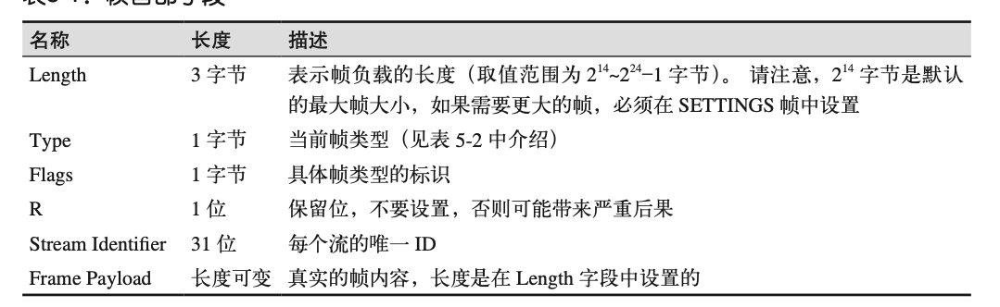

# HTTP 2.0

>记录下http2.0的学习

### HTTP2 能带给我们什么？

+ 相比http1.1 更低的时延
+ 解决http1.1 对头阻塞问题
+ 向下兼容http1.1
+ tcp连接的多路复用,一个连接发送多次请求

### 特点

`二进制协议,首部压缩,多路复用,加密传输`

### HTTP2 分层

+ 分帧层

  tcp连接多路复用的核心部分

+ 数据层

  数据层兼容http1.1

###  帧

http2是基于帧的协议，http1.1是基于文本的协议,提升了解析效率和减少了出错的概率。

HTTP2帧结构:

帧类型:

