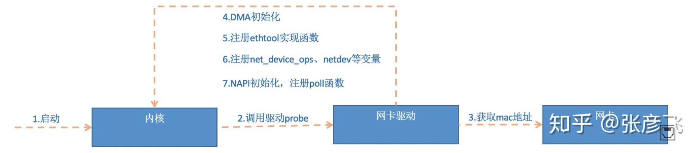

# Linux

>Linux 内核最初只是由芬兰人林纳斯·托瓦兹（Linus Torvalds）在赫尔辛基大学上学时出于个人爱好而编写的。
>
>Linux 是一套免费使用和自由传播的类 Unix 操作系统，是一个基于 POSIX 和 UNIX 的多用户、多任务、支持多线程和多 CPU 的操作系统。
>
>Linux 能运行主要的 UNIX 工具软件、应用程序和网络协议。它支持 32 位和 64 位硬件。Linux 继承了 Unix 以网络为核心的设计思想，是一个性能稳定的多用户网络操作系统。

### 发行版

Linux 的发行版说简单点就是将 Linux 内核与应用软件做一个打包。


目前市面上较知名的发行版有：Ubuntu、RedHat、CentOS、Debian、Fedora、SuSE、OpenSUSE、Arch Linux、SolusOS 等。


### Linux vs Windows

目前国内 Linux 更多的是应用于服务器上，而桌面操作系统更多使用的是 Windows。主要区别如下

| 比较     | Windows                                                      | Linux                                                        |
| :------- | :----------------------------------------------------------- | :----------------------------------------------------------- |
| 界面     | 界面统一，外壳程序固定所有 Windows 程序菜单几乎一致，快捷键也几乎相同 | 图形界面风格依发布版不同而不同，可能互不兼容。GNU/Linux 的终端机是从 UNIX 传承下来，基本命令和操作方法也几乎一致。 |
| 驱动程序 | 驱动程序丰富，版本更新频繁。默认安装程序里面一般包含有该版本发布时流行的硬件驱动程序，之后所出的新硬件驱动依赖于硬件厂商提供。对于一些老硬件，如果没有了原配的驱动有时很难支持。另外，有时硬件厂商未提供所需版本的 Windows 下的驱动，也会比较头痛。 | 由志愿者开发，由 Linux 核心开发小组发布，很多硬件厂商基于版权考虑并未提供驱动程序，尽管多数无需手动安装，但是涉及安装则相对复杂，使得新用户面对驱动程序问题（是否存在和安装方法）会一筹莫展。但是在开源开发模式下，许多老硬件尽管在Windows下很难支持的也容易找到驱动。HP、Intel、AMD 等硬件厂商逐步不同程度支持开源驱动，问题正在得到缓解。 |
| 使用     | 使用比较简单，容易入门。图形化界面对没有计算机背景知识的用户使用十分有利。 | 图形界面使用简单，容易入门。文字界面，需要学习才能掌握。     |
| 学习     | 系统构造复杂、变化频繁，且知识、技能淘汰快，深入学习困难。   | 系统构造简单、稳定，且知识、技能传承性好，深入学习相对容易。 |
| 软件     | 每一种特定功能可能都需要商业软件的支持，需要购买相应的授权。 | 大部分软件都可以自由获取，同样功能的软件选择较少。           |


### Linux 文件基本属性

Linux系统是一种典型的多用户系统，不同的用户处于不同的地位，拥有不同的权限。为了保护系统的安全性，Linux系统对不同的用户访问同一文件（包括目录文件）的权限做了不同的规定。

在Linux中我们可以使用ll或者ls –l命令来显示一个文件的属性以及文件所属的用户和组，如：

~~~shell
[root@www /]# ls -l
total 64
dr-xr-xr-x   2 root root 4096 Dec 14  2012 bin
dr-xr-xr-x   4 root root 4096 Apr 19  2012 boot
……
~~~

实例中，bin文件的第一个属性用"d"表示。"d"在Linux中代表该文件是一个目录文件。

在Linux中第一个字符代表这个文件是目录、文件或链接文件等等。

- 当为[ **d** ]则是目录
- 当为[ **-** ]则是文件；
- 若是[ **l** ]则表示为链接文档(link file)；
- 若是[ **b** ]则表示为装置文件里面的可供储存的接口设备(可随机存取装置)；
- 若是[ **c** ]则表示为装置文件里面的串行端口设备，例如键盘、鼠标(一次性读取装置)。


### Linux系统用户账号的管理

用户账号的管理工作主要涉及到用户账号的添加、修改和删除。

添加用户账号就是在系统中创建一个新账号，然后为新账号分配用户号、用户组、主目录和登录Shell等资源。刚添加的账号是被锁定的，无法使用。

#### 1、添加新的用户账号使用useradd命令

```shell
useradd 选项 用户名
```

参数说明：

- 选项:

  - -c comment 指定一段注释性描述。
  - -d 目录 指定用户主目录，如果此目录不存在，则同时使用-m选项，可以创建主目录。
  - -g 用户组 指定用户所属的用户组。
  - -G 用户组，用户组 指定用户所属的附加组。
  - -s Shell文件 指定用户的登录Shell。
  - -u 用户号 指定用户的用户号，如果同时有-o选项，则可以重复使用其他用户的标识号。

- 用户名:

  指定新账号的登录名。

##### 实例1

```
# useradd –d  /home/sam -m sam
```

此命令创建了一个用户sam，其中-d和-m选项用来为登录名sam产生一个主目录 /home/sam（/home为默认的用户主目录所在的父目录）。

##### 实例2

```
# useradd -s /bin/sh -g group –G adm,root gem
```

此命令新建了一个用户gem，该用户的登录Shell是 `/bin/sh`，它属于group用户组，同时又属于adm和root用户组，其中group用户组是其主组。

这里可能新建组：`#groupadd group及groupadd adm`

增加用户账号就是在/etc/passwd文件中为新用户增加一条记录，同时更新其他系统文件如/etc/shadow, /etc/group等。

Linux提供了集成的系统管理工具userconf，它可以用来对用户账号进行统一管理。


#### 2、删除帐号

如果一个用户的账号不再使用，可以从系统中删除。删除用户账号就是要将/etc/passwd等系统文件中的该用户记录删除，必要时还删除用户的主目录。

删除一个已有的用户账号使用`userdel`命令，其格式如下：

```shell
userdel 选项 用户名
```

常用的选项是 **-r**，它的作用是把用户的主目录一起删除。

例如：

```shell
userdel -r sam
```

此命令删除用户sam在系统文件中（主要是/etc/passwd, /etc/shadow, /etc/group等）的记录，同时删除用户的主目录。

#### 3、修改帐号

修改用户账号就是根据实际情况更改用户的有关属性，如用户号、主目录、用户组、登录Shell等。

修改已有用户的信息使用`usermod`命令，其格式如下：

```
usermod 选项 用户名
```

常用的选项包括`-c, -d, -m, -g, -G, -s, -u以及-o等`，这些选项的意义与`useradd`命令中的选项一样，可以为用户指定新的资源值。

另外，有些系统可以使用选项：-l 新用户名

这个选项指定一个新的账号，即将原来的用户名改为新的用户名。

例如：

```
# usermod -s /bin/ksh -d /home/z –g developer sam
```

此命令将用户sam的登录Shell修改为ksh，主目录改为/home/z，用户组改为developer。


#### 4、用户口令的管理

用户管理的一项重要内容是用户口令的管理。用户账号刚创建时没有口令，但是被系统锁定，无法使用，必须为其指定口令后才可以使用，即使是指定空口令。

指定和修改用户口令的Shell命令是`passwd`。超级用户可以为自己和其他用户指定口令，普通用户只能用它修改自己的口令。命令的格式为：

```
passwd 选项 用户名
```

可使用的选项：

- -l 锁定口令，即禁用账号。
- -u 口令解锁。
- -d 使账号无口令。
- -f 强迫用户下次登录时修改口令。

如果默认用户名，则修改当前用户的口令。

例如，假设当前用户是sam，则下面的命令修改该用户自己的口令：

```
$ passwd 
Old password:****** 
New password:******* 
Re-enter new password:*******
```

如果是超级用户，可以用下列形式指定任何用户的口令：

```
# passwd sam 
New password:******* 
Re-enter new password:*******
```

普通用户修改自己的口令时，passwd命令会先询问原口令，验证后再要求用户输入两遍新口令，如果两次输入的口令一致，则将这个口令指定给用户；而超级用户为用户指定口令时，就不需要知道原口令。

为了系统安全起见，用户应该选择比较复杂的口令，例如最好使用8位长的口令，口令中包含有大写、小写字母和数字，并且应该与姓名、生日等不相同。

为用户指定空口令时，执行下列形式的命令：

```
# passwd -d sam
```

此命令将用户 sam 的口令删除，这样用户 sam 下一次登录时，系统就不再允许该用户登录了。

passwd 命令还可以用 -l(lock) 选项锁定某一用户，使其不能登录，例如：

```
# passwd -l sam
```


### Linux系统用户组的管理

每个用户都有一个用户组，系统可以对一个用户组中的所有用户进行集中管理。不同Linux 系统对用户组的规定有所不同，如Linux下的用户属于与它同名的用户组，这个用户组在创建用户时同时创建。

用户组的管理涉及用户组的添加、删除和修改。组的增加、删除和修改实际上就是对/etc/group文件的更新。

#### 1、增加一个新的用户组使用groupadd命令

```
groupadd 选项 用户组
```

可以使用的选项有：

- -g GID 指定新用户组的组标识号（GID）。
- -o 一般与-g选项同时使用，表示新用户组的GID可以与系统已有用户组的GID相同。

##### 实例1：

```
# groupadd group1
```

此命令向系统中增加了一个新组group1，新组的组标识号是在当前已有的最大组标识号的基础上加1。

##### 实例2：

```
# groupadd -g 101 group2
```

此命令向系统中增加了一个新组group2，同时指定新组的组标识号是101。

#### 2、如果要删除一个已有的用户组，使用groupdel命令

```
groupdel 用户组
```

##### 例如：

```
# groupdel group1
```

此命令从系统中删除组group1。

#### 3、修改用户组的属性使用groupmod命令

```
groupmod 选项 用户组
```

常用的选项有：

- -g GID 为用户组指定新的组标识号。
- -o 与-g选项同时使用，用户组的新GID可以与系统已有用户组的GID相同。
- -n新用户组 将用户组的名字改为新名字

##### 实例1：

```
# groupmod -g 102 group2
```

此命令将组group2的组标识号修改为102。

##### 实例2：

```
# groupmod –g 10000 -n group3 group2
```

此命令将组group2的标识号改为10000，组名修改为group3。

#### 4、如果一个用户同时属于多个用户组，那么用户可以在用户组之间切换，以便具有其他用户组的权限。

用户可以在登录后，使用命令newgrp切换到其他用户组，这个命令的参数就是目的用户组。例如：

```
$ newgrp root
```

这条命令将当前用户切换到root用户组，前提条件是root用户组确实是该用户的主组或附加组。类似于用户账号的管理，用户组的管理也可以通过集成的系统管理工具来完成。


### Linux 权限使用

> 首先，我们规定 数字 4 、2 和 1表示读、写、执行权限
>
> 即 r=4，w=2，x=1 。此时其他的权限组合也可以用其他的八进制数字表示出来，如： rwx = 4 + 2 + 1 = 7 rw = 4 + 2 = 6 rx = 4 +1 = 5
>
> 若要同时设置 rwx (可读写运行） 权限则将该权限位 设置 为 4 + 2 + 1 = 7 若要同时设置 rw- （可读写不可运行）权限则将该权限位 设置 为 4 + 2 = 6 若要同时设置 r-x （可读可运行不可写）权限则将该权限位 设置 为 4 +1 = 5
>
> 每个文件都可以针对三个粒度，设置不同的rwx(读写执行)权限。即我们可以用用三个8进制数字分别表示 拥有者 、群组 、其它组( u、 g 、o)的权限详情，并用chmod直接加三个8进制数字的方式直接改变文件权限。
>
> u 表示该文件的拥有者，g 表示与该文件的拥有者属于同一个群体(group)者，o 表示其他以外的人，a 表示这三者皆是。u用户 g组 o其它  a 所有用户(默认)

```shell
chmod 777 file  (等价于  chmod u=rwx,g=rwx,o=rwx file 或  chmod a=rwx file)
chmod 600 file (等价于  chmod u=rw,g=---,o=--- file 或 chmod u=rw,go-rwx file )
更改文件拥有者（chown命令）
```

常见的权限表示形式有：

```
-rw------- (600)      只有拥有者有读写权限。
-rw-r--r-- (644)      只有拥有者有读写权限；而属组用户和其他用户只有读权限。
-rwx------ (700)     只有拥有者有读、写、执行权限。
-rwxr-xr-x (755)    拥有者有读、写、执行权限；而属组用户和其他用户只有读、执行权限。
-rwx--x--x (711)    拥有者有读、写、执行权限；而属组用户和其他用户只有执行权限。
-rw-rw-rw- (666)   所有用户都有文件读、写权限。
-rwxrwxrwx (777)  所有用户都有读、写、执行权限。
```

##### 更改文件拥有者

使用chown命令来更改文件的拥有者

```shell
设置文件 d.key、e.scrt的拥有者设为 users 群体的 tom
chown tom:users file d.key e.scrt
```


### Linux网络收发包过程

在TCP/IP网络分层模型里，整个协议栈被分成了物理层、链路层、网络层，传输层和应用层。物理层对应的是网卡和网线，应用层对应的是我们常见的Nginx，FTP等等各种应用。Linux实现的是链路层、网络层和传输层这三层。

在Linux内核实现中，链路层协议靠网卡驱动来实现，内核协议栈来实现网络层和传输层。内核对更上层的应用层提供socket接口来供用户进程访问。我们用Linux的视角来看到的TCP/IP网络分层模型应该是下面这个样子的。


在Linux的源代码中，网络设备驱动对应的逻辑位于`driver/net/ethernet`, 其中intel系列网卡的驱动在`driver/net/ethernet/intel`目录下。协议栈模块代码位于`kernel`和`net`目录。

内核和网络设备驱动是通过中断的方式来处理的。当设备上有数据到达的时候，会给CPU的相关引脚上触发一个电压变化，以通知CPU来处理数据。对于网络模块来说，由于处理过程比较复杂和耗时，如果在中断函数中完成所有的处理，将会导致中断处理函数（优先级过高）将过度占据CPU，将导致CPU无法响应其它设备，例如鼠标和键盘的消息。因此Linux中断处理函数是分上半部和下半部的。上半部是只进行最简单的工作，快速处理然后释放CPU，接着CPU就可以允许其它中断进来。剩下将绝大部分的工作都放到下半部中，可以慢慢从容处理。2.4以后的内核版本采用的下半部实现方式是软中断，由ksoftirqd内核线程全权处理。和硬中断不同的是，硬中断是通过给CPU物理引脚施加电压变化，而软中断是通过给内存中的一个变量的二进制值以通知软中断处理程序。

好了，大概了解了网卡驱动、硬中断、软中断和ksoftirqd线程之后，我们在这几个概念的基础上给出一个内核收包的路径示意:


当网卡上收到数据以后，Linux中第一个工作的模块是网络驱动。 网络驱动会以DMA的方式把网卡上收到的帧写到内存里。再向CPU发起一个中断，以通知CPU有数据到达。第二，当CPU收到中断请求后，会去调用网络驱动注册的中断处理函数。 网卡的中断处理函数并不做过多工作，发出软中断请求，然后尽快释放CPU。ksoftirqd检测到有软中断请求到达，调用poll开始轮询收包，收到后交由各级协议栈处理。对于UDP包来说，会被放到用户socket的接收队列中。

我们从上面这张图中已经从整体上把握到了Linux对数据包的处理过程。但是要想了解更多网络模块工作的细节，我们还得往下看。

#### Linux启动

Linux驱动，内核协议栈等等模块在具备接收网卡数据包之前，要做很多的准备工作才行。比如要提前创建好ksoftirqd内核线程，要注册好各个协议对应的处理函数，网络设备子系统要提前初始化好，网卡要启动好。只有这些都Ready之后，我们才能真正开始接收数据包。那么我们现在来看看这些准备工作都是怎么做的。

##### 创建ksoftirqd内核线程

Linux的软中断都是在专门的内核线程（ksoftirqd）中进行的，因此我们非常有必要看一下这些进程是怎么初始化的，这样我们才能在后面更准确地了解收包过程。该进程数量不是1个，而是N个，其中N等于你的机器的核数。

系统初始化的时候在kernel/smpboot.c中调用了smpboot_register_percpu_thread， 该函数进一步会执行到spawn_ksoftirqd（位于kernel/softirq.c）来创建出softirqd进程。


当ksoftirqd被创建出来以后，它就会进入自己的线程循环函数ksoftirqd_should_run和run_ksoftirqd了。不停地判断有没有软中断需要被处理。这里需要注意的一点是，软中断不仅仅只有网络软中断，还有其它类型。

```c
//file: include/linux/interrupt.h
enum
{
    HI_SOFTIRQ=0,
    TIMER_SOFTIRQ,
    NET_TX_SOFTIRQ,
    NET_RX_SOFTIRQ,
    BLOCK_SOFTIRQ,
    BLOCK_IOPOLL_SOFTIRQ,
    TASKLET_SOFTIRQ,
    SCHED_SOFTIRQ,
    HRTIMER_SOFTIRQ,
    RCU_SOFTIRQ,    /* Preferable RCU should always be the last softirq */

    NR_SOFTIRQS
};
```

##### 网络子系统初始化


linux内核通过调用`subsys_initcall`来初始化各个子系统，在源代码目录里你可以grep出许多对这个函数的调用。这里我们要说的是网络子系统的初始化，会执行到`net_dev_init`函数。

```c
//file: net/core/dev.c
static int __init net_dev_init(void)
{
    ......

    for_each_possible_cpu(i) {
        struct softnet_data *sd = &per_cpu(softnet_data, i);

        memset(sd, 0, sizeof(*sd));
        skb_queue_head_init(&sd->input_pkt_queue);
        skb_queue_head_init(&sd->process_queue);
        sd->completion_queue = NULL;
        INIT_LIST_HEAD(&sd->poll_list);

        ......
    }

    ......

    open_softirq(NET_TX_SOFTIRQ, net_tx_action);
    open_softirq(NET_RX_SOFTIRQ, net_rx_action);
}
subsys_initcall(net_dev_init);
```

在这个函数里，会为每个CPU都申请一个`softnet_data`数据结构，在这个数据结构里的`poll_list`是等待驱动程序将其poll函数注册进来，稍后网卡驱动初始化的时候我们可以看到这一过程。

另外open_softirq注册了每一种软中断都注册一个处理函数。 NET_TX_SOFTIRQ的处理函数为net_tx_action，NET_RX_SOFTIRQ的为net_rx_action。继续跟踪`open_softirq`后发现这个注册的方式是记录在`softirq_vec`变量里的。后面ksoftirqd线程收到软中断的时候，也会使用这个变量来找到每一种软中断对应的处理函数。

```c
//file: kernel/softirq.c
void open_softirq(int nr, void (*action)(struct softirq_action *))
{
    softirq_vec[nr].action = action;
}
```

##### 协议栈注册

内核实现了网络层的ip协议，也实现了传输层的tcp协议和udp协议。 这些协议对应的实现函数分别是ip_rcv(),tcp_v4_rcv()和udp_rcv()。和我们平时写代码的方式不一样的是，内核是通过注册的方式来实现的。 Linux内核中的`fs_initcall`和`subsys_initcall`类似，也是初始化模块的入口。`fs_initcall`调用`inet_init`后开始网络协议栈注册。 通过`inet_init`，将这些函数注册到了inet_protos和ptype_base数据结构中了。如下图:


##### 网卡驱动初始化

每一个驱动程序（不仅仅只是网卡驱动）会使用 `module_init` 向内核注册一个初始化函数，当驱动被加载时，内核会调用这个函数。

驱动调用完成后，Linux内核就知道了该驱动的相关信息。当网卡设备被识别以后，内核会调用其驱动的probe方法，驱动probe方法执行的目的就是让设备ready



第5步中我们看到，网卡驱动**实现了ethtool所需要的接口**，也在这里**注册完成函数地址的注册**。当 `ethtool`发起一个系统调用之后，内核会找到对应操作的回调函数。

##### 启动网卡

当上面的初始化都完成以后，就可以启动网卡了。我们在驱动初始化时，会将网卡启用、法宝、设置mac地址等回调函数注册。当启用一个网卡是，这些注册了的方法会被调用


##### 总结

首先在开始收包之前，Linux要做许多的准备工作：

1. 创建ksoftirqd线程，为它设置好它自己的线程函数，后面就指望着它来处理软中断呢。

2. 协议栈注册，linux要实现许多协议，比如arp，icmp，ip，udp，tcp，每一个协议都会将自己的处理函数注册一下，方便包来了迅速找到对应的处理函数

3. 网卡驱动初始化，每个驱动都有一个初始化函数，内核会让驱动也初始化一下。在这个初始化过程中，把自己的DMA准备好，把NAPI的poll函数地址告诉内核

4. 启动网卡，分配RX，TX队列，注册中断对应的处理函数

以上是内核准备收包之前的重要工作，当上面都ready之后，就可以打开硬中断，等待数据包的到来了。

当数据到来了以后，第一个迎接它的是网卡：

1. 网卡将数据帧DMA到内存的RingBuffer中，然后向CPU发起中断通知

2.  CPU响应中断请求，调用网卡启动时注册的中断处理函数
3.  中断处理函数几乎没干啥，就发起了软中断请求
4. 内核线程ksoftirqd线程发现有软中断请求到来，先关闭硬中断
5.  ksoftirqd线程开始调用驱动的poll函数收包
6.  poll函数将收到的包送到协议栈注册的ip_rcv函数中
7.  ip_rcv函数再讲包送到udp_rcv函数中（对于tcp包就送到tcp_rcv）

理解了整个收包过程以后，我们就能明确知道Linux收一个包的CPU开销了。首先第一块是用户进程调用系统调用陷入内核态的开销。第二块是CPU响应包的硬中断的CPU开销。第三块是ksoftirqd内核线程的软中断上下文花费的。

##### 参考

- [图解Linux网络包接收过程](https://zhuanlan.zhihu.com/p/256428917?utm_source=wechat_session&utm_medium=social&utm_oi=74052207116288)