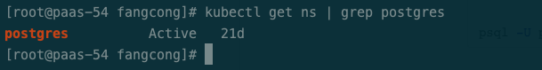
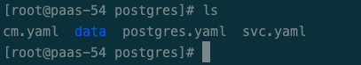
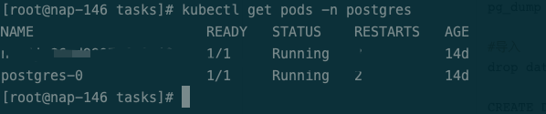

# 在kubernetes上运行Postgres以及Postgres特性

>Postgres 是一款开源的关系性数据库，并且自称是世界上最先进的开源关系性数据库。经过30多年的积极开发，已在可靠性，功能健壮性和性能方面赢得了极高的声誉。

## 安装

官方文档对于源代码安装和二进制安装的教程已经十分详细这里不详细介绍了，这里我会介绍**如何在kubernetes上安装postgresql数据库**

第一步：下载postgres的镜像,需要docker环境,这里以postgres:11.3为例

~~~shell
docker pull postgres:11.3
~~~


第二步：创建namesapce postgres 我们会将postgres放在postgres 的namespace下

~~~shell
kubectl create ns postgres
~~~



第三步：准备好postgres的资源定义文件，有三个: **cm.yaml(挂载配置文件)，postgres.yaml(资源定义), svc.yaml(服务发现)**

### cm.yaml

~~~yaml
apiVersion: v1
kind: ConfigMap
metadata:
  name: postgres-cm                                 # configmaps的名称
  namespace: postgres                               # configmaps的域
  labels:
    app: postgres-cm                                # 标签
data:
  master.conf: |
    listen_addresses = '*'                          # 监听所有IP
    archive_mode = on                               # 允许归档
    archive_command = 'cp %p /var/lib/postgresql/data/pg_archive/%f'  # 用该命令来归档logfile segment
    wal_level = hot_standby                         #开启热备
    max_wal_senders = 32                            # 这个设置了可以最多有几个流复制连接，差不多有几个从，就设置几个
    wal_keep_segments = 64                          # 设置流复制保留的最多的xlog数目，一份是 16M，注意机器磁盘 16M*64 = 1G
    wal_sender_timeout = 60s                        # 设置流复制主机发送数据的超时时间
    max_connections = 100                           # 这个设置要注意下，从库的max_connections必须要大于主库的
  pg_hba.conf: |
    local   all             all                                     trust
    host    all             all             127.0.0.1/32            trust
    host    all             all             ::1/128                 trust
    local   replication     all                                     trust
    host    replication     all             127.0.0.1/32            trust
    host    replication     all             ::1/128                 trust
    host 	all 			all 			all 					trust
    host    all             all        		0.0.0.0/0          		trust
    host   	replication     postgres       	0.0.0.0/0          		trust
  slave.conf: |
    wal_level = hot_standby                         # 热备
    max_connections = 1000                          # 一般查多于写的应用从库的最大连接数要比较大
    hot_standby = on                                # 说明这台机器不仅仅是用于数据归档，也用于数据查询
    max_standby_streaming_delay = 30s               # 数据流备份的最大延迟时间
    wal_receiver_status_interval = 10s              # 多久向主报告一次从的状态，当然从每次数据复制都会向主报告状态，这里只是设置最长的间隔时间
    hot_standby_feedback = on                       # 如果有错误的数据复制，是否向主进行反馈
    log_destination = 'csvlog'                      # 日志文件的位置
    logging_collector = on                          # 启动日志信息写到了当前terminal的stdout,系统操作日志信息写到了pg_log/enterprisedb-*.log
    log_directory = 'log'                           # 日志文件目录
  recovery.conf: |
    standby_mode = on                               # 启动从节点
    primary_conninfo = 'host=postgres-0.postgres.postgres port=5432 user=postgres password=r00tme'  # 主节点信息
    recovery_target_timeline = 'latest'             # 更新备份[root@paas-54 postgres]
~~~

### postgres.yaml

~~~yaml
apiVersion: apps/v1
kind: StatefulSet
metadata:
  name: postgres                                      # 主库
  namespace: postgres                                 # 使用postgres域
spec:
  replicas: 1      # 创建副本数
  selector:
    matchLabels:
      app: postgres                                   # 被{"app":"postgres"}的标签匹配
  serviceName: postgres                               # Statefulset使用的Headless Serivce为postgres
  template:                                           # 创建Pod模板
    metadata:
      name: postgres                                  # 创建Pod名
      labels:
        app: postgres                                 # Pod对应的标签
        node: master                                  # 只能在主节点上部署
    spec:
      tolerations:                                    # 1分钟如果节点不可达视为异常
      - key: "node.kubernetes.io/unreachable"
        operator: "Exists"
        effect: "NoExecute"
        tolerationSeconds: 60
      - key: "node.kubernetes.io/not-ready"
        operator: "Exists"
        effect: "NoExecute"
        tolerationSeconds: 60
      affinity:                                       # 亲和性
        nodeAffinity:                              # Pod亲和性
          requiredDuringSchedulingIgnoredDuringExecution:   # 硬要求
            nodeSelectorTerms:
            - matchExpressions:
              - key: node                             # 根据label是node的键来配对
                operator: In                          # 适用表达式
                values:                               # 值如下
                - master                              # 调度到有master标签的节点
        podAntiAffinity:                              # 如果检测到节点有{app:postgres}则不部署，避免postgres在同一节点重复部署
          requiredDuringSchedulingIgnoredDuringExecution:
          - labelSelector:
              matchExpressions:
              - key: app
                operator: In
                values:
                - postgres
            topologyKey: "kubernetes.io/hostname"
      terminationGracePeriodSeconds: 0                # 异常立即删除
      initContainers:                                 # 初始化容器
      - command:                                      # 命令
        - bash
        - "-c"
        - |
          set -ex                                     # 写入环境变量
          [[ `hostname` =~ -([0-9]+)$ ]]              # 获取容器的主机名，用于数据库同步判断
          ordinal=${BASH_REMATCH[1]}                  # 获取主机名后获取主机编号
          if [[ $ordinal -eq 0 ]]; then               # 如果是postgres-0,也就是主节点
            echo test
          else                                        # 如果是非postgres-0,则为从节点
            rm /var/lib/postgresql/data1 -fr
            mkdir -p /var/lib/postgresql/data1
            pg_basebackup -h  postgres-0.postgres.postgres -U postgres -D /var/lib/postgresql/data1 -X stream -P    # 与postgres-0进行同步
            \cp /mnt/config-map/slave.conf /var/lib/postgresql/data1/postgresql.conf -f          # 写入配置文件
            \cp /mnt/config-map/recovery.conf /var/lib/postgresql/data1/recovery.conf -f         # 写入配置文件
            rm /var/lib/postgresql/data/* -fr
            mv /var/lib/postgresql/data1/* /var/lib/postgresql/data/
          fi
        env:
        - name: POSTGRES_USER                         # 数据库用户
          value: postgres
        - name: POSTGRES_DB                           # 数据库DB
          value: test
        name: init-postgres                           # 容器名
        image: postgres:11.3    # 镜像名
        imagePullPolicy: IfNotPresent                 # 若镜像存在，则不拉取
        volumeMounts:                                 # 容器内挂载目录
        - name: postgres-pv                           # 挂载文件名
          mountPath: /var/lib/postgresql/data/        # 挂载路径
        - name: config-map                            # configmap的文件存储路径
          mountPath: /mnt/config-map                  # 存储路径
        - name: tz
          mountPath: /etc/localtime
      containers:                                     # Pod中容器
      - name: postgres                                # 容器名
        image: postgres:11.3    # 镜像名
        ports:                                        # 端口
        - name: postgres                              # 端口名
          containerPort: 5432                         # 端口号
        volumeMounts:                                 # 容器内挂载目录
        - name: postgres-pv                           # 挂载文件名
          mountPath: /var/lib/postgresql/data/        # 挂载路径
        - name: config-map                            # configmap的文件存储路径
          mountPath: /mnt/config-map                  # 存储路径
        - name: tz
          mountPath: /etc/localtime
        env:                                          # 环境变量
        - name: TZ                                    # 时区，键
          value: Asia/Shanghai                        # 值
      volumes:                                        # Pod外挂载位置
      - name: postgres-pv                             # 挂载文件名
        hostPath:                                     # 挂载在主机目录
          path: /srv/system/postgres/data           # 主机目录路径
      - name: tz
        hostPath:
          path: /etc/localtime
      - name: config-map                              # 挂载文件名
        configMap:                                    # 挂载在configmaps
          name: postgres-cm                           # configmaps的名字
~~~

### svc.yaml

~~~yaml
apiVersion: v1
kind: Service
metadata:
  name: postgres         # 服务名
  namespace: postgres    # 服务所在域
  labels:                # 标签
    app: postgres        # 键值对为{"app":"postgres"}的标签
spec:
  ports:                 # 端口
  - name: postgres       # 端口名
    port: 5432           # 内部服务访问Service的端口
  clusterIP: None        # Headless Service,设置后服务没有内网IP，访问服务会直接寻路到Pod
  selector:              # 服务选择器
    app: postgres        # 服务选择标签键值对为{"app":"postgres"}的Pod
---
apiVersion: v1
kind: Service
metadata:
  name: postgres-read    # 服务名
  namespace: postgres    # 服务所在域
  labels:                # 标签
    app: postgres        # 键值对为{"app":"postgres"}的标签
spec:
  externalIPs:               # 暴露Service到外部IP
  - 192.168.1.225        #填宿主机ip即可
  ports:                 # 端口
  - name: postgres       # 端口名
    port: 5432           # 内部服务访问Service的端口
    targetPort: 5432     # Pod内的端口
  selector:              # 服务选择器
    app: postgres        # 服务选择标签键值对为{"app":"postgres-slave"}的Pod
~~~


### 创建数据挂载目录

~~~shell
mkdir data
~~~



### 启动

~~~shell
kubectl apply -f .
~~~

### 写入配置文件

这里由于一些原因，导致需要手动将文件写入，这一步是可以省略的，可以在yaml定义里面去优化,具体优化以后在进行。

写入postgresql.conf

~~~shell
kubectl exec -it postgres-0 -n postgres -- sh -c 'cp /mnt/config-map/master.conf /var/lib/postgresql/data/postgresql.conf -f'
~~~

写入pg_hab.conf

~~~shell
kubectl exec -it postgres-0 -n postgres -- sh -c 'cp /mnt/config-map/pg_hba.conf /var/lib/postgresql/data/pg_hba.conf -f'
~~~

### 重启

~~~shell
kubectl delete pods postgres-0 -n postgres
~~~




## 特性

在使用方面，postgres性能十分强劲，使用起来也十分方便。

### 不只是关系性数据库

postgresql 自称**世界上最先进的开源关系数据库**，但其实postgres丰富的数据类型以及支持json,这让它完全可以像mongodb一样来存储文档,并且postgres的性能更好


postgres和mongodb 在文档数据方面的性能比较 [postgres vs mongodb](https://www.prnewswire.com/news-releases/new-benchmarks-show-postgres-dominating-mongodb-in-varied-workloads-300875314.html#:~:text=As%20shown%20in%20the%20graph,performance%20advantage%20grows%20over%20MongoDB)

#### 丰富的数据类型

如果没有足够丰富的数据类型，postgres也不会来分mongodb的蛋糕

##### 网络地址类型

PostgreSQL提供用于存储 IPv4、IPv6 和 MAC 地址的数据类型， 用这些数据类型存储网络地址比用纯文本类型好，因为这些类型提供输入错误检查以及特殊的操作符和函数

| 名字       | 存储尺寸  | 描述                   |
| ---------- | --------- | ---------------------- |
| `cidr`     | 7或19字节 | IPv4和IPv6网络         |
| `inet`     | 7或19字节 | IPv4和IPv6主机以及网络 |
| `macaddr`  | 6字节     | MAC地址                |
| `macaddr8` | 8 bytes   | MAC地址（EUI-64格式）  |

###### 操作符

| 操作符 | 描述                                      | 例子                                            |
| ------ | ----------------------------------------- | ----------------------------------------------- |
| `<`    | 小于                                      | `inet '192.168.1.5' < inet '192.168.1.6'`       |
| `<=`   | 小于等于                                  | `inet '192.168.1.5' <= inet '192.168.1.5'`      |
| `=`    | 等于                                      | `inet '192.168.1.5' = inet '192.168.1.5'`       |
| `>=`   | 大于等于                                  | `inet '192.168.1.5' >= inet '192.168.1.5'`      |
| `>`    | 大于                                      | `inet '192.168.1.5' > inet '192.168.1.4'`       |
| `<>`   | 不等于                                    | `inet '192.168.1.5' <> inet '192.168.1.4'`      |
| `<<`   | 被包含在内                                | `inet '192.168.1.5' << inet '192.168.1/24'`     |
| `<<=`  | 被包含在内或等于                          | `inet '192.168.1/24' <<= inet '192.168.1/24'`   |
| `>>`   | 包含                                      | `inet '192.168.1/24' >> inet '192.168.1.5'`     |
| `>>=`  | 包含或等于                                | `inet '192.168.1/24' >>= inet '192.168.1/24'`   |
| `&&`   | 包含或者被包含contains or is contained by | `inet '192.168.1/24' && inet '192.168.1.80/28'` |
| `~`    | 按位 NOT                                  | `~ inet '192.168.1.6'`                          |
| `&`    | 按位 AND                                  | `inet '192.168.1.6' & inet '0.0.0.255'`         |
| `|`    | 按位 OR                                   | `inet '192.168.1.6' | inet '0.0.0.255'`         |
| `+`    | 加                                        | `inet '192.168.1.6' + 25`                       |
| `-`    | 减                                        | `inet '192.168.1.43' - 36`                      |
| `-`    | 减                                        | `inet '192.168.1.43' - inet '192.168.1.19'`     |

###### 函数

| 函数                           | 返回类型  | 描述                                | 例子                                             | 结果               |
| ------------------------------ | --------- | ----------------------------------- | ------------------------------------------------ | ------------------ |
| `abbrev(inet)`                 | `text`    | 缩写显示格式文本                    | `abbrev(inet '10.1.0.0/16')`                     | `10.1.0.0/16`      |
| `abbrev(cidr)`                 | `text`    | 缩写显示格式文本                    | `abbrev(cidr '10.1.0.0/16')`                     | `10.1/16`          |
| `broadcast(inet)`              | `inet`    | 网络广播地址                        | `broadcast('192.168.1.5/24')`                    | `192.168.1.255/24` |
| `family(inet)`                 | `int`     | 抽取地址族；`4`为 IPv4， `6`为 IPv6 | `family('::1')`                                  | `6`                |
| `host(inet)`                   | `text`    | 抽取 IP 地址为文本                  | `host('192.168.1.5/24')`                         | `192.168.1.5`      |
| `hostmask(inet)`               | `inet`    | 为网络构造主机掩码                  | `hostmask('192.168.23.20/30')`                   | `0.0.0.3`          |
| `masklen(inet)`                | `int`     | 抽取网络掩码长度                    | `masklen('192.168.1.5/24')`                      | `24`               |
| `netmask(inet)`                | `inet`    | 为网络构造网络掩码                  | `netmask('192.168.1.5/24')`                      | `255.255.255.0`    |
| `network(inet)`                | `cidr`    | 抽取地址的网络部分                  | `network('192.168.1.5/24')`                      | `192.168.1.0/24`   |
| `set_masklen(inet, int)`       | `inet`    | 为`inet`值设置网络掩码长度          | `set_masklen('192.168.1.5/24', 16)`              | `192.168.1.5/16`   |
| `set_masklen(cidr, int)`       | `cidr`    | 为`cidr`值设置网络掩码长度          | `set_masklen('192.168.1.0/24'::cidr, 16)`        | `192.168.0.0/16`   |
| `text(inet)`                   | `text`    | 抽取 IP 地址和网络掩码长度为文本    | `text(inet '192.168.1.5')`                       | `192.168.1.5/32`   |
| `inet_same_family(inet, inet)` | `boolean` | 地址是来自于同一个家族吗？          | `inet_same_family('192.168.1.5/24', '::1')`      | `false`            |
| `inet_merge(inet, inet)`       | `cidr`    | 包括给定网络的最小网络              | `inet_merge('192.168.1.5/24', '192.168.2.5/24')` | `192.168.0.0/22`   |

##### json

JSON 数据类型是用来存储 JSON（JavaScript Object Notation） 数据的。这种数据也可以被存储为`text`，但是 JSON 数据类型的优势就在于能强制要求每个被存储的值符合 JSON 规则。也有很多 JSON 相关的函数和操作符可以用于存储在这些数据类型中的数据

json类型也是postgres可以做文档数据库的基础

`json` 和 `jsonb`。它们 **几乎**接受完全相同的值集合作为输入。主要的实际区别之一是效率。`json`数据类型存储输入文本的精准拷贝，处理函数必须在每 次执行时必须重新解析该数据。而`jsonb`数据被存储在一种分解好的 二进制格式中，它在输入时要稍慢一些，因为需要做附加的转换。但是 `jsonb`在处理时要快很多，因为不需要解析。`jsonb`也支持索引，这也是一个令人瞩目的优势。

| 操作符 | 右操作数类型 | 描述                                                    | 例子                                               | 例子结果       |
| ------ | ------------ | ------------------------------------------------------- | -------------------------------------------------- | -------------- |
| `->`   | `int`        | 获得 JSON 数组元素（索引从 0 开始，负整数从末尾开始计） | `'[{"a":"foo"},{"b":"bar"},{"c":"baz"}]'::json->2` | `{"c":"baz"}`  |
| `->`   | `text`       | 通过键获得 JSON 对象域                                  | `'{"a": {"b":"foo"}}'::json->'a'`                  | `{"b":"foo"}`  |
| `->>`  | `int`        | 以`text`形式获得 JSON 数组元素                          | `'[1,2,3]'::json->>2`                              | `3`            |
| `->>`  | `text`       | 以`text`形式获得 JSON 对象域                            | `'{"a":1,"b":2}'::json->>'b'`                      | `2`            |
| `#>`   | `text[]`     | 获取在指定路径的 JSON 对象                              | `'{"a": {"b":{"c": "foo"}}}'::json#>'{a,b}'`       | `{"c": "foo"}` |
| `#>>`  | `text[]`     | 以`text`形式获取在指定路径的 JSON 对象                  | `'{"a":[1,2,3],"b":[4,5,6]}'::json#>>'{a,2}'`      | `3`            |

| 操作符 | 右操作数类型 | 描述                                                         | 例子                                                |
| ------ | ------------ | ------------------------------------------------------------ | --------------------------------------------------- |
| `@>`   | `jsonb`      | 左边的 JSON 值是否在顶层包含右边的 JSON 路径/值项？          | `'{"a":1, "b":2}'::jsonb @> '{"b":2}'::jsonb`       |
| `<@`   | `jsonb`      | 左边的 JSON 路径/值项是否被包含在右边的 JSON 值的顶层？      | `'{"b":2}'::jsonb <@ '{"a":1, "b":2}'::jsonb`       |
| `?`    | `text`       | 键/元素**字符串**是否存在于 JSON 值的顶层？                  | `'{"a":1, "b":2}'::jsonb ? 'b'`                     |
| `?|`   | `text[]`     | 这些数组**字符串**中的任何一个是否做为顶层键存在？           | `'{"a":1, "b":2, "c":3}'::jsonb ?| array['b', 'c']` |
| `?&`   | `text[]`     | 是否所有这些数组*字符串*都作为顶层键存在？                   | `'["a", "b"]'::jsonb ?& array['a', 'b']`            |
| `||`   | `jsonb`      | 把两个`jsonb`值串接成一个新的`jsonb`值                       | `'["a", "b"]'::jsonb || '["c", "d"]'::jsonb`        |
| `-`    | `text`       | 从左操作数删除键/值对或者**string** 元素。键/值对基于它们的键值来匹配。 | `'{"a": "b"}'::jsonb - 'a'`                         |
| `-`    | `text[]`     | 从左操作数中删除多个键/值对或者**string**元素。键/值对基于它们的键值来匹配。 | `'{"a": "b", "c": "d"}'::jsonb - '{a,c}'::text[]`   |
| `-`    | `integer`    | 删除具有指定索引（负值表示倒数）的数组元素。如果 顶层容器不是数组则抛出一个错误。 | `'["a", "b"]'::jsonb - 1`                           |
| `#-`   | `text[]`     | 删除具有指定路径的域或者元素（对于 JSON 数组，负值 表示倒数） | `'["a", {"b":1}]'::jsonb #- '{1,b}'`                |

##### 数组类型

PostgreSQL允许一个表中的列定义为变长多维数组。可以创建任何内建或用户定义的基类、枚举类型、组合类型或者域的数组。

这给我们设计数据结构提供了非常高的灵活度。

```sql
CREATE TABLE sal_emp (
    name            text,
    pay_by_quarter  integer[],
    schedule        text[][],
    body            json
);
```

我可以使用postgres建立上面的这种表,这挣脱了关系性型数据库的舒服，拥抱json

##### 几何类型

几何数据类型表示二维的空间物体。

| 名字      | 存储尺寸   | 表示                     | 描述                      |
| --------- | ---------- | ------------------------ | ------------------------- |
| `point`   | 16字节     | 平面上的点               | (x,y)                     |
| `line`    | 32字节     | 无限长的线               | {A,B,C}                   |
| `lseg`    | 32字节     | 有限线段                 | ((x1,y1),(x2,y2))         |
| `box`     | 32字节     | 矩形框                   | ((x1,y1),(x2,y2))         |
| `path`    | 16+16n字节 | 封闭路径（类似于多边形） | ((x1,y1),...)             |
| `path`    | 16+16n字节 | 开放路径                 | [(x1,y1),...]             |
| `polygon` | 40+16n字节 | 多边形（类似于封闭路径） | ((x1,y1),...)             |
| `circle`  | 24字节     | 圆                       | <(x,y),r>（中心点和半径） |

Postgres有一系列丰富的函数和操作符可用来进行各种几何操作， 如缩放、平移、旋转和计算相交等 

#### 索引

postgres提供了多种适用于不同场景的索引供我们选择使用

+ B-tree 索引:   `CREATE INDEX`命令创建适合于大部分情况的B-tree 索引。

+ Hash 索引:  只能处理简单等值比较。不论何时当一个索引列涉及到一个使用了`=`操作符的比较时，查询规划器将考虑使用一个Hash索引。下面的命令将创建一个Hash索引：

  ~~~sql
  CREATE INDEX name ON policy USING HASH (column);
  ~~~

+ GiST 索引: GiST索引并不是一种单独的索引，而是可以用于实现很多不同索引策略的基础设施 postgres的标准库提供了用于多种二维几何数据类型的GiST操作符。

  ~~~sql
  -- 它将找到离给定目标点最近的10个位置。
  SELECT * FROM places ORDER BY location <-> point '(101,456)' LIMIT 10;
  ~~~

+ BRIN 索引: (块范围索引的缩写）存储有关存放在一个表的连续物理块范围上的值摘要信息。与 GiST、SP-GiST 和 GIN 相似，BRIN 可以支持很多种不同的索引策略，并且可以与一个 BRIN 索引配合使用的特定操作符取决于索引策略。

+ GIN 索引: GIN 索引是“倒排索引”，它适合于包含多个组成值的数据值，例如数组。倒排索引中为每一个组成值都包含一个单独的项，它可以高效地处理测试指定组成值是否存在的查询。

  ~~~sql
  CREATE INDEX idxgin ON policy USING gin (source,destination); -- 在 source 和 destination字段上建立联合索引 遵循最左法则
  ~~~

  

## 运维

这里会记录一些我常遇到的postgres问题和命令

### postgres 数据备份恢复

```shell
#导出sql文件
pg_dump -U postgres nap > nap.sql

#导入
drop database nap; #删除原来的库

CREATE DATABASE nap;

psql -U postgres -d nap -f nap.sql
```

