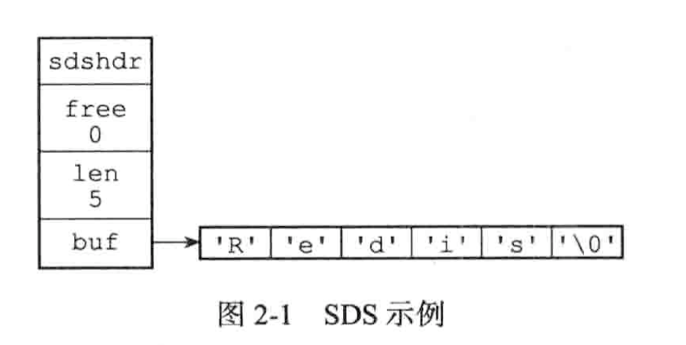

# Redis相关问题

记录一下Redis的学习

### SDS 简单动态字符串

redis没有直接使用C语言的传统字符串表示，而是自己构建了(simple dynamic string)的抽象类型，并且广泛运用在redis的代码当中。

传统的c字符串只会在redis的代码中充当字符串字面量使用，也就是类似于打印日志时 log("xxxxx")这样使用。

sds.h/sdshdr 定义了sds的结构

~~~
struct sdshdr {
		//记录buf数组中所使用的字节数量
		//等于sds所保存的字符串的长度
		int len;
		//记录buf数组中为使用的字节数量
		int free;
		//字节数组 用于保存字符串
		char buf[];
}
~~~

并且还沿用了c字符串的以空字符串'\0'结尾，这样可以重用一部分c字符串函数库里面的函数。

|                 C字符串                  |                  SDS                   |
| :--------------------------------------: | :------------------------------------: |
|       获取字符串长度的复杂度为O(n)       |      获取字符串长度的复杂度为O(1)      |
|    API是不安全的，可能造成缓冲区溢出     |    API是安全的，不会造成缓冲区溢出     |
| 修改字符串长度N次必然要执行N次内存重分配 | 修改字符串长度N次最多执行N次内存重分配 |
|             只能保存文本数据             |       可以保存文本或者二进制数据       |

### 对象的类型与编码

redis内置有5种对象：`字符串，列表，哈希，集合，有序集合`。而redis中也自己实现了许多的数据结构例如:`SDS，双端链表，字典，跳表，压缩列表，整数集合，哈希表`等等，这里不会讨论如何实现这些数据结构，但是redis是用这些实现的数据结构来实现它的5种内置对象的，每种对象都用到了至少一种我们刚才介绍的数据结构。

针对不同的场景，我们可以为对象设置多种不同的数据结构实现，可以优化对象在不同场景下的使用效率。

对象

|   类型常量   |                  对象                  |
| :----------: | :------------------------------------: |
| REDIS_STRING |     字符串对象      |
|  REDIS_LIST  |    列表对象    |
|  REDIS_HASH  | 哈希对象 |
|  REDIS_SET   |       集合对象       |
|  REDIS_ZSET  |             有序集合的对象             |

编码

|         编码常量          |          数据结构          |
| :-----------------------: | :------------------------: |
|    REDIS_ENCODING_INT     |       long类型的整数       |
|   REDIS_ENCODING_EMBSTR   | embstr编码的简单动态字符串 |
|    REDIS_ENCODING_RAW     |       简单动态字符串       |
|     REDIS_ENCODING_HT     |            字典            |
| REDIS_ENCODING_LINKEDLIST |       有序集合的对象       |
|  REDIS_ENCODING_ZIPLIST   |          压缩列表          |
|   REDIS_ENCODING_INTSET   |          整数集合          |
|  REDIS_ENCODING_SKIPLIST  |         跳表，字典         |

对象与编码的关系

|     类型     |           编码            |                    对象                    |
| :----------: | :-----------------------: | :----------------------------------------: |
| REDIS_STRING |    REDIS_ENCODING_INT     |          使用整数实现的字符串对象          |
| REDIS_STRING |   REDIS_ENCODING_EMBSTR   | 使用embstr编码的动态字符串实现的字符串对象 |
| REDIS_STRING |    REDIS_ENCODING_RAW     |     使用简单动态字符串实现的字符串对象     |
|  REDIS_LIST  |  REDIS_ENCODING_ZIPLIST   |         使用压缩列表实现的列表对象         |
|  REDIS_LIST  | REDIS_ENCODING_LINKEDLIST |         使用双端列表实现的列表对象         |
|  REDIS_HASH  |  REDIS_ENCODING_ZIPLIST   |         使用压缩列表实现的哈希对象         |
|  REDIS_HASH  |     REDIS_ENCODING_HT     |           使用字典实现的哈希对象           |
|  REDIS_SET   |   REDIS_ENCODING_INTSET   |         使用整数集合实现的集合对象         |
|  REDIS_SET   |     REDIS_ENCODING_HT     |           使用字典实现的集合对象           |
|  REDIS_ZSET  |  REDIS_ENCODING_ZIPLIST   |       使用压缩列表实现的有序集合对象       |
|  REDIS_ZSET  |  REDIS_ENCODING_SKIPLIST  |      使用跳表和字典实现的有序集合对象      |

### 谨慎处理多数据库程序

到目前为止，Redis仍然没有可以返回客户端目标数据库的命令，虽然redis-cli客户端会在输入符旁边提示当前所使用的目标数据库，但在其他的redis-sdk中并没有继承，所以为了避免对数据库进行误操作，最好先执行下select命令。

### RDB和AOF

rdb和aof 都是redis提供的用于持久化的功能。

RDB持久化保存数据库状态的方法是将数据编码后保存在RDB文件当中，而AOF则是记录执行的`SET,SADD,RPUSH`三个命令保存到AOF文件当中。

两种恢复手段的载入判断流程。

~~~flow
 st=>start: 服务器启动
 e=>end: 载入AOF文件
 e2=>end: 载入RDB文件
 op=>operation: 执行载入程序
 cond=>condition: 已开启AOF持久化功能?
 io=>inputoutput: 输入/输出
 st->op->cond
 cond(yes)->e
 cond(no)->e2
~~~

#### SAVE 和 BGSAVE

这两个命令都用来生成RDB文件，她们主要的区别如下：

**SAVE** 命令会阻塞Redis 服务器进程，直到RDB文件创建完毕，在此期间，redis-server不能处理任何命令请求。

**BGSAVE** 命令会派生出一个子进程，由它来负责创建RDB文件，服务器进程继续进行命令请求。

伪代码：

~~~
def save():
   rdbSave()
   
def bg_save():
   pid = fork() //创建子进程
   
   if pid == 0
     rdbSave()
     signal_parent() //告诉父进程
   elif pid > 0 //父进程继续处理命令请求，并通过轮训等待子进程的信号
     handle_request_and_wait_signal()
   else:
     //处理出错情况
     handle_fork_error()
     
~~~

与生成rdb文件不同，rdb的载入工作是服务器启动时自动执行的，所以redis并没有专门用于载入rdb文件的命令。

由于BGSAVE命令的保存工作是由子进程执行的，所以在子进程创建RDB文件的过程中，Redis服务器仍然可以处理客户端的命令请求，但是在此期间服务器处理`SAVE,BGSAVE,BGREWRITEAOF`三个命令的方式会和平时有所不同。

+ 在BGSAVE命令执行期间，客户端发送的SAVE命令会被服务器拒绝，此举是防止父进程和子进程同时执行rdbSave函数调用，防止产生竞争条件。
+ 其次客户端发送BGSAVE也会被拒绝，理由与拒绝SAVE命令一样
+ BGREWRITEAOF 和 BGSAVE两个命令不能同时执行
  + 如果BGSAVE命令正在执行，那么BGREWRITEAOF会被延迟到BGSAVE命令执行完成之后执行
  + 如果BGREWRITEAOF命令正在执行，那么BGSAVE会被服务器拒绝
    + 原因是这两个命令的实际工作都是子进程执行，所以没有冲突和竞争，但是这两个子进程同时执行大量的磁盘写入，会大大的降低性能。

#### AOF持久化的实现

AOF持久化功能的实现可以分为命令追加(append)，文件写入，文件同步(sync) 三个步骤。

##### 命令追加

##### AOF文件的写入与同步

