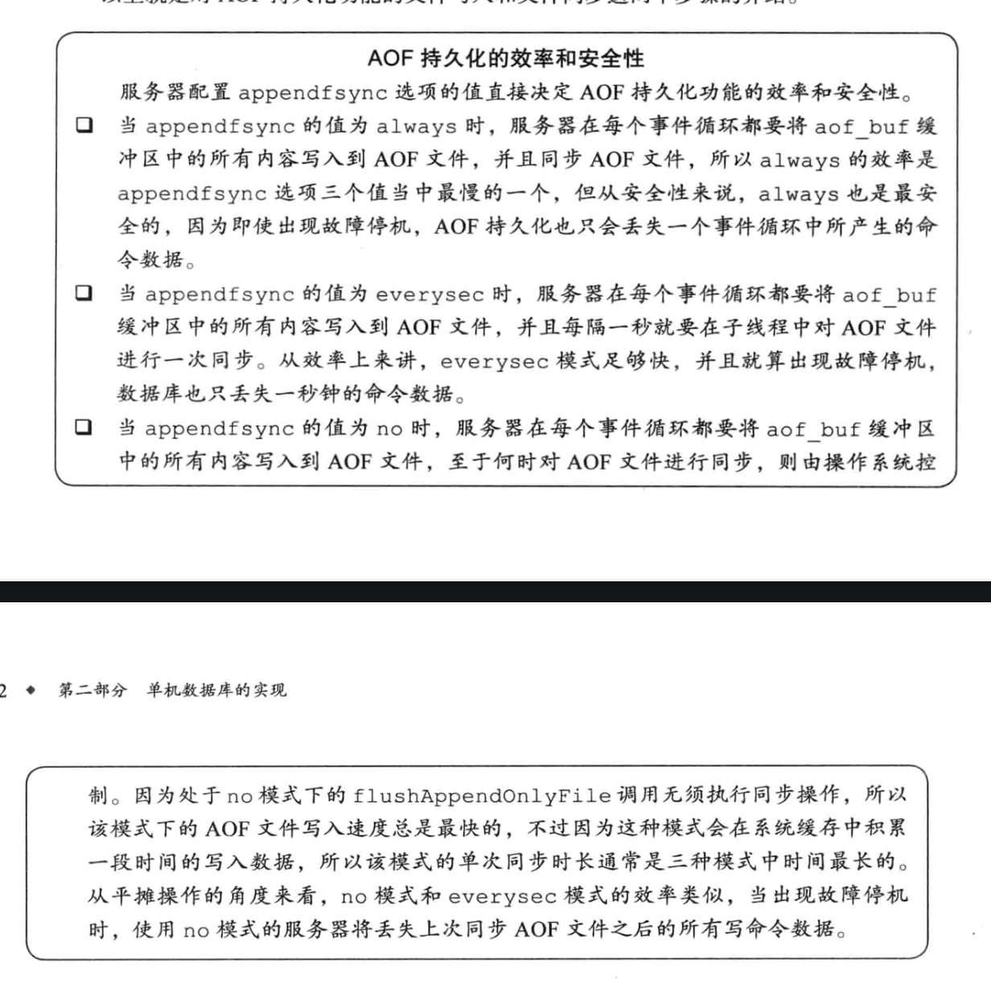

# Redis相关问题

记录一下Redis的学习


### SDS 简单动态字符串

redis没有直接使用C语言的传统字符串表示，而是自己构建了(simple dynamic string)的抽象类型，并且广泛运用在redis的代码当中。

传统的c字符串只会在redis的代码中充当字符串字面量使用，也就是类似于打印日志时 log("xxxxx")这样使用。

sds.h/sdshdr 定义了sds的结构

~~~
struct sdshdr {
		//记录buf数组中所使用的字节数量
		//等于sds所保存的字符串的长度
		int len;
		//记录buf数组中为使用的字节数量
		int free;
		//字节数组 用于保存字符串
		char buf[];
}
~~~


并且还沿用了c字符串的以空字符串'\0'结尾，这样可以重用一部分c字符串函数库里面的函数。

|                 C字符串                  |                  SDS                   |
| :--------------------------------------: | :------------------------------------: |
|       获取字符串长度的复杂度为O(n)       |      获取字符串长度的复杂度为O(1)      |
|    API是不安全的，可能造成缓冲区溢出     |    API是安全的，不会造成缓冲区溢出     |
| 修改字符串长度N次必然要执行N次内存重分配 | 修改字符串长度N次最多执行N次内存重分配 |
|             只能保存文本数据             |       可以保存文本或者二进制数据       |


### 对象的类型与编码

redis内置有5种对象：`字符串，列表，哈希，集合，有序集合`。而redis中也自己实现了许多的数据结构例如:`SDS，双端链表，字典，跳表，压缩列表，整数集合，哈希表`等等，这里不会讨论如何实现这些数据结构，但是redis是用这些实现的数据结构来实现它的5种内置对象的，每种对象都用到了至少一种我们刚才介绍的数据结构。

针对不同的场景，我们可以为对象设置多种不同的数据结构实现，可以优化对象在不同场景下的使用效率。

对象

|   类型常量   |                  对象                  |
| :----------: | :------------------------------------: |
| REDIS_STRING |     字符串对象      |
|  REDIS_LIST  |    列表对象    |
|  REDIS_HASH  | 哈希对象 |
|  REDIS_SET   |       集合对象       |
|  REDIS_ZSET  |             有序集合的对象             |

编码

|         编码常量          |          数据结构          |
| :-----------------------: | :------------------------: |
|    REDIS_ENCODING_INT     |       long类型的整数       |
|   REDIS_ENCODING_EMBSTR   | embstr编码的简单动态字符串 |
|    REDIS_ENCODING_RAW     |       简单动态字符串       |
|     REDIS_ENCODING_HT     |            字典            |
| REDIS_ENCODING_LINKEDLIST |       有序集合的对象       |
|  REDIS_ENCODING_ZIPLIST   |          压缩列表          |
|   REDIS_ENCODING_INTSET   |          整数集合          |
|  REDIS_ENCODING_SKIPLIST  |         跳表，字典         |

对象与编码的关系

|     类型     |           编码            |                    对象                    |
| :----------: | :-----------------------: | :----------------------------------------: |
| REDIS_STRING |    REDIS_ENCODING_INT     |          使用整数实现的字符串对象          |
| REDIS_STRING |   REDIS_ENCODING_EMBSTR   | 使用embstr编码的动态字符串实现的字符串对象 |
| REDIS_STRING |    REDIS_ENCODING_RAW     |     使用简单动态字符串实现的字符串对象     |
|  REDIS_LIST  |  REDIS_ENCODING_ZIPLIST   |         使用压缩列表实现的列表对象         |
|  REDIS_LIST  | REDIS_ENCODING_LINKEDLIST |         使用双端列表实现的列表对象         |
|  REDIS_HASH  |  REDIS_ENCODING_ZIPLIST   |         使用压缩列表实现的哈希对象         |
|  REDIS_HASH  |     REDIS_ENCODING_HT     |           使用字典实现的哈希对象           |
|  REDIS_SET   |   REDIS_ENCODING_INTSET   |         使用整数集合实现的集合对象         |
|  REDIS_SET   |     REDIS_ENCODING_HT     |           使用字典实现的集合对象           |
|  REDIS_ZSET  |  REDIS_ENCODING_ZIPLIST   |       使用压缩列表实现的有序集合对象       |
|  REDIS_ZSET  |  REDIS_ENCODING_SKIPLIST  |      使用跳表和字典实现的有序集合对象      |


### 谨慎处理多数据库程序

到目前为止，Redis仍然没有可以返回客户端目标数据库的命令，虽然redis-cli客户端会在输入符旁边提示当前所使用的目标数据库，但在其他的redis-sdk中并没有继承，所以为了避免对数据库进行误操作，最好先执行下select命令。


### RDB和AOF

rdb和aof 都是redis提供的用于持久化的功能。

RDB持久化保存数据库状态的方法是将数据编码后保存在RDB文件当中，而AOF则是记录执行的`SET,SADD,RPUSH`三个命令保存到AOF文件当中。

两种恢复手段的载入判断流程。

~~~flow
 st=>start: 服务器启动
 e=>end: 载入AOF文件
 e2=>end: 载入RDB文件
 op=>operation: 执行载入程序
 cond=>condition: 已开启AOF持久化功能?
 io=>inputoutput: 输入/输出
 st->op->cond
 cond(yes)->e
 cond(no)->e2
~~~

#### SAVE 和 BGSAVE

这两个命令都用来生成RDB文件，她们主要的区别如下：

**SAVE** 命令会阻塞Redis 服务器进程，直到RDB文件创建完毕，在此期间，redis-server不能处理任何命令请求。

**BGSAVE** 命令会派生出一个子进程，由它来负责创建RDB文件，服务器进程继续进行命令请求。

伪代码：

~~~
def save():
   rdbSave()
   
def bg_save():
   pid = fork() //创建子进程
   
   if pid == 0
     rdbSave()
     signal_parent() //告诉父进程
   elif pid > 0 //父进程继续处理命令请求，并通过轮训等待子进程的信号
     handle_request_and_wait_signal()
   else:
     //处理出错情况
     handle_fork_error()
     
~~~

与生成rdb文件不同，rdb的载入工作是服务器启动时自动执行的，所以redis并没有专门用于载入rdb文件的命令。

由于BGSAVE命令的保存工作是由子进程执行的，所以在子进程创建RDB文件的过程中，Redis服务器仍然可以处理客户端的命令请求，但是在此期间服务器处理`SAVE,BGSAVE,BGREWRITEAOF`三个命令的方式会和平时有所不同。

+ 在BGSAVE命令执行期间，客户端发送的SAVE命令会被服务器拒绝，此举是防止父进程和子进程同时执行rdbSave函数调用，防止产生竞争条件。
+ 其次客户端发送BGSAVE也会被拒绝，理由与拒绝SAVE命令一样
+ BGREWRITEAOF 和 BGSAVE两个命令不能同时执行
  + 如果BGSAVE命令正在执行，那么BGREWRITEAOF会被延迟到BGSAVE命令执行完成之后执行
  + 如果BGREWRITEAOF命令正在执行，那么BGSAVE会被服务器拒绝
    + 原因是这两个命令的实际工作都是子进程执行，所以没有冲突和竞争，但是这两个子进程同时执行大量的磁盘写入，会大大的降低性能。


#### AOF持久化的实现

AOF持久化功能的实现可以分为命令追加(append)，文件写入，文件同步(sync) 三个步骤。

##### 命令追加

 当AOF功能正处在打开状态时，客户端发送一条写入命令，服务器执行完之后，会以协议格式将这条命令追加到aof_buf缓冲区末尾

```c
struct redisServer {
   // ....
   // AOF 缓冲区
   sds aof_buf;
   // ....
}
```

这就是AOF持久化命令追加步骤的实现原理。

##### AOF文件的写入与同步

Redis的服务器进程就是一个事件循环(loop),这个循环中的文件事件负责接收客户端的命令请求，以及向客户端发送命令回复。那么如果打开了AOF功能，则会将命令尾加到aof_buf缓冲区中，所以在事件结束前都会调用flushAppendOnlyFile函数来考虑是否要将缓冲区里的内容写入和保存到AOF文件当中。

伪代码:

```c
def eventLoop():
   while True:
     //处理文件事件，接收命令请求以及发送命令回复
     processFileEvents();
     //处理时间事件
     processTimeEvents();
     //考虑是否将aof_buf中的内容写入AOF缓冲区
     flushAppendOnlyFile();
```

`flushAppendOnlyFile`这个函数的行为由服务器配置的`appendfsync`选项的值来决定

+ always
  + 将aof_buf缓冲区中的所有内容写入并同步到AOF文件
+ everysec
  + 将oaf_buf缓冲区中的所有内容写入到AOF文件，如果上次同步AOF文件的时间距离现在超过了1秒钟，那么再次对AOF文件进行同步，并且这个同步操作是由一个线程专门负责的
+ no
  + 将aof_buf缓冲区中的所有内容写入到AOF文件，但并不对AOF文件进行同步，何时同步由操作系统来决定。



##### AOF文件重写的实现

为了解决AOF文件体积膨胀的问题，Redis提供了AOF文件重写功能，新生成一个AOF文件来替代现有的AOF文件，新旧两个文件所保存的数据库状态相同，但新文件不会包含任何冗余命令,所以新AOF文件的体积会比旧的文件小。

redis的重写aof算法非常的聪明。

**直接读取key的值，获取最新的key当前的值,然后用一条命令就可以做为这个key的当前状态。**

伪代码:

```ruby
def aof_rewrite(new_aof_file_name):
    # 创建新的AOF文件
  	f = create_file(new_aof_file_name)
    
    # 遍历数据库
    for db in redisServer.db:
       # 忽略空数据库
       if db.is_empty(): continue
       
       # 显示指定数据库
       f.write_command("SELECT "+ db.id)  
         
       for key in db:
       	# 忽略已过期的key
       	if key.is_expired(): continue
         # 根据key的类型对key进行重新
         switch(key.type):
             case String:
               rewrite_string(key) #根据key获取到所有的value 然后拼成写入命令即可
             case List:
               rewrite_list(key)
             case Hash:
               rewrite_hash(key)
             case Set:
               rewrite_set(key)
             case SortedSet:
               rewrite_sorted_set(key)  
  				if key.have_expire_time()
             rewrite_expire_time(key)
     #写入完毕，关闭文件
     f.close()       
```

**ps:**在实际中，重写程序在处理列表，哈希表，集合，有序集合这四种带有多个元素的键时，会先检查键所包含的元素数量，如果元素的数量超过了redis.h/REDIS_AOF_REWRITE_ITEMS_PER_CMD 常量的值，那么重写程序将使用多条命令来记录键的值，而不是单单一条命令。在redis 2.9 版本中这个常量的值为64。

##### AOF后台重写

因为redis是使用单线程来处理请求命令，为了不阻塞主进程,所以AOF重写的工作会起一个子进程来进行。

但这样做的同时会导致一个问题，如果子进程在进行重写的同时，主进程继续处理命令请求，而新的命令可能会对现在的数据库状态进行修改，从而使得重写前后的文件保存的数据库状态不一致。


为了解决这个问题，redis服务器设置了一个AOF重写缓冲区，这个缓冲区在服务器创建子进程之后开始使用，当执行完一个写命令之后，他会同时将这个写命令发送给AOF缓冲区和AOF重写缓冲区，这样子进程开始后，服务器执行的所有写命令都会被记录到AOF重写缓冲区里面，这样就能解决上面这个问题了。

在整个过程中只有重写完成后的信号处理函数会对主进程造成阻塞，其他时候都不会造成阻塞。

这就是**AOF后台重写，也就是BGREWRITEAOF命令**的实现原理。


### 事件

>redis服务器于客户端或者其他redis服务器通信是基于socket套接字,并且是事件驱动的。

redis需要处理以下两种事件:

1. 文件事件(file event)

    文件事件就是redis socket通信的抽象，我认为就是数据交换格式。通过监听各种文件事件来完成一系列的网络通信操作。

2. 时间事件(time event)

   redis服务器中有一系列的操作需要在指定时间执行,时间事件就是这类定时操作的抽象。

####  文件事件

redis基于Reactor模式开发了自己的网络事件处理器:这个处理器被称作文件处理器。

使用I/O多路复用来监听多个套接字,然后根据套接字当前执行的任务来关联不同的事件处理器

当套接字准备应答(accpet),读取(read),写入(write),关闭(close)时，相应的事件就会产生，然后文件处理器就会调用关联好的事件处理器来处理这些事件。

通过I/O多路复用,虽然是文件事件处理器虽然是单线程，但是却实现了高性能的网络通信模型，又方便与redis中其他的单线程模块进行对接，保持了redis内部单线程简单性。

