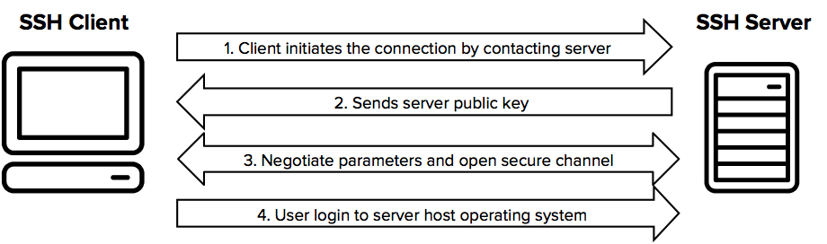

# SSH

>SSH协议（也称为Secure Shell）是一种用于从一台计算机安全登录到另一台计算机的方法。它提供了多种用于强身份验证的选项，并通过强加密来保护通信安全性和完整性。它是非受保护的登录协议（例如[telnet](https://www.ssh.com/ssh/telnet)，rlogin）和不安全的文件传输方法（例如[FTP](https://www.ssh.com/ssh/ftp/)）的安全替代方法。

该协议在客户端-服务器模型中起作用，这意味着该连接是由连接到SSH服务器的SSH客户端建立的。SSH客户端驱动连接建立过程，并使用公共密钥加密技术来验证SSH服务器的身份。在设置阶段之后，SSH协议使用强大的对称加密和哈希算法来确保在客户端和服务器之间交换的数据的私密性和完整性。

下图显示了SSH连接的简化设置流程。

### 命令

ssh [user@] host [command]

#### 选项

- -1：强制使用ssh协议版本1
- -2：强制使用ssh协议版本2
- -4：强制使用IPv4地址
- -6：强制使用IPv6地址
- -A：开启认证代理连接转发功能
- -a：关闭认证代理连接转发功能
- -b：使用本机指定地址作为对应连接的源ip地址
- -C：请求压缩所有数据
- -c：选择所加密的密码型式 （blowfish|3des 预设是3des）
- -e：设定跳脱字符
- -F：指定ssh指令的配置文件
- -f：后台执行ssh指令
- -g：允许远程主机连接主机的转发端口
- -i：指定身份文件（预设是在使用者的家目录 中的 .ssh/identity）
- -l：指定连接远程服务器登录用户名
- -N：不执行远程指令
- -n：重定向stdin 到 /dev/null
- -o：指定配置选项
- -p：指定远程服务器上的端口（默认22）
- -P：使用非特定的 port 去对外联机（注意这个选项会关掉 RhostsAuthentication 和 RhostsRSAAuthentication）
- -q：静默模式
- -T：禁止分配伪终端
- -t：强制配置 pseudo-tty
- -v：打印更详细信息
- -X：开启X11转发功能
- -x：关闭X11转发功能
- -y：开启信任X11转发功能
- -L listen-port:host:port 指派本地的 port 到达端机器地址上的 port

> - 建立本地SSH隧道(本地客户端建立监听端口)
> - 将本地机(客户机)的某个端口转发到远端指定机器的指定端口.

- -R listen-port:host:port 指派远程上的 port 到本地地址上的 port

> - 建立远程SSH隧道(隧道服务端建立监听端口)
> - 将远程主机(服务器)的某个端口转发到本地端指定机器的指定端口.

- -D port 指定一个本地机器 “动态的’’ 应用程序端口转发.

### ssh远程隧道

通过 -R 参数实现

利用外网服务器以及反向SSH搭一条通道，就可以利用外网的服务器登录内网的服务器。
两台服务器配置

| 名称       | IP              |
| ---------- | --------------- |
| 内网服务器 | 192.168.0.201   |
| 外网服务器 | 100.100.100.100 |

+ #### 建立通道

  在内网服务器上执行命令

  ~~~shell
  ssh -NfR 1122:localhost:22 root@100.100.100.100 -p 22
  ~~~

  其中，这条命令的意思是在后台执行(-f)，不实际连接而是做port forwarding(-N)，做反向ssh(-R)
  将远程服务器的1122端口映射成连接本机与该服务器的反向ssh的端口。
  root为外网服务器的登录名，100.100.100.100为外网IP

+ #### 登录内网服务器

  首先使用SSH登录外网服务器
  然后执行以下命令就可以进行登录内网服务器了

  ~~~shell
  ssh www@localhost -p 1122
  ~~~

  www是指你登录内网服务器所用的用户名

+ #### ssh连接中断问题

  使用autossh保持连接

  ubuntu安装autossh

  ~~~shell
  sudo apt-get install autossh
  ~~~

  centos安装autossh

  ~~~shell
  yum install autossh
  ~~~

  在内网服务器上执行autossh命令，代替之前的ssh命令

  ~~~ shell
  autossh -M 3322 -NfR 1122:localhost:22 root@100.100.100.100 -p 22
  ~~~

  如果还出现断线

  修改外网服务器 /etc/ssh/sshd_config

  ~~~shell
  ClientAliveInterval 120
  ClientAliveCountMax 0
  ~~~

  修改内网服务器 /etc/ssh/ssh_config

  ~~~shell
  Host *
  	ServerAliveInterval 15  #每隔15s向服务器发送一次 alive 请求
  	GSSAPIAuthentication yes
  ~~~

### 公钥认证

>ssh 公钥认证是 ssh 的认证方式之一,通过公钥认证可以实现 ssh 免密码登录

在用户的主目录下有一个.ssh 目录,用来存放当前用户的 ssh 配置相关的文件,进入到.ssh 目录

通过 : `ssh-keygen | ssh-keygen -t rsa -C “email”`命令来生成 ssh 公钥认证所需要的公钥和私钥文件
默认生成 id_rsa 和 id_rsa.pub 两个文件,分别为私钥和公钥。

最后需要将本机的公钥添加到服务器中的~/.ssh/authorized_keys 文件中 (如不存在需手动创建)。

这样就可以实现 ssh 免密码登录