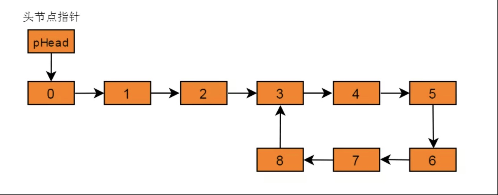

#  Leetcode 算法题解

### 两数之和

>给定一个整数数组 nums 和一个目标值 target，请你在该数组中找出和为目标值的那 两个 整数，并返回他们的数组下标。
>
>你可以假设每种输入只会对应一个答案。但是，数组中同一个元素不能使用两遍。
>
>给定 nums = [2, 7, 11, 15], target = 9
>
>因为 nums[0] + nums[1] = 2 + 7 = 9
>所以返回 [0, 1]

1. 暴力破解,使用循环，一次不行就多次

   >时间复杂度：O(n^2)
   >对于每个元素，我们试图通过遍历数组的其余部分来寻找它所对应的目标元素，这将耗费 O(n)O(n) 的时间。因此时间复杂度为 O(n^2)
   >
   >空间复杂度：O(1)
   >

~~~go
func toSum(nums []int, target int) []int {   //暴力破解
	result := make([]int, 0, 2)

	for i := 0; i < len(nums); i++ {
		for j := i + 1; j < len(nums); j++ {
			if nums[i]+nums[j] == target {
				result = append(result, i)
				result = append(result, j)
			}
		}
	}

	return result
}
~~~


2. 使用hash表

   >通过以空间换取速度的方式，我们可以将查找时间从 O(n)降低到 O(1)。哈希表正是为此目的而构建的，它支持以 近似 恒定的时间进行快速查找。我用“近似”来描述，是因为一旦出现冲突，查找用时可能会退化到 O(n))。但只要你仔细地挑选哈希函数，在哈希表中进行查找的用时应当被摊销为 O(1)。
   >
   >

~~~go
func toSum2(nums []int,target int) []int { //hash
	
	m := map[int]int{}

	for i, v := range nums {
		if k,ok:=m[target-v]; ok{
			return []int{k,i}
		}
		m[v] = i
	}
	return nil
}
~~~


### 最长公共前缀

>编写一个函数来查找字符串数组中的最长公共前缀。
>
>如果不存在公共前缀，返回空字符串 ""。
>
>示例 1:
>
>输入: ["flower","flow","flight"]
>输出: "fl"
>示例 2:
>
>输入: ["dog","racecar","car"]
>输出: ""
>解释: 输入不存在公共前缀。
>说明:
>
>所有输入只包含小写字母 a-z 。

1. 横向扫描

   >依次遍历字符串数组中的每个字符串，对于每个遍历到的字符串，更新最长公共前缀，当遍历完所有的字符串以后，即可得到字符串数组中的最长公共前缀。

   

如果在尚未遍历完所有的字符串时，最长公共前缀已经是空串，则最长公共前缀一定是空串，因此不需要继续遍历剩下的字符串，直接返回空串即可。

~~~java
class Solution {
    public String longestCommonPrefix(String[] strs) {
        if (strs == null || strs.length == 0) {
            return "";
        }
        String prefix = strs[0];
        int count = strs.length;
        for (int i = 1; i < count; i++) {
            prefix = longestCommonPrefix(prefix, strs[i]);
            if (prefix.length() == 0) {
                break;
            }
        }
        return prefix;
    }

    public String longestCommonPrefix(String str1, String str2) {
        int length = Math.min(str1.length(), str2.length());
        int index = 0;
        while (index < length && str1.charAt(index) == str2.charAt(index)) {
            index++;
        }
        return str1.substring(0, index);
    }
}

~~~


2. 纵向扫描

   >另一种方法是纵向扫描。纵向扫描时，从前往后遍历所有字符串的每一列，比较相同列上的字符是否相同，如果相同则继续对下一列进行比较，如果不相同则当前列不再属于公共前缀，当前列之前的部分为最长公共前缀。

   

~~~java
class Solution {
    public String longestCommonPrefix(String[] strs) {
        if (strs == null || strs.length == 0) {
            return "";
        }
        int length = strs[0].length();
        int count = strs.length;
        for (int i = 0; i < length; i++) {
            char c = strs[0].charAt(i);
            for (int j = 1; j < count; j++) {
                if (i == strs[j].length() || strs[j].charAt(i) != c) {
                    return strs[0].substring(0, i);
                }
            }
        }
        return strs[0];
    }
}
~~~


###  回文数

>判断一个整数是否是回文数。回文数是指正序（从左向右）和倒序（从右向左）读都是一样的整数。

1. 使用双指针，头尾扫描

   ~~~java
   public boolean isPalindrome(int x) {
     			if(x < 0){
             return false;
           }
           String str = Integer.valueOf(x).toString();
           String[] strList = str.split("");
           int a = 0;
           int b = strList.length - 1;
           for(int i = 0; i < strList.length; i++){
               if(!strList[a].equals(strList[b])){
                   return false;
               }
               a ++;
               b --;
           }
           return true;
       }
   ~~~

   2. 使用数学方法，不通过字符串方式实现，使用字符串方法实现需要而外的内存空间

      >对于数字 1221，如果执行 1221 % 10，我们将得到最后一位数字 1，要得到倒数第二位数字，我们可以先通过除以 10 把最后一位数字从 1221 中移除，1221 / 10 = 122，再求出上一步结果除以 10 的余数，122 % 10 = 2，就可以得到倒数第二位数字。如果我们把最后一位数字乘以 10，再加上倒数第二位数字，1 * 10 + 2 = 12，就得到了我们想要的反转后的数字。如果继续这个过程，我们将得到更多位数的反转数字。
      >
      >现在的问题是，我们如何知道反转数字的位数已经达到原始数字位数的一半？
      >
      >由于整个过程我们不断将原始数字除以 10，然后给反转后的数字乘上 10，所以，当原始数字小于或等于反转后的数字时，就意味着我们已经处理了一半位数的数字了。
      >


~~~go
func isPalindrome(x int) bool {
    // 特殊情况：
    // 如上所述，当 x < 0 时，x 不是回文数。
    // 同样地，如果数字的最后一位是 0，为了使该数字为回文，
    // 则其第一位数字也应该是 0
    // 只有 0 满足这一属性
    if x < 0 || (x % 10 == 0 && x != 0) {
        return false
    }

    revertedNumber := 0
    for x > revertedNumber {
        revertedNumber = revertedNumber * 10 + x % 10
        x /= 10
    }

    // 当数字长度为奇数时，我们可以通过 revertedNumber/10 去除处于中位的数字。
    // 例如，当输入为 12321 时，在 while 循环的末尾我们可以得到 x = 12，revertedNumber = 123，
    // 由于处于中位的数字不影响回文（它总是与自己相等），所以我们可以简单地将其去除。
    return x == revertedNumber || x == revertedNumber / 10
}
~~~

### 删除链表的倒数第n个节点

其他实现方式就不提了，就使用快慢指针，也叫双指针的算法。

（1）定义两个指针 p1 和 p2 分别指向链表头节点。
（2）p1 前进 K 个节点，则 p1 与 p2 相距 K 个节点。
（3）p1，p2 同时前进，每次前进 1 个节点。
（4）当 p1 指向到达链表末尾，由于 p1 与 p2 相距 K 个节点，则 p2 指向目标节点。

~~~go
/**
 * Definition for singly-linked list.
 * type ListNode struct {
 *     Val int
 *     Next *ListNode
 * }
 */
func removeNthFromEnd(head *ListNode, n int) *ListNode {
    var temp *ListNode = new(ListNode)
    temp.Next = head
    var startN *ListNode = temp
    var endN *ListNode = temp
    for i := 0; i < n; i++ {
        endN = endN.Next
    }
    for{
        if endN.Next == nil{
            break
        }
        startN = startN.Next
        endN = endN.Next
    }
    startN.Next = startN.Next.Next
    return temp.Next

}
~~~

### 链表中存在环问题

>单链表中的环是指链表末尾的节点的 next 指针不为 NULL ，而是指向了链表中的某个节点，导致链表中出现了环形结构

如图：



###### 穷举比较法

>（1）遍历链表，记录已访问的节点。
>（2）将当前节点与之前以及访问过的节点比较，若有相同节点则有环。
>否则，不存在环。

这种穷举比较思想简单，但是效率过于低下，尤其是当链表节点数目较多，在进行比较时花费大量时间，时间复杂度大致在 O(n^2)。


###### 哈希缓存法

>（1）首先创建一个以节点 ID 为键的 HashSe t集合，用来存储曾经遍历过的节点。
>（2）从头节点开始，依次遍历单链表的每一个节点。
>（3）每遍历到一个新节点，就用新节点和 HashSet 集合当中存储的节点作比较，如果发现 HashSet 当中存在相同节点 ID，则说明链表有环，如果 HashSet 当中不存在相同的节点 ID，就把这个新节点 ID 存入 HashSet ，之后进入下一节点，继续重复刚才的操作。

假设从链表头节点到入环点的距离是 a ，链表的环长是 r 。而每一次 HashSet 查找元素的时间复杂度是 O(1), 所以总体的时间复杂度是 `1 * ( a + r ) = a + r`，可以简单理解为 O(n) 。而算法的空间复杂度还是 a + r - 1，可以简单地理解成 O(n) 。


###### 快慢指针法

>（1）定义两个指针分别为 slow，fast，并且将指针均指向链表头节点。
>（2）规定，slow 指针每次前进 1 个节点，fast 指针每次前进两个节点。
>（3）当 slow 与 fast 相等，且二者均不为空，则链表存在环。


若链表中存在环，则快慢指针必然能在环中相遇。这就好比在环形跑道中进行龟兔赛跑。由于兔子速度大于乌龟速度，则必然会出现兔子与乌龟再次相遇情况。因此，当出现快慢指针相等时，且二者不为NULL，则表明链表存在环。

~~~c
bool isExistLoop(ListNode* pHead)  {  
    ListNode* fast;//慢指针，每次前进一个节点
    ListNode* slow;//快指针，每次前进2个节点 
    slow = fast = pHead ;  //两个指针均指向链表头节点
    //当没有到达链表结尾，则继续前进
    while (slow != NULL && fast -> next != NULL)  {  
        slow = slow -> next ; //慢指针前进一个节点
        fast = fast -> next -> next ; //快指针前进两个节点
        if (slow == fast)  //若两个指针相遇，且均不为NULL则存在环
            return true ;  
    }  
    //到达末尾仍然没有相遇，则不存在环
    return false ;  
}  
~~~


##### 定位环入口

>slow 指针每次前进一个节点，故 slow 与 fast 相遇时，slow 还没有遍历完整个链表。设 slow 走过节点数为 s，fast 走过节点数为 2s。设环入口点距离头节点为 a，slow 与 fast 首次相遇点距离入口点为 b，环的长度为 r。
>则有：
>s = a + b;
>2s = n * r + a + b; n 代表fast指针已经在环中循环的圈数。
>则推出：
>s = n * r; 意味着slow指针走过的长度为环的长度整数倍。
>
>若链表头节点到环的末尾节点度为 L，slow 与 fast 的相遇节点距离环入口节点为 X。
>则有：
>a+X = s = n * r = (n - 1) * r + (L - a);
>a = (n - 1) * r + (L - a - X);
>上述等式可以看出：
>从 slow 与 fast 相遇点出发一个指针 p1，请进 (L - a - X) 步，则此指针到达入口节点。同时指针 p2 从头结点出发，前进 a 步。当 p1 与 p2 相遇时，此时 p1 与 p2 均指向入口节点。
>
>例如图3.1所示链表：
>slow 走过节点 s = 6；
>fast 走过节点 2s = 12；
>环入口节点据流头节点 a = 3；
>相遇点距离头节点 X = 3；
>L = 8；
>r = 6；
>可以得出 a = (n - 1) * r + (L - a - X)结果成立。


~~~c
//找到环中的相遇节点
ListNode* getMeetingNode(ListNode* pHead) // 假设为带头节点的单链表
{
    ListNode* fast;//慢指针，每次前进一个节点
    ListNode* slow;//快指针，每次前进2个节点 
    slow = fast = pHead ;  //两个指针均指向链表头节点
    //当没有到达链表结尾，则继续前进
    while (slow != NULL && fast -> next != NULL){  
        slow = slow -> next ; //慢指针前进一个节点
        fast = fast -> next -> next ; //快指针前进两个节点
        if (slow == fast)  //若两个指针相遇，且均不为NULL则存在环
            return slow;  
    }  

    //到达末尾仍然没有相遇，则不存在环
    return NULL ;
}
//找出环的入口节点
ListNode* getEntryNodeOfLoop(ListNode* pHead){
    ListNode* meetingNode = getMeetingNode(pHead); // 先找出环中的相遇节点
    if (meetingNode == NULL)
        return NULL;
    ListNode* p1 = meetingNode;
    ListNode* p2 = pHead;
    while (p1 != p2) // p1和p2以相同的速度向前移动，当p2指向环的入口节点时，p1已经围绕着环走了n圈又回到了入口节点。
    {
        p1 = p1->next;
        p2 = p2->next;
    }
    //返回入口节点
    return p1;
}
~~~


##### 计算环的长度

>找到了 slow 与 fast 的相遇节点，令 solw 与 fast 指针从相遇节点出发，按照之前的前进规则，当 slow 与fast 再次相遇时，slow 走过的长度正好为环的长度。

~~~c
int getLoopLength(ListNode* head){
    ListNode* slow = head;
    ListNode* fast = head;
    while ( fast && fast->next ){
        slow = slow->next;
        fast = fast->next->next;
        if ( slow == fast )//第一次相遇
            break;
    }
    //slow与fast继续前进
    slow = slow->next;
    fast = fast->next->next;
    int length = 1;       //环长度
    while ( fast != slow )//再次相遇
    {
        slow = slow->next;
        fast = fast->next->next;
        length ++;        //累加
    }
    //当slow与fast再次相遇，得到环长度
    return length;
}
~~~

##### 有序列表合并

>将两个有序链表合并为一个新的有序链表并返回。新链表是通过拼接给定的两个链表的所有节点组成的。

（1）对空链表存在的情况进行处理，假如 pHead1 为空则返回 pHead2 ，pHead2 为空则返回 pHead1。（两个都为空此情况在pHead1为空已经被拦截）
（2）在两个链表无空链表的情况下确定第一个结点，比较链表1和链表2的第一个结点的值，将值小的结点保存下来为合并后的第一个结点。并且把第一个结点为最小的链表向后移动一个元素。
（3）继续在剩下的元素中选择小的值，连接到第一个结点后面，并不断next将值小的结点连接到第一个结点后面，直到某一个链表为空。
（4）当两个链表长度不一致时，也就是比较完成后其中一个链表为空，此时需要把另外一个链表剩下的元素都连接到第一个结点的后面。

~~~c
ListNode* mergeTwoOrderedLists(ListNode* pHead1, ListNode* pHead2){
    ListNode* pTail = NULL;//指向新链表的最后一个结点 pTail->next去连接
    ListNode* newHead = NULL;//指向合并后链表第一个结点
    if (NULL == pHead1){
        return pHead2;
    }else if(NULL == pHead2){
        return pHead1;
    }else{
        //确定头指针
        if ( pHead1->data < pHead2->data){
            newHead = pHead1;
            pHead1 = pHead1->next;//指向链表的第二个结点
        }else{
            newHead = pHead2;
            pHead2 = pHead2->next;
        }
        pTail = newHead;//指向第一个结点
        while ( pHead1 && pHead2) {
            if ( pHead1->data <= pHead2->data ){
                pTail->next = pHead1;  
                pHead1 = pHead1->next;
            }else {
                pTail->next = pHead2;
                pHead2 = pHead2->next;
            }
            pTail = pTail->next;

        }
        if(NULL == pHead1){
            pTail->next = pHead2;
        }else if(NULL == pHead2){
            pTail->next = pHead1;
        }
        return newHead;
}
~~~


##### 删除链表中节点，要求时间复杂度为O(1)

单链表删除节点中，最普通的方法就是遍历链表，复杂度为O(n)。
如果我们把删除节点的下一个结点的值赋值给要删除的结点，然后删除这个结点，这相当于删除了需要删除的那个结点。因为我们很容易获取到删除节点的下一个节点，所以复杂度只需要O(1)。


### 有效的括号

>给定一个只包括 '('，')'，'{'，'}'，'['，']' 的字符串，判断字符串是否有效。
>
>有效字符串需满足：
>
>左括号必须用相同类型的右括号闭合。
>左括号必须以正确的顺序闭合。
>注意空字符串可被认为是有效字符串。

思路：成对出现，可以用栈+hash来解决

~~~java
class Solution {
    public boolean isValid(String s) {
        if(s.equals("") || s.contains(" ") || s.length() %2 !=0) return false;

        Map<Character, Character> pairs = new HashMap<Character, Character>() {{
            put(')', '(');
            put(']', '[');
            put('}', '{');
        }};
        LinkedList<Character> stack = new LinkedList();
        for(int i = 0 ; i < s.length(); i ++ ){
            char c = s.charAt(i);
            if(pairs.containsKey(c)){
                if(stack.isEmpty() || stack.peek() != pairs.get(c)){
                    return false;
                }
                stack.pop();
            } else {
               stack.push(c);
            }
        }

        return stack.isEmpty();
    }
}
~~~


### 字符串的排列

>输入一个字符串，打印出该字符串中字符的所有排列。
>
> 你可以以任意顺序返回这个字符串数组，但里面不能有重复元素。
>
>

**示例:**

```
输入：s = "abc"
输出：["abc","acb","bac","bca","cab","cba"]
```

思路，通过递归进行求解

~~~java
class Solution {
        HashSet<String> res = new HashSet();
        public String[] permutation(String s) {
            if (s.length() == 0) return new String[]{};
            boolean[] flag = new boolean[s.length()];   //用来控制当前index是否已用 aab 则为false
            DG(s,"",flag);
            String[] result=new String[res.size()];
            return res.toArray(result);
        }


        public void DG(String s,String temp ,boolean[] flag){
            if (s.length() == temp.length()) {
                res.add(temp);
                return;
            }
            for (int i = 0; i < s.length(); i++) {
                char c = s.charAt(i);
                if (flag[i])continue;
                flag[i] = true;
                DG(s, temp + c, flag);
                flag[i] = false;
            }
        }
    }
~~~

### 排序算法

#### 冒泡排序

> 比较相邻的元素。如果第一个比第二个大，就交换他们两个。
>
> 对每一对相邻元素作同样的工作，从开始第一对到结尾的最后一对。这步做完后，最后的元素会是最大的数。
>
> 针对所有的元素重复以上的步骤，除了最后一个。
>
> 持续每次对越来越少的元素重复上面的步骤，直到没有任何一对数字需要比较。


~~~go
//SelectionSort is the realization of bubble sort
func BubbleSort(source []int) []int {

	for i := 0; i < len(source); i++ {
		for j := 1; j < len(source)-i; j++ {
			if source[j] < source[j-1] {
				source[j], source[j-1] = source[j-1], source[j]
			}
		}
	}
	return source
}
~~~


#### 选择排序

> 首先在未排序序列中找到最小（大）元素，存放到排序序列的起始位置
>
> 再从剩余未排序元素中继续寻找最小（大）元素，然后放到已排序序列的末尾。
>
> 重复第二步，直到所有元素均排序完毕。

​	


~~~go
//SelectionSort is the realization of selection sort
func SelectionSort(source []int) []int {
	length := len(source)
	for i := 0; i < length; i++ {
		maxIndex := 0
		for j := 1; j < length-i; j++ {
			if source[j] > source[maxIndex] {
				maxIndex = j
			}
		}
		source[length-i-1], source[maxIndex] = source[maxIndex], source[length-i-1]
	}
	return source
}
~~~


#### 插入排序

> - 将第一待排序序列第一个元素看做一个有序序列，把第二个元素到最后一个元素当成是未排序序列。
> - 从头到尾依次扫描未排序序列，将扫描到的每个元素插入有序序列的适当位置。（如果待插入的元素与有序序列中的某个元素相等，则将待插入元素插入到相等元素的后面。）


~~~go
//SelectionSort is the realization of insertion sort
func InsertionSort(source []int) {
	length := len(source)

	for i := 1; i < length; i++ {
		j := i
		for j > 0 {
			if source[j-1] > source[j] {
				source[j], source[j-1] = source[j-1], source[j]
			}
			j -= 1
		}
	}
}
~~~


#### 希尔排序

> 选择一个增量序列 t1，t2，……，tk，其中 ti > tj, tk = 1；
>
> 按增量序列个数 k，对序列进行 k 趟排序；
>
> 每趟排序，根据对应的增量 ti，将待排序列分割成若干长度为 m 的子序列，分别对各子表进行直接插入排序。仅增量因子为 1 时，整个序列作为一个表来处理，表长度即为整个序列的长度


~~~go
//ShellSort is the realization of shell sort
func ShellSort(source []int) {
	K := len(source) / 2
	for {
		for i := 0; i < len(source); i++ {
			gap(source, 0, len(source)-1, K)
		}

		if K == 1 {
			break
		}

		K = K / 2
		if K%2 == 0 {
			K++
		}
	}
}

func gap(source []int, first, last, K int) {
    for i := first; i <= last; i++ {
		if i+K <= last && source[i] > source[i+K] {
			source[i], source[i+K] = source[i+K], source[i]
		}
	}
}
~~~


#### 归并排序

> 申请空间，使其大小为两个已经排序序列之和，该空间用来存放合并后的序列；
>
> 设定两个指针，最初位置分别为两个已经排序序列的起始位置；
>
> 比较两个指针所指向的元素，选择相对小的元素放入到合并空间，并移动指针到下一位置；
>
> 重复步骤 3 直到某一指针达到序列尾；
>
> 将另一序列剩下的所有元素直接复制到合并序列尾。


~~~go
//MergeSort is the realization of merge sort
func MergeSort(source []int) []int {
	if len(source) < 2 {
		return source
	}
	mid := (len(source)) / 2
	return merge(MergeSort(source[:mid]), MergeSort(source[mid:]))
}

func merge(left, right []int) []int {
	size, li, ri := len(left)+len(right), 0, 0 //left和right的指针位置
	slice := make([]int, size, size)

	count := 0

	for li < len(left) && ri < len(right) {
		if left[li] <= right[ri] {
			slice[count] = left[li]
			count, li = count+1, li+1
			continue
		}
		slice[count] = right[ri]
		count, ri = count+1, ri+1
	}
	for li < len(left) {
		slice[count] = left[li]
		count, li = count+1, li+1
	}
	for ri < len(right) {
		slice[count] = right[ri]
		count, ri = count+1, ri+1
	}

	return slice

}

~~~


#### 快速排序

> 从数列中挑出一个元素，称为 “基准”（pivot）;
>
> 重新排序数列，所有元素比基准值小的摆放在基准前面，所有元素比基准值大的摆在基准的后面（相同的数可以到任一边）。在这个分区退出之后，该基准就处于数列的中间位置。这个称为分区（partition）操作；
>
> 递归地（recursive）把小于基准值元素的子数列和大于基准值元素的子数列排序；


~~~go
//SelectionSort is the realization of quick sort
func QuickSort(source []int) {
	recursionSort(source, 0, len(source)-1)
}

func recursionSort(source []int, left, right int) {
	if left < right {
		index := partition(source, left, right)
		recursionSort(source, left, index-1)
		recursionSort(source, index+1, right)
	}
}

func partition(source []int, left, right int) int {
	for left < right {
		for left < right && source[left] <= source[right] {
			right--
		}
		if left < right {
			source[left], source[right] = source[right], source[left]
			left++
		}

		for left < right && source[left] <= source[right] {
			left++
		}
		if left < right {
			source[left], source[right] = source[right], source[left]
			right--
		}
	}

	return left //or right
}
~~~


#### 堆排序

> - 创建一个堆 H[0……n-1]；
> - 把堆首（最大值）和堆尾互换；
> - 把堆的尺寸缩小 1，并调用 shift_down(0)，目的是把新的数组顶端数据调整到相应位置；
> - 重复步骤 2，直到堆的尺寸为 1。


#### 桶排序

> - 设置固定数量的空桶。
> - 把数据放到对应的桶中。
> - 对每个不为空的桶中数据进行排序。
> - 拼接不为空的桶中数据，得到结果


~~~go
//BucketSort is the realization of bucket sort
func BucketSort(source []int, bucketSize int) []int {
	//桶数
	var num int
	if bucketSize == 0 {
		num = len(source)
	} else {
		num = bucketSize
	}

	//数组最大值
	max := array.Array.GetMaxInArray(source)

	//桶
	buckets := make([][]int, num)

	for _, n := range source {
		// 计算出指定值应该进入哪个桶
		idx := n * num / (max + 1)
		buckets[idx] = append(buckets[idx], n)
	}

	sorted := make([]int, 0)
	for _, bucket := range buckets {
		if len(bucket) > 0 {
			InsertionSort(bucket)  //内部实现由插入排序实现  也可以由其他排序实现
			sorted = append(sorted, bucket...)
		}
	}
	return sorted
}
~~~

