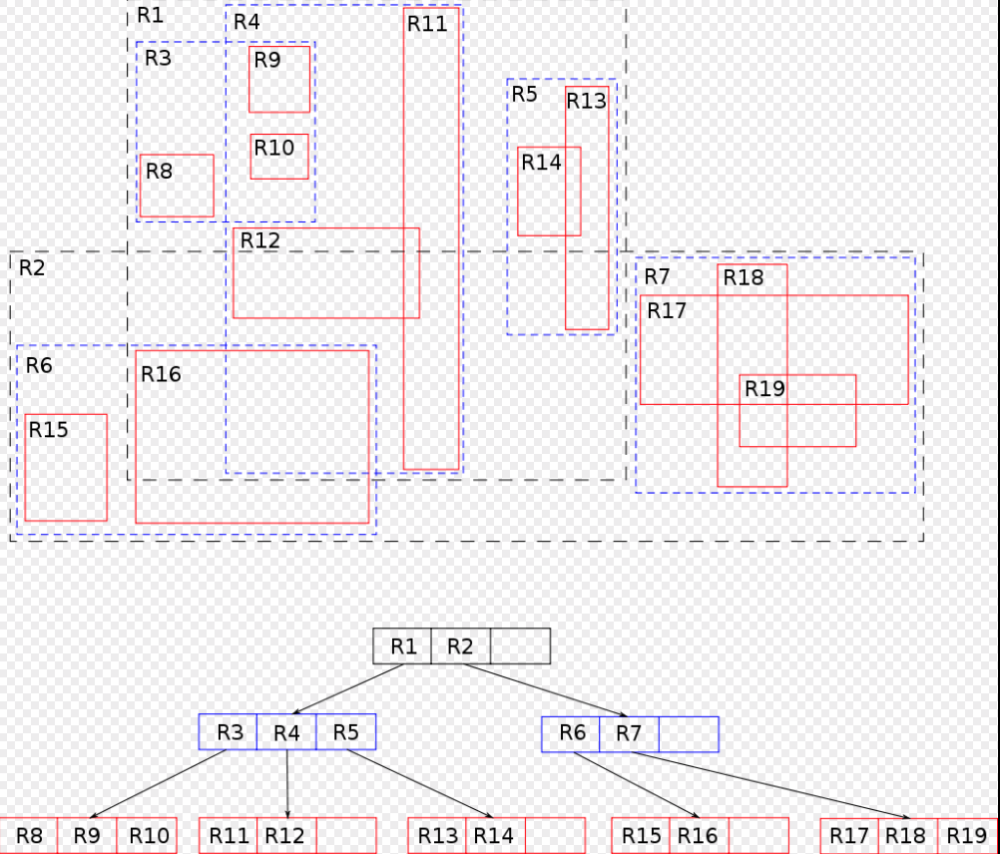
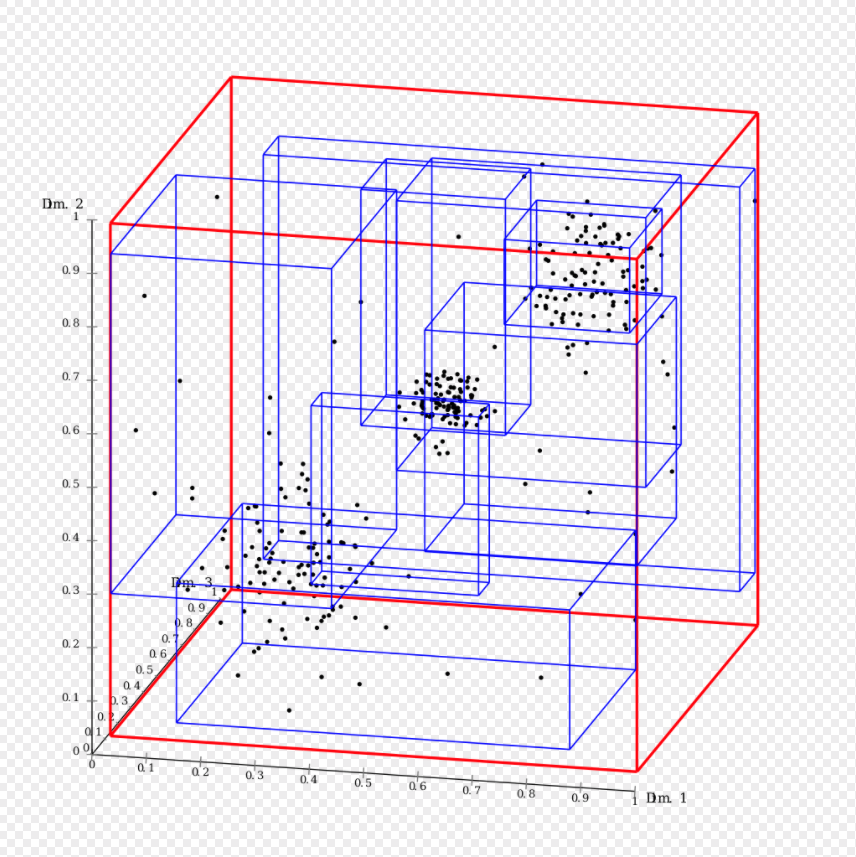

# 数据结构

整理在学习工作中所用到的数据结构，实现方式和语言不限定。

## 顺序表

## 链表

### 单链表

### 双链表

## 队列

### 双向队列

## 栈

## 堆

### 大顶堆

### 小顶堆

## 跳表

## 哈希表

## 二叉树

### AVL树

### 红黑树

## B树

### B+树

### B*树

## R树

>**R树**是用来做[空间数据存储](https://zh.wikipedia.org/w/index.php?title=空间数据存储&action=edit&redlink=1)的[树状数据结构](https://zh.wikipedia.org/wiki/树_(数据结构))。例如给[地理位置](https://zh.wikipedia.org/wiki/地理位置)，[矩形](https://zh.wikipedia.org/wiki/矩形)和[多边形](https://zh.wikipedia.org/wiki/多边形)这类多维数据创建索引。R树是由Antonin Guttman于1984年提出的[[1\]](https://zh.wikipedia.org/wiki/R树#cite_note-guttman-1)。人们随后发现它在理论和应用方面都非常实用[[2\]](https://zh.wikipedia.org/wiki/R树#cite_note-rtree-book-2)。 在现实生活中，R树可以用来存储地图上的空间信息，例如餐馆地址，或者地图上用来构造街道，建筑，湖泊边缘和海岸线的多边形。然后可以用它来回答“查找距离我2千米以内的博物馆”，“检索距离我2千米以内的所有路段”（然后显示在导航系统中）或者“查找（直线距离）最近的加油站”这类问题。R树还可以用来加速使用包括[大圆距离](https://zh.wikipedia.org/wiki/大圆距离)[[3\]](https://zh.wikipedia.org/wiki/R树#cite_note-geodetic-3)在内的各种距离度量方式的[最邻近搜索](https://zh.wikipedia.org/wiki/最邻近搜索)[[4\]](https://zh.wikipedia.org/wiki/R树#cite_note-4)。 ------wiki

### 原理

R树的核心思想是聚合距离相近的节点并在树结构的上一层将其表示为这些节点的[最小外接矩形](https://zh.wikipedia.org/wiki/最小外接矩形)，这个最小外接矩形就成为上一层的一个节点。R树的“R”代表“Rectangle（矩形）”。因为所有节点都在它们的最小外接矩形中，所以跟某个矩形不相交的查询就一定跟这个矩形中的所有节点都不相交。叶子节点上的每个矩形都代表一个对象，节点都是对象的聚合，并且越往上层聚合的对象就越多。也可以把每一层看做是对数据集的近似，叶子节点层是最细粒度的近似，与数据集相似度100%，越往上层越粗糙。

跟[B树](https://zh.wikipedia.org/wiki/B树)类似，R树也是平衡树（所以所有叶子节点都在同一深度）。它把数据按（内存）页存储，是为磁盘存储设计的（跟[数据库](https://zh.wikipedia.org/wiki/数据库)的做法相同）。每一页可以存储不超过一个上限的条目，这个上限一般用表示。R树会在除根节点以外的节点上维持数据条目不小于最小条目数。根据经验，最小条目数在条目上限的30%–40%时性能最佳，而[B树](https://zh.wikipedia.org/wiki/B树)会维持条目上限的50%，[B*树](https://zh.wikipedia.org/w/index.php?title=B*树&action=edit&redlink=1)甚至维持条目上限的66%。这么做的原因是平衡空间数据比平衡B树上的线性数据更复杂。

跟其他树结构一样，R树的搜索算法（例如：[交集](https://zh.wikipedia.org/wiki/交集)，[子集](https://zh.wikipedia.org/wiki/子集)，[最邻近搜索](https://zh.wikipedia.org/wiki/最邻近搜索)）也非常简单。核心思想是画出查询语句相应的边框，并用它来决定要不要搜索某个子树。这样在搜索时可以跳过树上的大部分节点。跟B树类似，这个特性让R树可以把整棵树放在磁盘里，在需要的时候再把节点读进内存页，从而可以应用在大数据集和[数据库](https://zh.wikipedia.org/wiki/数据库)上。

R树的主要难点在于构建一棵既能保持平衡（所有叶子节点在同一层），又能让树上的矩形既不包括太多空白区域也不过多相交（这样在搜索的时候可以处理尽量少的子树）的高效的树。例如，最初的通过插入节点来构建一棵高效的R树的构想是选择一棵子树插入，使得对其外接矩形的扩张最小。填满一页后，把数据分成两份，使它们分别包括尽量小的区域。大部分关于R树的研究和改进都是关于如何改进建树的过程。它们可以分为两类，一类是如何从头开始构建一棵高效的树（被称为批量加载），另一类是如何在一棵已经存在的树上插入和删除。

R树不保证[最坏情况](https://zh.wikipedia.org/w/index.php?title=最坏情况&action=edit&redlink=1)下的性能，但是在现实数据[[5\]](https://zh.wikipedia.org/wiki/R树#cite_note-5)上一般表现不错。理论上来说，批量加载的[优先级R树](https://zh.wikipedia.org/w/index.php?title=优先级R树&action=edit&redlink=1)是最坏情况下的最优解[[6\]](https://zh.wikipedia.org/wiki/R树#cite_note-prtree-6)，但由于复杂度太高，目前还没有在实际应用中获得关注。

当数据被构建成R树时，任意[Lp空间](https://zh.wikipedia.org/wiki/Lp空间)中的数据的[最近k个邻居](https://zh.wikipedia.org/wiki/最近鄰居法)都可以很高效地用空间交集计算[[7\]](https://zh.wikipedia.org/wiki/R树#cite_note-7) 。这对很多基于[最近邻居法](https://zh.wikipedia.org/wiki/最近鄰居法)的算法（例如[本地异常因子算法](https://zh.wikipedia.org/w/index.php?title=本地异常因子算法&action=edit&redlink=1)）都很有帮助。 DeLi-Clu[[8\]](https://zh.wikipedia.org/wiki/R树#cite_note-8)提出的Density-Link-Clustering是一种使用R树来进行空间交集，从而高效地计算OPTICS聚类的聚类分析算法.

二维例子：

   三维例子:

## 图

### 有向图

### 无向图

### 有向无环图

