# etcd的基本使用和原理

>etcd诞生于 CoreOS 公司，最初用于解决集群管理系统中 OS 升级的分布式并非控制，配置文件的存储与分发等问题。基于此，etcd被设计为提供高可用，强一致的小型key-value数据存储服务，该项目当前隶属于cncf基金会。目前根据不完全统计有超过30个公司在自己的项目中使用了etcd,其中最出名的就是google公司开源的kubernetes，kubernetes使用etcd来存储关键的元数据。

## etcd的安装

etcd可以通过多种方式安装，可以直接下载官方提供的tar包或者通过使用官方镜像容器启动。

我们这里采用下载tar包的方式安装etcd (以linux为例)

1. 下载安装包

~~~shell
curl -L https://github.com/etcd-io/etcd/releases/download/v3.4.14/etcd-v3.4.14-linux-amd64.tar.gz -o /tmp/etcd-v3.4.14-linux-amd64.tar.gz
~~~

2. 创建工作文件夹

~~~shell
mkdir -p /tmp/etcd-download-test
~~~

3. 解压

~~~shell
tar -xzvf /tmp/etcd-v3.4.14-linux-amd64.tar.gz -C /tmp/etcd-download-test --strip-components=1
~~~

通过` ./etcd --version` 查看etcd版本

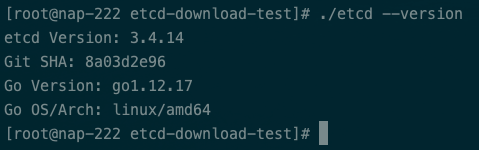

4. 启动

~~~shell
./etcd &>etcd.log &
~~~

## 核心概念

**etcd是分布式的，可靠的，key-value存储系统，用于存储分布式系统中的关键数据的。**

在一个etcd集群中通常会由3个或者5个节点组成，多个节点之间会有一个叫Raft的一致性算法方式来完成分布式一致性协同，多个节点之间算法会选举出一个leader，由leader来负责数据的同步与分发，当leader发生故障的时候，系统自动选取另一个节点成为leader并重新完成数据的同步与分发

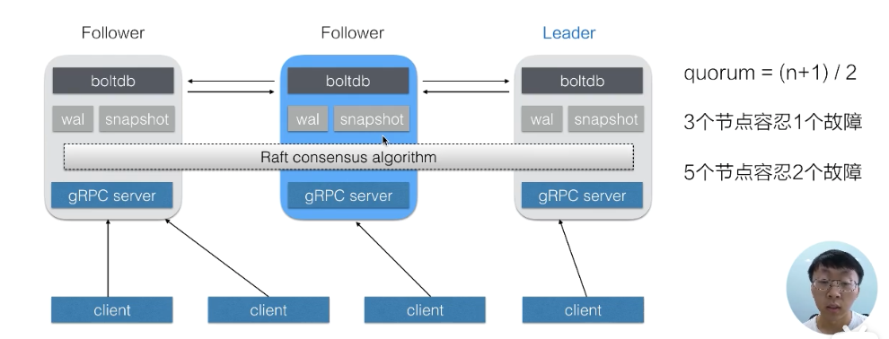

### API

etcd对外暴露非常简单的http接口，etcd还提供watch的机制实时的拿到数据的增量更新从而保持与etcd中的数据保持一致

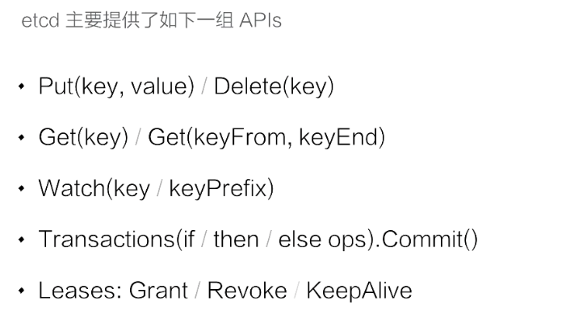

### 数据版本号机制

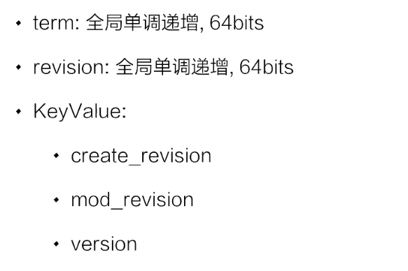

+ term 当etcd集群的leader发生故障或者其他原因导致leader发生切换时，term值会加一
+ revision 代表了全局数据的版本，当数据发生变更时包括创建，修改，删除，revision 都会加一，在整个leader任期内revision都会保持单调递增，正是revision的存在才似的etcd可以支持mvcc和数据的watch
+ 对于每一个k-v数据，etcd都会记录三个版本
  + create_revision 就是在创建的时候的对应的版本号
  + mod_revision 就是修改的时候对应的版本号,当此数据被修改时，mod_revision会变为上面全局的revision
  + version 代表了该数据被修改了多少次

### 多版本并发控制mvcc和watch

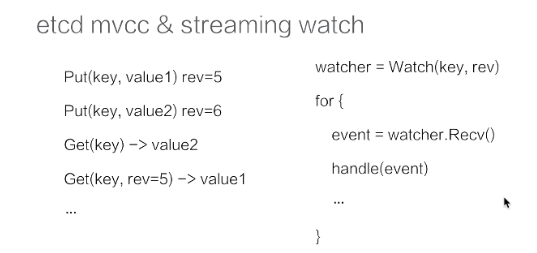

etcd 支持对一个key发起多次修改，而且通过上面可以知道每一次修改都对应了一个版本号，这样我们查询数据的时候可以指定版本号获取指定版本的数据，如果不指定数据就会返回最新的版本数据。

我们还可以在watch的时候指定数据的版本，通过这种方式创建一个watcher,并且通过这个watcher提供的数据管道能够获取制定版本之后所有的数据变更，如果我们指定的是一个旧版本，那我们可以马上拿到从旧版本到新版本的数据更新。

### 数据存储结构

在etcd中所有的数据都存储在一棵B+树中，这颗B+树是保存在磁盘中的如下图灰色的部分，这棵树维护着revision到value的映射关系，当我们指定revsion的时候可以通过这颗b+树直接返回数据，当使用watch的来订阅数据的时候也可以通过这颗b+树中维护的revision到value的映射关系从而通过指定的revision之后遍历b+树从而获取数据的增量更新

同时在etcd内部还维护了另一颗b+树，它维护着key-revision的映射关系,这样我们如果想通过key查找数据的时候，我们通过这两颗b+树就可以实现

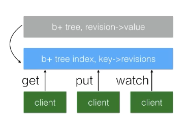

在这种多版本历史数据的机制下，可能会造成内存和磁盘的大量消耗，这样对资源有限的场景是不能接受的，所以etcd中有Compaction的机制来定期清理历史数据

### 事物机制

etcd的transaction的机制比较简单，可以理解为一段if-else的程序

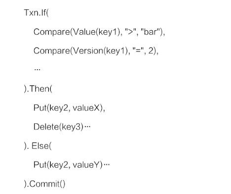

在etcd内部会保证整个事务操作的原子性

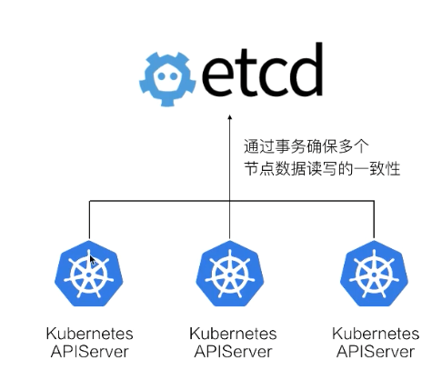

通过etcd的事务机制来保证kubernetes中多个APIServer的对同样一份数据修改的一致性

### lease机制

lease 是分布式系统中常见的一个概念，用于代表一个租约

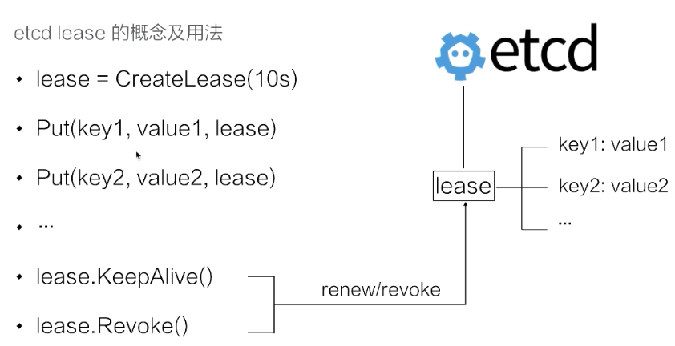

如上图创建了一个10的租约,如果在10内不做任何操作，这个租约就会过期

然后创建了key1和key2两个数据并绑定到这个租约上，如果租约过期，etcd就会自定清理掉key1和key2的数据

我们也可以通过调用KeepAlive方法来续约

etcd可以允许将多个key绑定到同一个lease对象上,这样可以大幅减少lease对象个数和刷新时间

### 实际操作

#### 数据的插入和查询

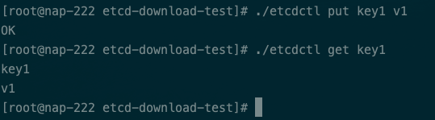

创建key0到key9

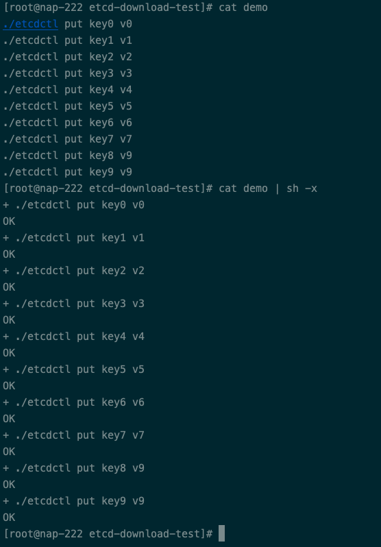

#### 查询范围 

`./etcdctl get key1 key6`

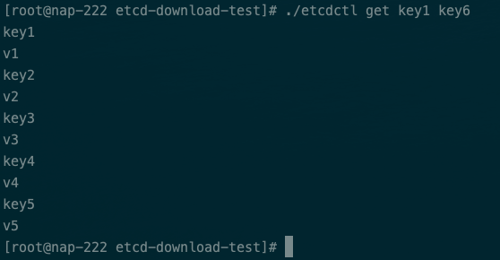

#### 指定前缀查询

`./etcdctl get key --prefix`

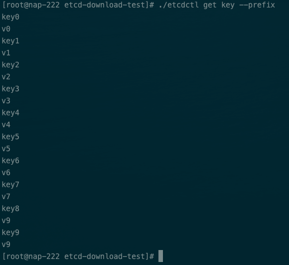

#### json形式输出

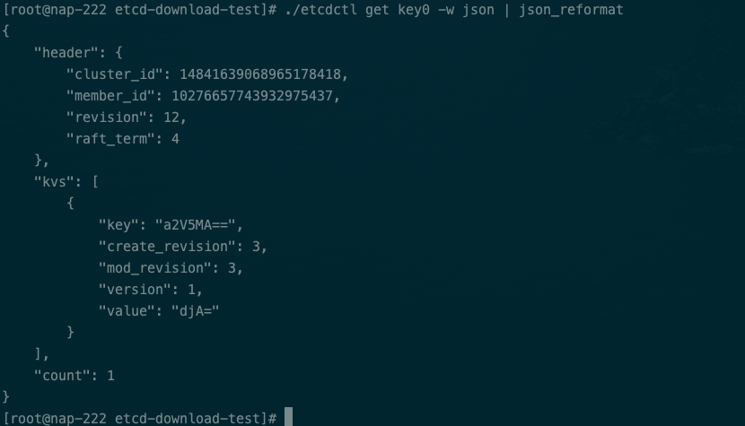