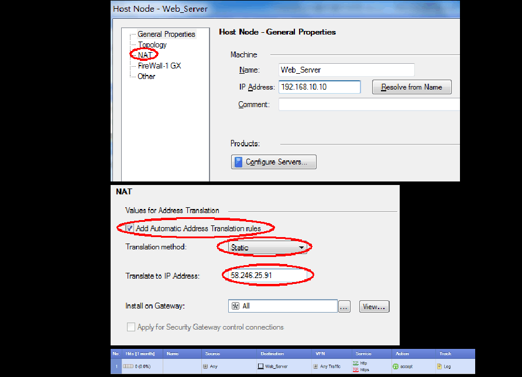

# CheckPoint overview

>CheckPoint分为三层架构，GUI客户端（SmartConsole)是一个可视化的管理配置客户端，用于连接到管理服务器（SmartCenter), SmartCenter是一个集中管理平台，用于管理所有设备，将策略分发给执行点(Firewall)去执行，并且收集所有执行点的日志，执行点具体执行策略，进行网络访问k控制。

### 命令行登录专家模式

登录命令行（ssh）默认模式下支持部分操作及命令，如需要执行更高权限的命令则需要登录专家模式。

在命令行中输入**expert**,输入密码即可

### 防火墙策略

CheckPoint防火墙的策略执行顺序为自上而下，当满足某一条策略后将执行该策略的操作，并且不再匹配后面的策略。

如果策略中包含用户对象，即使匹配该策略，仍然会继续匹配后面的策略，只有后面的策略没有匹配或者后面的策略中匹配的操作是drop时，才会执行之前包含用户的策略。

通常CheckPoint 策略配置的顺序依次为防火墙的管理策略，VPN策略，服务器策略（DMZ）,内网上网策略，全部drop策略。

创建策略后，必须Install Policy之后才会生效。

### NAT

在CheckPoint 中地址转换分为自动和手动两种，其中自动又分为Static NAT,和hide NAT

#### Static NAT

static是指将内部网络的私有ip地址转换为公用IP地址，IP地址对是一对一的，是一成不变的，某个私有IP地址只转换某个公有IPd地址，借助于静态转换，可以实现外部网络对内部网络中某些特定设备（如服务器）的访问

在对象中配置static nat 然后才开通一条访问策略，上图所示的策略表示允许访问192.168.10.10 和58.246.25.91的http和https

#### Hide NAT 

Hide NAT 是指改变外出数据包的源端口并进行端口转换，即端口转换（PAT，Port Address Translation）采用端口多路复用方式。内部网络的所有主机都可共享一个合法外部ip地址实现对互联网的访问。从而最大限度的节约IP地址资源，同时又可隐藏网络内部的所有主机，有效避免来自互联网的攻击，因此，网络中应用的最多的就是端口复用方式。

### 手动 NAT

将公网地址58.246.25.91的80端口映射到内网地址的192.168.10.10的443端口

1. 创建主机地址分别为58.246.25.91和192.168.10.10

2. 创建允许访问58.246.25.91的80端口的策略

3. 创建一条nat策略，Original Destination填58.246.25.91

   ​								 Original Service填80

   ​                                 Translated Destination填192.168.10.10

​                                        Translated Service填443

### 使用mgmt cli命令管理配置

首先登录mgmt

~~~shell
mgmt login user admin
~~~

然后使用mgmt命令

例如：

~~~shell
mgmt_cli show gateways-and-servers details-level "full" --version 1.1 --format json
~~~

最后要退出mgmt,如果不退出，则会导致session增多，一旦session到了极限，则可能造成极大的风险，即其他管理员登录不上smartcenter  

~~~
mgmt logout
~~~

